# 乡村治理一张图 · 系统原型走读与需求确认

---

## 0. 版本信息

| 项目 | 内容 |
|------|------|
| 文档名称 | 乡村治理一张图 · 系统原型走读与需求确认 |
| 版本号 | V1.0 |
| 编写日期 | 2026-01-13 |
| 编写人 | Claude |
| 确认人 |  |
| 确认日期 |  |

---

## 1. 系统是做什么的

**一句话说明**：乡村治理一张图是面向乡镇级政府的综合治理可视化大屏系统，用于展示乡村基础信息、人口经济、农业产业、公共设施等数据，辅助乡镇领导了解辖区全貌、支撑日常决策。

**谁会使用这个系统**：
- 乡镇党委、政府领导班子
- 驻村干部、村两委
- 上级主管部门来访人员
- 乡村振兴工作督导检查人员

---

## 2. 本次确认范围

本次走读确认的模块为：**乡情概览**、**联村共治**、**宜居乡村**、**信息惠民**、**文旅全景**、**农旅融合**（农文旅融合一张图）

各模块包含功能面板如下：

**5.1 乡情概览模块（6个面板）：**

| 序号 | 功能名称 | 面板位置 | 是否关联地图 |
|------|----------|----------|--------------|
| 1 | 乡情概览 | 左侧上 | 是（村庄点位图层） |
| 2 | 人口统计 | 左侧中 | 否 |
| 3 | 经济发展 | 左侧下 | 否 |
| 4 | 农业产业 | 右侧上 | 是（种植分布/养殖小区图层） |
| 5 | 村庄动态 | 右侧中 | 是（点击村庄可定位） |
| 6 | 设施点位 | 右侧下 | 是（公共设施图层） |

**5.2 联村共治模块（6个面板）：**

| 序号 | 功能名称 | 面板位置 | 是否关联地图 |
|------|----------|----------|--------------|
| 1 | 治理架构 | 左侧上 | 否 |
| 2 | 综治态势 | 左侧中 | 否 |
| 3 | 综治网格 | 左侧下 | 是（综治网格图层） |
| 4 | 视频监控 | 右侧上 | 是（监控点位图层） |
| 5 | 重点人群 | 右侧中 | 否 |
| 6 | 典型案例 | 右侧下 | 否 |

**5.3 宜居乡村模块（5个面板）：**

| 序号 | 功能名称 | 面板位置 | 是否关联地图 |
|------|----------|----------|--------------|
| 1 | 生态资源 | 左侧上 | 是（生态资源图层） |
| 2 | 居住点分布 | 左侧中 | 是（居住点图层） |
| 3 | 人居环境 | 左侧下 | 否 |
| 4 | 曝光公示 | 右侧上 | 是（曝光点位图层） |
| 5 | 应急减灾 | 右侧下 | 是（广播终端/避难场所图层） |

**5.4 信息惠民模块（5个面板）：**

| 序号 | 功能名称 | 面板位置 | 是否关联地图 |
|------|----------|----------|--------------|
| 1 | 数字便民 | 左侧上 | 是（便民网点图层） |
| 2 | 服务指南 | 左侧下 | 否 |
| 3 | 养老服务 | 右侧上 | 是（养老设施图层） |
| 4 | 文化地图 | 右侧中 | 是（文化设施图层） |
| 5 | 典型案例 | 右侧下 | 否 |

**5.5 文旅全景模块（3个面板）：**

| 序号 | 功能名称 | 面板位置 | 是否关联地图 |
|------|----------|----------|--------------|
| 1 | 景点分布 | 左侧上 | 是（景点标注图层） |
| 2 | 全景漫游 | 左侧下 | 否 |
| 3 | 精品路线 | 右侧 | 是（旅游路线/民宿农家图层） |

**5.6 农旅融合模块（5个面板）：**

| 序号 | 功能名称 | 面板位置 | 是否关联地图 |
|------|----------|----------|--------------|
| 1 | 农业基地 | 左侧上 | 是（农业基地图层） |
| 2 | 特色农产 | 左侧下 | 否 |
| 3 | 采摘体验 | 右侧上 | 否 |
| 4 | 民宿农家 | 右侧中 | 是（民宿点位图层） |
| 5 | 农事活动 | 右侧下 | 否 |

---

## 3. 走读方式

1. **按面板逐个走读**：每个面板单独讲解，先看界面、再看数据需求
2. **确认项当场勾选**：每个面板确认后，请现场勾选确认项
3. **数据问题现场记录**：如有数据无法提供，请在备注栏说明原因

---

## 4. 角色与责任

| 角色 | 职责 |
|------|------|
| 讲解人（开发方） | 演示系统功能、说明数据需求、记录反馈意见 |
| 确认人（业主方） | 确认功能是否需要、数据是否能提供、提出调整意见 |
| 记录人 | 记录会议纪要、整理待确认事项 |

---

## 5. 页面卡片

### 5.1 乡情概览模块
- 系统界面：
  

#### 5.1.1 功能名称：`乡情概览`（所属模块：`乡情概览`）

**这页用来干啥（1句话）：**
展示乡镇整体形象，包括地标照片、简介、荣誉和负责人信息。

---

##### 页面展示内容（直接放界面原型）

- 系统界面：
  
  

- 标注说明：
  ① 顶部为乡镇地标风貌图片，支持720°全景入口，支持显示/隐藏地图中的所有村点位
  ② 中部为乡镇简介描述和荣誉标签
  ③ 底部显示特色文化和负责人信息
  
---

##### 需要的数据（表格：让用户直接对着填/勾）

**面板数据：**

| 序号 | 数据项名称（用户能理解） | 必填/选填 | 数据说明/口径（人话） | 是否能提供（勾选） | 备注 |
|---|---|---|---|---|---|
| 1 | 乡镇名称 | [x]必填 [ ]选填 | 乡镇的正式名称 | [ ]能 [ ]部分能 [ ]不能 |  |
| 2 | 乡镇口号/标语 | [ ]必填 [x]选填 | 如"塞上江南 丝路明珠" | [ ]能 [ ]部分能 [ ]不能 |  |
| 3 | 地标风貌图片 | [x]必填 [ ]选填 | 展示乡镇特色风貌的照片，建议16:9比例 | [ ]能 [ ]部分能 [ ]不能 |  |
| 4 | 乡镇/村简介 | [x]必填 [ ]选填 | 如地理位置，历史沿革、发展定位等 | [ ]能 [ ]部分能 [ ]不能 |  |
| 5 | 荣誉称号列表 | [ ]必填 [x]选填 | 获得的各级荣誉，如"省级文明乡镇" | [ ]能 [ ]部分能 [ ]不能 |  |
| 6 | 特色文化 | [ ]必填 [x]选填 | 乡镇的特色文化标签 | [ ]能 [ ]部分能 [ ]不能 |  |
| 7 | 负责人姓名 | [x]必填 [ ]选填 | 乡镇主要负责人姓名 | [ ]能 [ ]部分能 [ ]不能 |  |

**地图图层数据（村庄点位）：**

| 序号 | 数据项名称（用户能理解） | 必填/选填 | 数据说明/口径（人话） | 是否能提供（勾选） | 备注 |
|---|---|---|---|---|---|
| 1 | 村庄名称 | [x]必填 [ ]选填 | 各行政村的名称 | [ ]能 [ ]部分能 [ ]不能 | 用于地图图层 |
| 2 | 村庄坐标 | [x]必填 [ ]选填 | 经纬度，用于在地图上标点 | [ ]能 [ ]部分能 [ ]不能 | 用于地图图层 |
| 3 | 村庄人口 | [x]必填 [ ]选填 | 各村的户籍人口数 | [ ]能 [ ]部分能 [ ]不能 | 用于地图弹窗 |
| 4 | 村庄特色 | [ ]必填 [x]选填 | 各村的主要特色或产业 | [ ]能 [ ]部分能 [ ]不能 | 用于地图弹窗 |
| 5 | 村庄面积 | [ ]必填 [x]选填 | 各村的行政区域面积 | [ ]能 [ ]部分能 [ ]不能 | 用于地图弹窗 |
| 6 | 村庄简介 | [ ]必填 [x]选填 | 各村的概况描述 | [ ]能 [ ]部分能 [ ]不能 | 用于地图弹窗 |
| 7 | 村负责人 | [ ]必填 [x]选填 | 村书记/村长姓名 | [ ]能 [ ]部分能 [ ]不能 | 用于地图弹窗 |
| 8 | 联系电话 | [ ]必填 [x]选填 | 村委会联系电话 | [ ]能 [ ]部分能 [ ]不能 | 用于地图弹窗 |

---

##### 确认项（本页必须勾选/填写）
- 功能是否需要： [ ] 需要  [ ] 不需要（原因：                ）
- 展示内容是否符合： [ ] 符合  [ ] 需调整（写明调整点：                ）
- 数据整体是否可落地： [ ] 可落地  [ ] 有风险（风险点：                ）

---

#### 5.1.2 功能名称：`人口统计`（所属模块：`乡情概览`）

**这页用来干啥（1句话）：**
展示乡镇人口核心数据、年龄结构分布和特殊人群统计。

---

##### 页面展示内容（直接放界面原型）

- 系统界面：
  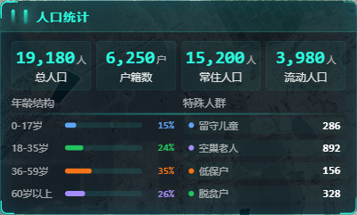

- 标注说明：
  ① 顶部显示总人口、户籍数、常住人口、流动人口四项核心指标
  ② 左下为年龄结构分布条形图（0-17岁、18-35岁、36-59岁、60岁以上）
  ③ 右下为特殊人群统计（留守儿童、空巢老人、低保户、脱贫户）

---

##### 需要的数据（表格：让用户直接对着填/勾）

| 序号 | 数据项名称（用户能理解） | 必填/选填 | 数据说明/口径（人话） | 是否能提供（勾选） | 备注 |
|---|---|---|---|---|---|
| 1 | 总人口 | [x]必填 [ ]选填 | 乡镇户籍人口总数 | [ ]能 [ ]部分能 [ ]不能 |  |
| 2 | 户籍数 | [x]必填 [ ]选填 | 乡镇总户数 | [ ]能 [ ]部分能 [ ]不能 |  |
| 3 | 常住人口 | [x]必填 [ ]选填 | 实际长期居住的人口数 | [ ]能 [ ]部分能 [ ]不能 |  |
| 4 | 流动人口 | [x]必填 [ ]选填 | 外出务工或临时居住人口 | [ ]能 [ ]部分能 [ ]不能 |  |
| 5 | 0-17岁人口数 | [x]必填 [ ]选填 | 未成年人口数量 | [ ]能 [ ]部分能 [ ]不能 |  |
| 6 | 18-35岁人口数 | [x]必填 [ ]选填 | 青年人口数量 | [ ]能 [ ]部分能 [ ]不能 |  |
| 7 | 36-59岁人口数 | [x]必填 [ ]选填 | 中年人口数量 | [ ]能 [ ]部分能 [ ]不能 |  |
| 8 | 60岁以上人口数 | [x]必填 [ ]选填 | 老年人口数量 | [ ]能 [ ]部分能 [ ]不能 |  |
| 9 | 留守儿童数量 | [x]必填 [ ]选填 | 父母外出务工的儿童数 | [ ]能 [ ]部分能 [ ]不能 |  |
| 10 | 空巢老人数量 | [x]必填 [ ]选填 | 独居或无子女照料的老人数 | [ ]能 [ ]部分能 [ ]不能 |  |
| 11 | 低保户数量 | [x]必填 [ ]选填 | 享受最低生活保障的家庭数 | [ ]能 [ ]部分能 [ ]不能 |  |
| 12 | 脱贫户数量 | [x]必填 [ ]选填 | 已脱贫的建档立卡户数 | [ ]能 [ ]部分能 [ ]不能 |  |

---

##### 确认项（本页必须勾选/填写）
- 功能是否需要： [ ] 需要  [ ] 不需要（原因：                ）
- 展示内容是否符合： [ ] 符合  [ ] 需调整（写明调整点：                ）
- 数据整体是否可落地： [ ] 可落地  [ ] 有风险（风险点：                ）

---

#### 5.1.3 功能名称：`经济发展`（所属模块：`乡情概览`）

**这页用来干啥（1句话）：**
展示乡镇人均可支配收入、村集体收入及近年增长趋势。

---

##### 页面展示内容（直接放界面原型）

- 系统界面：
  

- 标注说明：
  ① 左上显示人均可支配收入及同比增长率
  ② 右上显示村集体收入及同比增长率
  ③ 下方为近5年人均收入趋势图（柱状图+折线图）

---

##### 需要的数据（表格：让用户直接对着填/勾）

| 序号 | 数据项名称（用户能理解） | 必填/选填 | 数据说明/口径（人话） | 是否能提供（勾选） | 备注 |
|---|---|---|---|---|---|
| 1 | 人均可支配收入（当年） | [x]必填 [ ]选填 | 农民人均可支配收入，单位元 | [ ]能 [ ]部分能 [ ]不能 |  |
| 2 | 人均收入同比增长率 | [x]必填 [ ]选填 | 与上年相比的增长百分比 | [ ]能 [ ]部分能 [ ]不能 |  |
| 3 | 村集体收入（当年） | [x]必填 [ ]选填 | 全乡村集体经济总收入，单位万元 | [ ]能 [ ]部分能 [ ]不能 |  |
| 4 | 村集体收入同比增长率 | [x]必填 [ ]选填 | 与上年相比的增长百分比 | [ ]能 [ ]部分能 [ ]不能 |  |
| 5 | 近5年人均收入数据 | [x]必填 [ ]选填 | 2020-2024年各年人均收入 | [ ]能 [ ]部分能 [ ]不能 | 用于趋势图 |
| 6 | 近5年收入增长率数据 | [x]必填 [ ]选填 | 2020-2024年各年增长率 | [ ]能 [ ]部分能 [ ]不能 | 用于趋势图 |

---

##### 确认项（本页必须勾选/填写）
- 功能是否需要： [ ] 需要  [ ] 不需要（原因：                ）
- 展示内容是否符合： [ ] 符合  [ ] 需调整（写明调整点：                ）
- 数据整体是否可落地： [ ] 可落地  [ ] 有风险（风险点：                ）

---

#### 5.1.4 功能名称：`农业产业`（所属模块：`乡情概览`）

**这页用来干啥（1句话）：**
展示乡镇种植结构、养殖结构及产业特色，支持切换地图图层查看分布。

---

##### 页面展示内容（直接放界面原型）

- 系统界面：
  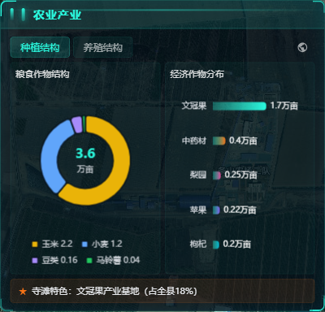
  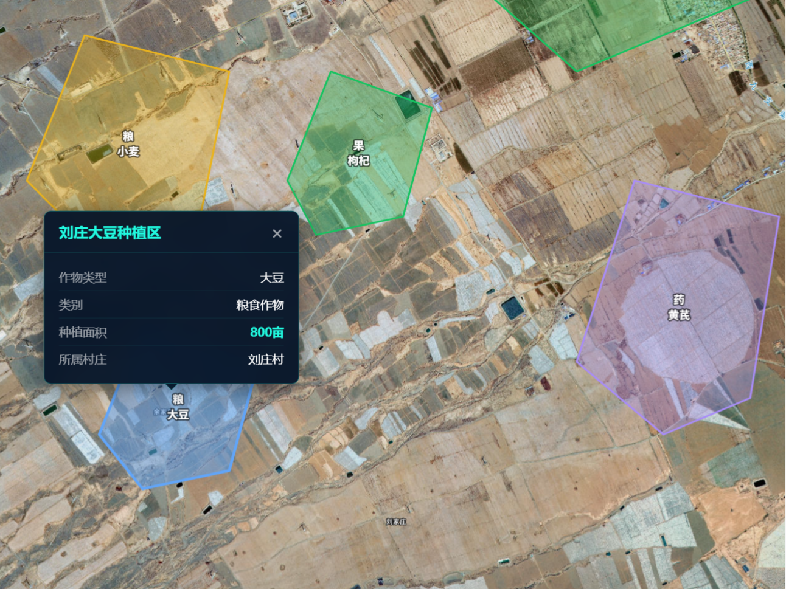
  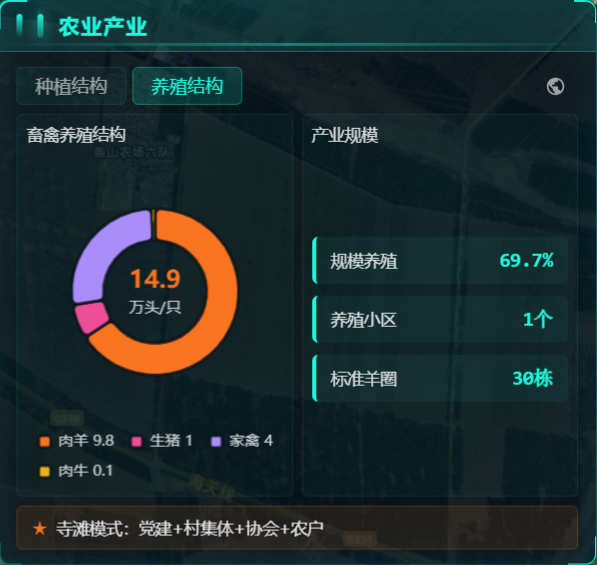
  

- 标注说明：
  ① 顶部Tab切换种植结构/养殖结构，右侧图标控制地图图层显示
  ② 种植结构：左侧饼图展示粮食作物，右侧条形图展示经济作物。底部显示乡镇农业特色标签
  ③ 养殖结构：左侧饼图展示畜禽养殖结构，右侧图表展示产业规模。底部显示乡镇养殖特色模式
---

##### 需要的数据（表格：让用户直接对着填/勾）

**面板数据（种植结构）：**

| 序号 | 数据项名称（用户能理解） | 必填/选填 | 数据说明/口径（人话） | 是否能提供（勾选） | 备注 |
|---|---|---|---|---|---|
| 1 | 玉米种植面积 | [x]必填 [ ]选填 | 玉米种植总面积，单位万亩 | [ ]能 [ ]部分能 [ ]不能 |  |
| 2 | 小麦种植面积 | [x]必填 [ ]选填 | 小麦种植总面积，单位万亩 | [ ]能 [ ]部分能 [ ]不能 |  |
| 3 | 豆类种植面积 | [x]必填 [ ]选填 | 大豆等豆类种植面积，单位万亩 | [ ]能 [ ]部分能 [ ]不能 |  |
| 4 | 马铃薯种植面积 | [x]必填 [ ]选填 | 马铃薯种植面积，单位万亩 | [ ]能 [ ]部分能 [ ]不能 |  |
| 5 | 文冠果种植面积 | [x]必填 [ ]选填 | 文冠果种植面积，单位万亩 | [ ]能 [ ]部分能 [ ]不能 |  |
| 6 | 中药材种植面积 | [x]必填 [ ]选填 | 黄芪等中药材种植面积，单位万亩 | [ ]能 [ ]部分能 [ ]不能 |  |
| 7 | 梨园种植面积 | [x]必填 [ ]选填 | 梨树种植面积，单位万亩 | [ ]能 [ ]部分能 [ ]不能 |  |
| 8 | 苹果种植面积 | [x]必填 [ ]选填 | 苹果树种植面积，单位万亩 | [ ]能 [ ]部分能 [ ]不能 |  |
| 9 | 枸杞种植面积 | [x]必填 [ ]选填 | 枸杞种植面积，单位万亩 | [ ]能 [ ]部分能 [ ]不能 |  |
| 10 | 种植特色说明 | [ ]必填 [x]选填 | 乡镇种植业的特色标签 | [ ]能 [ ]部分能 [ ]不能 |  |

**面板数据（养殖结构）：**

| 序号 | 数据项名称（用户能理解） | 必填/选填 | 数据说明/口径（人话） | 是否能提供（勾选） | 备注 |
|---|---|---|---|---|---|
| 1 | 肉羊存栏量 | [x]必填 [ ]选填 | 肉羊养殖规模，单位万只 | [ ]能 [ ]部分能 [ ]不能 |  |
| 2 | 生猪存栏量 | [x]必填 [ ]选填 | 生猪养殖规模，单位万头 | [ ]能 [ ]部分能 [ ]不能 |  |
| 3 | 家禽存栏量 | [x]必填 [ ]选填 | 家禽养殖规模，单位万只 | [ ]能 [ ]部分能 [ ]不能 |  |
| 4 | 肉牛存栏量 | [x]必填 [ ]选填 | 肉牛养殖规模，单位万头 | [ ]能 [ ]部分能 [ ]不能 |  |
| 5 | 规模养殖比例 | [x]必填 [ ]选填 | 规模化养殖占比，如69.7% | [ ]能 [ ]部分能 [ ]不能 |  |
| 6 | 养殖小区数量 | [x]必填 [ ]选填 | 集中养殖小区个数 | [ ]能 [ ]部分能 [ ]不能 |  |
| 7 | 标准羊圈数量 | [x]必填 [ ]选填 | 标准化羊圈栋数 | [ ]能 [ ]部分能 [ ]不能 |  |
| 8 | 养殖特色说明 | [ ]必填 [x]选填 | 乡镇养殖业的特色模式 | [ ]能 [ ]部分能 [ ]不能 |  |

**地图图层数据（种植分布）：**

| 序号 | 数据项名称（用户能理解） | 必填/选填 | 数据说明/口径（人话） | 是否能提供（勾选） | 备注 |
|---|---|---|---|---|---|
| 1 | 种植区域名称 | [x]必填 [ ]选填 | 如"永川玉米种植区" | [ ]能 [ ]部分能 [ ]不能 | 用于地图图层 |
| 2 | 种植区域边界坐标 | [x]必填 [ ]选填 | 多边形边界的经纬度数组 | [ ]能 [ ]部分能 [ ]不能 | 用于地图图层 |
| 3 | 种植作物类型 | [x]必填 [ ]选填 | 粮食/果树/蔬菜/中药材 | [ ]能 [ ]部分能 [ ]不能 | 用于地图弹窗 |
| 4 | 具体作物名称 | [x]必填 [ ]选填 | 如"玉米"、"文冠果" | [ ]能 [ ]部分能 [ ]不能 | 用于地图弹窗 |
| 5 | 种植面积 | [x]必填 [ ]选填 | 该区域种植面积，单位亩 | [ ]能 [ ]部分能 [ ]不能 | 用于地图弹窗 |
| 6 | 所属村庄 | [ ]必填 [x]选填 | 该区域所属的行政村 | [ ]能 [ ]部分能 [ ]不能 | 用于地图弹窗 |

**地图图层数据（养殖点位）：**

| 序号 | 数据项名称（用户能理解） | 必填/选填 | 数据说明/口径（人话） | 是否能提供（勾选） | 备注 |
|---|---|---|---|---|---|
| 1 | 养殖场名称 | [x]必填 [ ]选填 | 如"寺滩集中养殖小区" | [ ]能 [ ]部分能 [ ]不能 | 用于地图图层 |
| 2 | 养殖场坐标 | [x]必填 [ ]选填 | 养殖场位置的经纬度 | [ ]能 [ ]部分能 [ ]不能 | 用于地图图层 |
| 3 | 养殖类型 | [x]必填 [ ]选填 | 羊/猪/牛/禽 | [ ]能 [ ]部分能 [ ]不能 | 用于地图弹窗 |
| 4 | 养殖规模 | [x]必填 [ ]选填 | 存栏数量，单位头/只 | [ ]能 [ ]部分能 [ ]不能 | 用于地图弹窗 |
| 5 | 所属村庄 | [ ]必填 [x]选填 | 养殖场所属的行政村 | [ ]能 [ ]部分能 [ ]不能 | 用于地图弹窗 |
| 6 | 特色标签 | [ ]必填 [x]选填 | 如"标准化羊圈30栋" | [ ]能 [ ]部分能 [ ]不能 | 用于地图弹窗 |

---

##### 确认项（本页必须勾选/填写）
- 功能是否需要： [ ] 需要  [ ] 不需要（原因：                ）
- 展示内容是否符合： [ ] 符合  [ ] 需调整（写明调整点：                ）
- 数据整体是否可落地： [ ] 可落地  [ ] 有风险（风险点：                ）

---

#### 5.1.5 功能名称：`村庄动态`（所属模块：`乡情概览`）

**这页用来干啥（1句话）：**
展示各行政村列表和预警公告信息，支持点击村庄定位到地图。

---

##### 页面展示内容（直接放界面原型）

- 系统界面：
  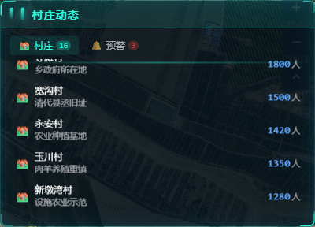
  
  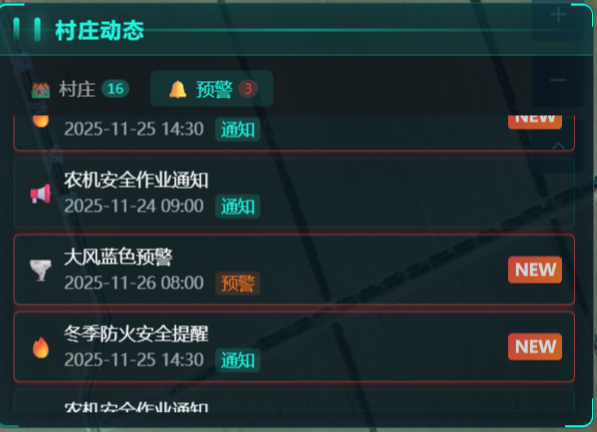

- 标注说明：
  ① 顶部Tab切换村庄列表/预警公告
  ② 村庄列表展示各村名称、特色和人口，自动滚动，带坐标的村庄可点击定位
  ③ 预警公告展示气象预警、安全提醒等信息
---

##### 需要的数据（表格：让用户直接对着填/勾）

**面板数据（村庄列表）：**

| 序号 | 数据项名称（用户能理解） | 必填/选填 | 数据说明/口径（人话） | 是否能提供（勾选） | 备注 |
|---|---|---|---|---|---|
| 1 | 村庄名称 | [x]必填 [ ]选填 | 各行政村的名称 | [ ]能 [ ]部分能 [ ]不能 |  |
| 2 | 村庄人口 | [x]必填 [ ]选填 | 各村户籍人口数 | [ ]能 [ ]部分能 [ ]不能 |  |
| 3 | 村庄特色 | [x]必填 [ ]选填 | 各村的主要特色或产业 | [ ]能 [ ]部分能 [ ]不能 |  |
| 4 | 村庄坐标 | [ ]必填 [x]选填 | 用于点击定位到地图 | [ ]能 [ ]部分能 [ ]不能 |  |

**面板数据（预警公告）：**

| 序号 | 数据项名称（用户能理解） | 必填/选填 | 数据说明/口径（人话） | 是否能提供（勾选） | 备注 |
|---|---|---|---|---|---|
| 1 | 预警标题 | [x]必填 [ ]选填 | 预警信息的标题 | [ ]能 [ ]部分能 [ ]不能 |  |
| 2 | 预警类型 | [x]必填 [ ]选填 | 气象/火灾/通知/其他 | [ ]能 [ ]部分能 [ ]不能 |  |
| 3 | 预警级别 | [x]必填 [ ]选填 | 紧急/预警/通知 | [ ]能 [ ]部分能 [ ]不能 |  |
| 4 | 预警内容 | [x]必填 [ ]选填 | 紧急/预警/通知 | [ ]能 [ ]部分能 [ ]不能 |  |
| 5 | 发布时间 | [x]必填 [ ]选填 | 预警发布的时间 | [ ]能 [ ]部分能 [ ]不能 |  |
| 6 | 是否新消息 | [ ]必填 [x]选填 | 标记是否为新发布的消息 | [ ]能 [ ]部分能 [ ]不能 |  |

---

##### 确认项（本页必须勾选/填写）
- 功能是否需要： [ ] 需要  [ ] 不需要（原因：                ）
- 展示内容是否符合： [ ] 符合  [ ] 需调整（写明调整点：                ）
- 数据整体是否可落地： [ ] 可落地  [ ] 有风险（风险点：                ）

---

#### 5.1.6 功能名称：`设施点位`（所属模块：`乡情概览`）

**这页用来干啥（1句话）：**
展示乡镇各类公共设施点位，按类别分Tab查看，点击可定位到地图。

---

##### 页面展示内容（直接放界面原型）

- 系统界面：
  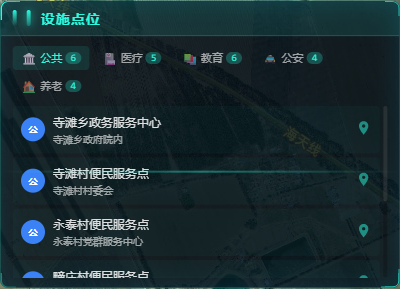
  

- 标注说明：
  ① 顶部5个类别Tab：公共、医疗、教育、公安、养老
  ② 列表显示各设施名称和地址
  ③ 点击设施项可定位到地图上对应位置
  
---

##### 需要的数据（表格：让用户直接对着填/勾）

**面板数据（设施列表）：**

| 序号 | 数据项名称（用户能理解） | 必填/选填 | 数据说明/口径（人话） | 是否能提供（勾选） | 备注 |
|---|---|---|---|---|---|
| 1 | 设施名称 | [x]必填 [ ]选填 | 设施的正式名称 | [ ]能 [ ]部分能 [ ]不能 |  |
| 2 | 设施类别 | [x]必填 [ ]选填 | 公共/医疗/教育/公安/养老 | [ ]能 [ ]部分能 [ ]不能 |  |
| 3 | 设施地址 | [x]必填 [ ]选填 | 设施的具体位置描述 | [ ]能 [ ]部分能 [ ]不能 |  |
| 4 | 设施坐标 | [x]必填 [ ]选填 | 经纬度，用于地图定位 | [ ]能 [ ]部分能 [ ]不能 |  |
| 5 | 设施说明 | [ ]必填 [x]选填 | 设施的功能或服务说明 | [ ]能 [ ]部分能 [ ]不能 |  |

**各类别设施清单参考：**

| 类别 | 设施举例 |
|------|----------|
| 公共设施 | 政务服务中心、便民服务点、银行、超市 |
| 医疗设施 | 乡镇卫生院、村卫生室、社区卫生服务站 |
| 教育设施 | 中心小学、幼儿园、教学点、农家书屋 |
| 公安设施 | 派出所、警务室、治安岗亭、综治工作站 |
| 养老设施 | 五保家园、互助幸福院、日间照料中心、居家养老服务站 |

---

##### 确认项（本页必须勾选/填写）
- 功能是否需要： [ ] 需要  [ ] 不需要（原因：                ）
- 展示内容是否符合： [ ] 符合  [ ] 需调整（写明调整点：                ）
- 数据整体是否可落地： [ ] 可落地  [ ] 有风险（风险点：                ）

---

### 5.2 联村共治模块

#### 5.2.1 功能名称：`治理架构`（所属模块：`联村共治`）

**这页用来干啥（1句话）：**
展示永麓社区"1+3"管理机制和"1+3+20"网格体系架构。

---

##### 页面展示内容

- 系统界面：
  

- 标注说明：
  ① 顶部4个统计卡片：联合村数、党员数、搬迁户数、总人口
  ② 中部展示"1+3"社区管理机制组织架构图
  ③ 底部展示"1+3+20"网格管理体系和七村合一村庄列表

---

##### 需要的数据

| 序号 | 数据项名称 | 必填/选填 | 数据说明/口径 | 是否能提供 | 备注 |
|------|------------|-----------|---------------|------------|------|
| 1 | 联合村数量 | [x]必填 [ ]选填 | 参与联村共治的行政村数量 | [ ]能 [ ]部分能 [ ]不能 |  |
| 2 | 党员总数 | [x]必填 [ ]选填 | 社区党员人数 | [ ]能 [ ]部分能 [ ]不能 |  |
| 3 | 搬迁户数 | [x]必填 [ ]选填 | 易地搬迁户数 | [ ]能 [ ]部分能 [ ]不能 |  |
| 4 | 总人口 | [x]必填 [ ]选填 | 社区常住人口总数 | [ ]能 [ ]部分能 [ ]不能 |  |
| 5 | 组织架构配置 | [ ]必填 [x]选填 | "1+3"管理机制各组织名称 | [ ]能 [ ]部分能 [ ]不能 | 可配置 |
| 6 | 网格层级配置 | [ ]必填 [x]选填 | "1+3+20"各层级名称和数量 | [ ]能 [ ]部分能 [ ]不能 | 可配置 |
| 7 | 联合村名单 | [x]必填 [ ]选填 | 七个搬迁村的名称列表 | [ ]能 [ ]部分能 [ ]不能 |  |

---

##### 确认项
- 功能是否需要： [ ] 需要  [ ] 不需要（原因：                ）
- 展示内容是否符合： [ ] 符合  [ ] 需调整（写明调整点：                ）
- 数据整体是否可落地： [ ] 可落地  [ ] 有风险（风险点：                ）

---

#### 5.2.2 功能名称：`综治态势`（所属模块：`联村共治`）

**这页用来干啥（1句话）：**
展示综合治理事件统计、类型分布、月度趋势和近期事件列表。

---

##### 页面展示内容

- 系统界面：
  
  

- 标注说明：
  ① 顶部4个核心指标：本月事件数、处置率、调解总数、重点人群数
  ② 中部左侧：事件类型分布（环境、纠纷、安全、其他）
  ③ 中部右侧：月度趋势折线图（近6个月）
  ④ 底部：近期事件滚动列表，可点击查看详情

---

##### 需要的数据

| 序号 | 数据项名称 | 必填/选填 | 数据说明/口径 | 是否能提供 | 备注 |
|------|------------|-----------|---------------|------------|------|
| 1 | 本月事件数 | [x]必填 [ ]选填 | 当月上报的综治事件总数 | [ ]能 [ ]部分能 [ ]不能 | 从小程序随手拍获取？ |
| 2 | 处置率 | [x]必填 [ ]选填 | 已处置事件/总事件数×100% | [ ]能 [ ]部分能 [ ]不能 | 从小程序随手拍获取？ |
| 3 | 调解总数 | [x]必填 [ ]选填 | 累计调解成功的纠纷数量 | [ ]能 [ ]部分能 [ ]不能 | 从小程序随手拍获取？ |
| 4 | 重点人群数 | [x]必填 [ ]选填 | 重点关注人员总数 | [ ]能 [ ]部分能 [ ]不能 | 关联重点人群面板 |
| 5 | 事件类型分布 | [x]必填 [ ]选填 | 按环境、纠纷、安全、其他分类的事件数量 | [ ]能 [ ]部分能 [ ]不能 | 从小程序随手拍获取？ |
| 6 | 月度事件趋势 | [x]必填 [ ]选填 | 近6个月每月事件数量 | [ ]能 [ ]部分能 [ ]不能 | 从小程序随手拍获取？ |
| 7 | 近期事件列表 | [x]必填 [ ]选填 | 事件标题、类型、地点、状态、上报时间 | [ ]能 [ ]部分能 [ ]不能 | 从小程序随手拍获取？ |
| 8 | 事件详情 | [x]必填 [ ]选填 | 事件描述、处理记录、现场照片等 | [ ]能 [ ]部分能 [ ]不能 | 点击查看弹窗。从小程序随手拍获取？ |

---

##### 确认项
- 功能是否需要： [ ] 需要  [ ] 不需要（原因：                ）
- 展示内容是否符合： [ ] 符合  [ ] 需调整（写明调整点：                ）
- 数据整体是否可落地： [ ] 可落地  [ ] 有风险（风险点：                ）

---

#### 5.2.3 功能名称：`综治网格`（所属模块：`联村共治`）

**这页用来干啥（1句话）：**
展示网格化管理核心指标和网格覆盖情况，可在地图上显示网格边界。

---

##### 页面展示内容

- 系统界面：
  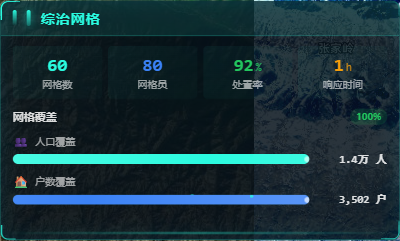
  

- 标注说明：
  ① 顶部4个核心指标：网格数、网格员数、处置率、响应时间
  ② 底部网格覆盖区域：显示人口和户数覆盖进度条

---

##### 需要的数据

**面板数据：**

| 序号 | 数据项名称 | 必填/选填 | 数据说明/口径 | 是否能提供 | 备注 |
|------|------------|-----------|---------------|------------|------|
| 1 | 网格总数 | [x]必填 [ ]选填 | 村级+组级网格数量 | [ ]能 [ ]部分能 [ ]不能 |  |
| 2 | 网格员总数 | [x]必填 [ ]选填 | 在册网格员人数 | [ ]能 [ ]部分能 [ ]不能 |  |
| 3 | 平均处置率 | [x]必填 [ ]选填 | 各网格处置率的平均值 | [ ]能 [ ]部分能 [ ]不能 |  |
| 4 | 平均响应时间 | [x]必填 [ ]选填 | 事件上报到响应的平均时长（小时） | [ ]能 [ ]部分能 [ ]不能 |  |
| 5 | 覆盖人口数 | [x]必填 [ ]选填 | 网格覆盖的常住人口总数 | [ ]能 [ ]部分能 [ ]不能 |  |
| 6 | 覆盖户数 | [x]必填 [ ]选填 | 网格覆盖的户籍数 | [ ]能 [ ]部分能 [ ]不能 |  |

**地图图层数据：**

| 序号 | 数据项名称 | 必填/选填 | 数据说明/口径 | 是否能提供 | 备注 |
|------|------------|-----------|---------------|------------|------|
| 1 | 网格边界坐标 | [x]必填 [ ]选填 | 每个网格的多边形边界坐标（GeoJSON格式） | [ ]能 [ ]部分能 [ ]不能 | 用于地图图层 |
| 2 | 网格中心点 | [x]必填 [ ]选填 | 网格中心经纬度，用于标签定位 | [ ]能 [ ]部分能 [ ]不能 | 用于地图图层 |
| 3 | 网格名称 | [x]必填 [ ]选填 | 网格的显示名称 | [ ]能 [ ]部分能 [ ]不能 | 用于地图图层 |
| 4 | 网格级别 | [x]必填 [ ]选填 | 村级/组级，用于控制显示层级 | [ ]能 [ ]部分能 [ ]不能 | 用于地图图层 |

**地图弹窗数据：**

| 序号 | 数据项名称 | 必填/选填 | 数据说明/口径 | 是否能提供 | 备注 |
|------|------------|-----------|---------------|------------|------|
| 1 | 网格详情 | [x]必填 [ ]选填 | 网格名称、编码、面积、覆盖人口/户数 | [ ]能 [ ]部分能 [ ]不能 | 点击网格弹窗显示 |
| 2 | 网格员列表 | [x]必填 [ ]选填 | 该网格负责的网格员姓名、电话、角色 | [ ]能 [ ]部分能 [ ]不能 | 点击网格弹窗显示 |
| 3 | 近期事件数 | [ ]必填 [x]选填 | 该网格近期上报的事件数量 | [ ]能 [ ]部分能 [ ]不能 | 从小程序随手拍获取？ |

---

##### 确认项
- 功能是否需要： [ ] 需要  [ ] 不需要（原因：                ）
- 展示内容是否符合： [ ] 符合  [ ] 需调整（写明调整点：                ）
- 数据整体是否可落地： [ ] 可落地  [ ] 有风险（风险点：                ）

---

#### 5.2.4 功能名称：`视频监控`（所属模块：`联村共治`）

**这页用来干啥（1句话）：**
展示视频监控设备统计、分布情况和异常告警，支持查看视频整合面板。

---

##### 页面展示内容

- 系统界面：
  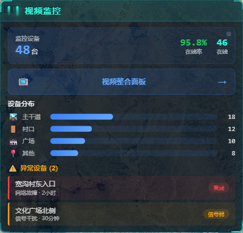
  
  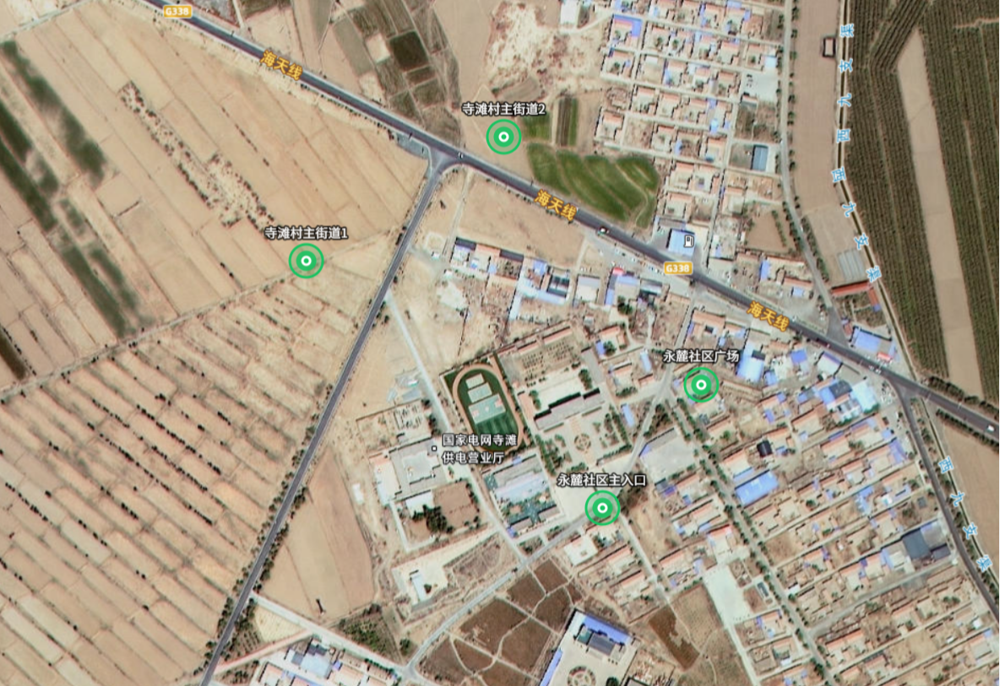
  

- 标注说明：
  ① 顶部设备统计：总数、在线率、在线数，点击可显示视频点位地图，点击地图点位显示单个视频弹窗
  ② "视频整合面板"按钮：点击打开多路视频查看弹窗
  ③ 中部设备分布：按主干道、村口、广场、其他分类统计
  ④ 底部异常设备告警：显示离线或信号弱的设备

---

##### 需要的数据

**面板数据：**

| 序号 | 数据项名称 | 必填/选填 | 数据说明/口径 | 是否能提供 | 备注 |
|------|------------|-----------|---------------|------------|------|
| 1 | 设备总数 | [x]必填 [ ]选填 | 监控摄像头总数量 | [ ]能 [ ]部分能 [ ]不能 |  |
| 2 | 在线率 | [x]必填 [ ]选填 | 在线设备数/总设备数×100% | [ ]能 [ ]部分能 [ ]不能 |  |
| 3 | 在线设备数 | [x]必填 [ ]选填 | 当前在线的设备数量 | [ ]能 [ ]部分能 [ ]不能 |  |
| 4 | 按位置分布 | [x]必填 [ ]选填 | 主干道、村口、广场、其他各类型数量 | [ ]能 [ ]部分能 [ ]不能 |  |
| 5 | 异常设备列表 | [x]必填 [ ]选填 | 离线/信号弱设备的名称、原因、持续时间 | [ ]能 [ ]部分能 [ ]不能 |  |

**地图图层数据：**

| 序号 | 数据项名称 | 必填/选填 | 数据说明/口径 | 是否能提供 | 备注 |
|------|------------|-----------|---------------|------------|------|
| 1 | 设备坐标 | [x]必填 [ ]选填 | 每个监控设备的经纬度 | [ ]能 [ ]部分能 [ ]不能 | 用于地图标点 |
| 2 | 设备状态 | [x]必填 [ ]选填 | 在线/离线/信号弱 | [ ]能 [ ]部分能 [ ]不能 | 用于标点颜色 |
| 3 | 设备名称 | [x]必填 [ ]选填 | 监控点名称 | [ ]能 [ ]部分能 [ ]不能 | 用于地图标点 |

**地图弹窗数据：**

| 序号 | 数据项名称 | 必填/选填 | 数据说明/口径 | 是否能提供 | 备注 |
|------|------------|-----------|---------------|------------|------|
| 1 | 设备详情 | [x]必填 [ ]选填 | 设备名称、位置、类型、安装日期 | [ ]能 [ ]部分能 [ ]不能 | 点击点位弹窗显示 |
| 2 | 实时视频流 | [ ]必填 [x]选填 | 设备的实时视频画面URL/RTSP地址 | [ ]能 [ ]部分能 [ ]不能 | 需对接视频平台 |

---

##### 确认项
- 功能是否需要： [ ] 需要  [ ] 不需要（原因：                ）
- 展示内容是否符合： [ ] 符合  [ ] 需调整（写明调整点：                ）
- 数据整体是否可落地： [ ] 可落地  [ ] 有风险（风险点：                ）

---

#### 5.2.5 功能名称：`重点人群`（所属模块：`联村共治`）

**这页用来干啥（1句话）：**
展示重点关注人员分类统计、村庄分布，支持筛选查看人员名单和地图定位。

---

##### 页面展示内容

- 系统界面：
  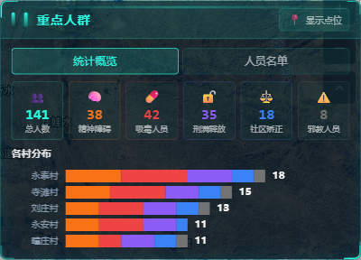
  
  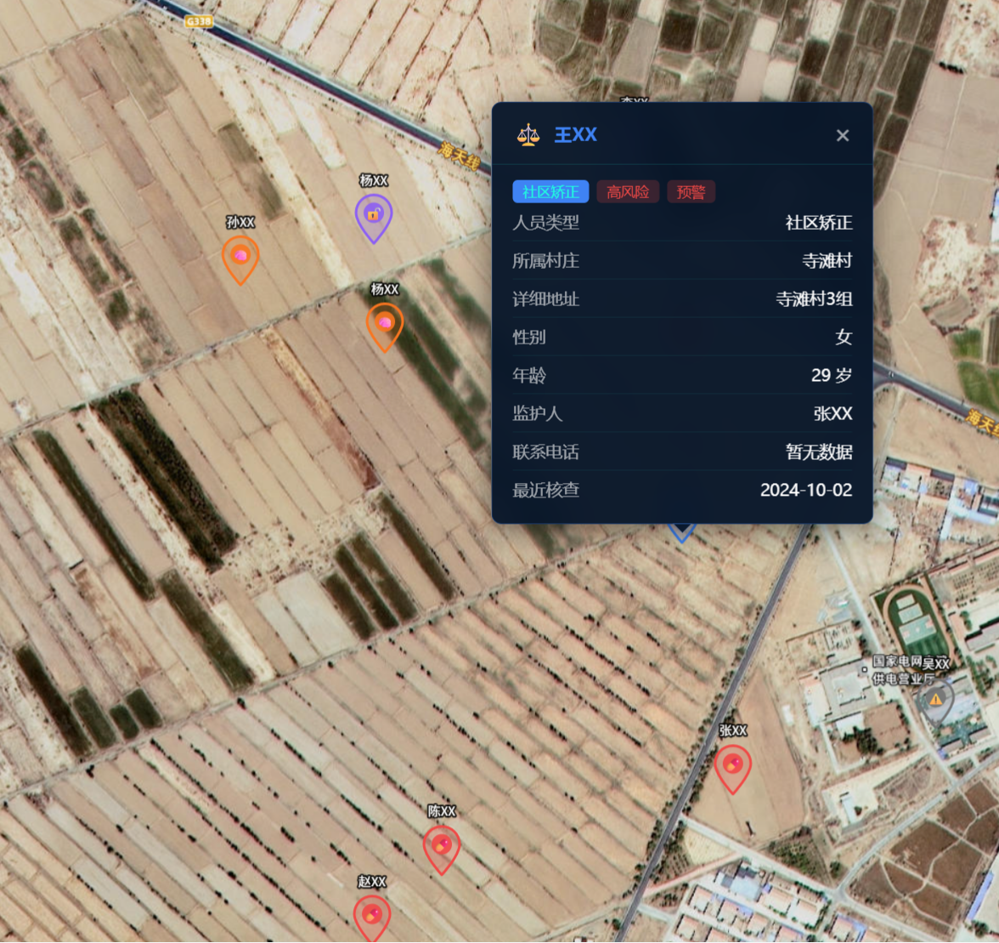

- 标注说明：
  ① Tab切换：统计概览/人员名单两个视图
  ② 统计卡片：总人数及各类型（精神障碍、吸毒人员、刑满释放、社区矫正、涉邪人员）数量
  ③ 各村分布：横向堆叠条形图展示各村各类型人数
  ④ 人员名单：支持按类型、村庄、风险等级筛选，点击定位图标可在地图定位

---

##### 需要的数据

**面板数据：**

| 序号 | 数据项名称 | 必填/选填 | 数据说明/口径 | 是否能提供 | 备注 |
|------|------------|-----------|---------------|------------|------|
| 1 | 重点人员总数 | [x]必填 [ ]选填 | 所有重点关注人员数量 | [ ]能 [ ]部分能 [ ]不能 |  |
| 2 | 分类统计 | [x]必填 [ ]选填 | 精神障碍、吸毒、刑满释放、社区矫正、涉邪各类型人数 | [ ]能 [ ]部分能 [ ]不能 |  |
| 3 | 各村分布统计 | [x]必填 [ ]选填 | 每个村各类型人员数量 | [ ]能 [ ]部分能 [ ]不能 |  |
| 4 | 人员名单 | [x]必填 [ ]选填 | 姓名、类型、所属村、风险等级 | [ ]能 [ ]部分能 [ ]不能 | 需脱敏处理 |
| 5 | 风险等级 | [x]必填 [ ]选填 | 高/中/低三级分类 | [ ]能 [ ]部分能 [ ]不能 |  |

**地图图层数据：**

| 序号 | 数据项名称 | 必填/选填 | 数据说明/口径 | 是否能提供 | 备注 |
|------|------------|-----------|---------------|------------|------|
| 1 | 人员位置坐标 | [x]必填 [ ]选填 | 人员居住地经纬度 | [ ]能 [ ]部分能 [ ]不能 | 用于地图标点 |
| 2 | 人员类型 | [x]必填 [ ]选填 | 用于区分标点颜色/图标 | [ ]能 [ ]部分能 [ ]不能 | 用于地图图层 |

**地图弹窗数据：**

| 序号 | 数据项名称 | 必填/选填 | 数据说明/口径 | 是否能提供 | 备注 |
|------|------------|-----------|---------------|------------|------|
| 1 | 人员基本信息 | [x]必填 [ ]选填 | 姓名（脱敏）、类型、村庄、风险等级 | [ ]能 [ ]部分能 [ ]不能 | 点击点位弹窗显示 |
| 2 | 管控责任人 | [ ]必填 [x]选填 | 负责网格员姓名、联系方式 | [ ]能 [ ]部分能 [ ]不能 | 点击点位弹窗显示 |

---

##### 确认项
- 功能是否需要： [ ] 需要  [ ] 不需要（原因：                ）
- 展示内容是否符合： [ ] 符合  [ ] 需调整（写明调整点：                ）
- 数据整体是否可落地： [ ] 可落地  [ ] 有风险（风险点：                ）

---

#### 5.2.6 功能名称：`典型案例`（所属模块：`联村共治`）

**这页用来干啥（1句话）：**
展示治理典型人物、治理成效对比和民生故事，宣传联村共治工作成果。

---

##### 页面展示内容

- 系统界面：
  

- 标注说明：
  ① 典型人物轮播：展示养殖能手、巾帼先锋等典型人物事迹
  ② 治理成效对比：人均收入、就业率、调解率的前后对比
  ③ 民生故事滚动：展示搬迁群众的生活改善故事

---

##### 需要的数据

| 序号 | 数据项名称 | 必填/选填 | 数据说明/口径 | 是否能提供 | 备注 |
|------|------------|-----------|---------------|------------|------|
| 1 | 典型人物列表 | [x]必填 [ ]选填 | 姓名、头像/图标、标签、事迹简介 | [ ]能 [ ]部分能 [ ]不能 |  |
| 2 | 人均收入对比 | [x]必填 [ ]选填 | 搬迁前后人均收入数值 | [ ]能 [ ]部分能 [ ]不能 |  |
| 3 | 就业率对比 | [x]必填 [ ]选填 | 搬迁前后就业率百分比 | [ ]能 [ ]部分能 [ ]不能 |  |
| 4 | 调解成功率对比 | [x]必填 [ ]选填 | 搬迁前后纠纷调解成功率 | [ ]能 [ ]部分能 [ ]不能 |  |
| 5 | 民生故事列表 | [x]必填 [ ]选填 | 图标、故事文案（30字左右） | [ ]能 [ ]部分能 [ ]不能 |  |

---

##### 确认项
- 功能是否需要： [ ] 需要  [ ] 不需要（原因：                ）
- 展示内容是否符合： [ ] 符合  [ ] 需调整（写明调整点：                ）
- 数据整体是否可落地： [ ] 可落地  [ ] 有风险（风险点：                ）

---

### 5.3 宜居乡村模块

#### 5.3.1 功能名称：`生态资源`（所属模块：`宜居乡村`）

**这页用来干啥（1句话）：**
展示乡镇林地、水资源、保护区等生态资源核心指标和森林覆盖率。

---

##### 页面展示内容

- 系统界面：
  
  

- 标注说明：
  ① 顶部3个核心指标卡片：林地面积、水资源、保护区面积
  ② 中部显示森林覆盖率进度条
  ③ 底部"查看生态地图"按钮，可切换地图上的生态资源图层

---

##### 需要的数据

**面板数据：**

| 序号 | 数据项名称 | 必填/选填 | 数据说明/口径 | 是否能提供 | 备注 |
|------|------------|-----------|---------------|------------|------|
| 1 | 林地面积 | [x]必填 [ ]选填 | 乡镇林地总面积，单位万亩 | [ ]能 [ ]部分能 [ ]不能 |  |
| 2 | 水资源总量 | [x]必填 [ ]选填 | 年径流量或可用水资源，单位万立方米 | [ ]能 [ ]部分能 [ ]不能 |  |
| 3 | 保护区面积 | [x]必填 [ ]选填 | 自然保护区或生态保护红线区面积，单位公顷 | [ ]能 [ ]部分能 [ ]不能 |  |
| 4 | 森林覆盖率 | [x]必填 [ ]选填 | 森林覆盖面积占国土面积的百分比 | [ ]能 [ ]部分能 [ ]不能 |  |

**地图图层数据（生态资源点位）：**

| 序号 | 数据项名称 | 必填/选填 | 数据说明/口径 | 是否能提供 | 备注 |
|------|------------|-----------|---------------|------------|------|
| 1 | 资源名称 | [x]必填 [ ]选填 | 如"寿鹿山国家森林公园" | [ ]能 [ ]部分能 [ ]不能 | 用于地图标点 |
| 2 | 资源类型 | [x]必填 [ ]选填 | 林地/水域/保护区/湿地 | [ ]能 [ ]部分能 [ ]不能 | 用于图标区分 |
| 3 | 资源坐标 | [x]必填 [ ]选填 | 经纬度，用于地图标点 | [ ]能 [ ]部分能 [ ]不能 | 用于地图图层 |
| 4 | 资源面积 | [ ]必填 [x]选填 | 该资源的覆盖面积 | [ ]能 [ ]部分能 [ ]不能 | 用于地图弹窗 |
| 5 | 资源描述 | [ ]必填 [x]选填 | 资源的简要说明 | [ ]能 [ ]部分能 [ ]不能 | 用于地图弹窗 |

---

##### 确认项
- 功能是否需要： [ ] 需要  [ ] 不需要（原因：                ）
- 展示内容是否符合： [ ] 符合  [ ] 需调整（写明调整点：                ）
- 数据整体是否可落地： [ ] 可落地  [ ] 有风险（风险点：                ）

---

#### 5.3.2 功能名称：`居住点分布`（所属模块：`宜居乡村`）

**这页用来干啥（1句话）：**
展示乡镇居住点总户数、人口、登记率，以及各村居住点分布情况。

---

##### 页面展示内容

- 系统界面：
  
  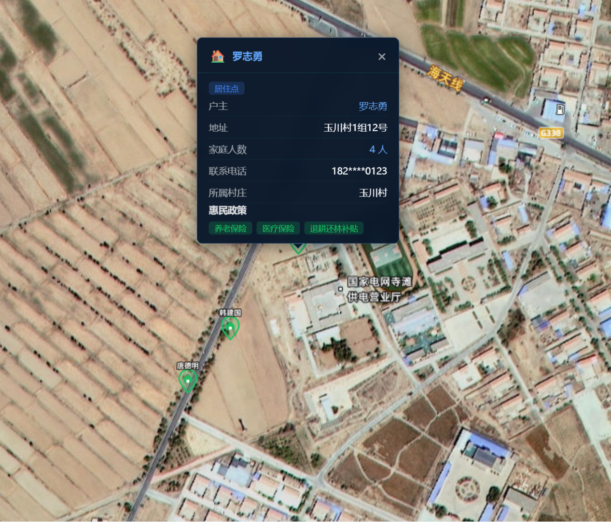

- 标注说明：
  ① 顶部4个核心指标：总户数、总人口、登记率、户均人口（点击可切换地图图层）
  ② 中部各村居住点分布条形图，显示户数和人口
  ③ 底部提示：点击地图上的居住点可查看住户详细信息

---

##### 需要的数据

**面板数据：**

| 序号 | 数据项名称 | 必填/选填 | 数据说明/口径 | 是否能提供 | 备注 |
|------|------------|-----------|---------------|------------|------|
| 1 | 总户数 | [x]必填 [ ]选填 | 乡镇总户籍数 | [ ]能 [ ]部分能 [ ]不能 |  |
| 2 | 总人口 | [x]必填 [ ]选填 | 乡镇户籍总人口 | [ ]能 [ ]部分能 [ ]不能 |  |
| 3 | 登记率 | [x]必填 [ ]选填 | 已登记户数/总户数的百分比 | [ ]能 [ ]部分能 [ ]不能 |  |
| 4 | 户均人口 | [x]必填 [ ]选填 | 平均每户人口数 | [ ]能 [ ]部分能 [ ]不能 |  |
| 5 | 各村户数 | [x]必填 [ ]选填 | 每个村的总户数 | [ ]能 [ ]部分能 [ ]不能 | 用于条形图 |
| 6 | 各村人口 | [x]必填 [ ]选填 | 每个村的总人口 | [ ]能 [ ]部分能 [ ]不能 | 用于条形图 |
| 7 | 各村已登记户数 | [x]必填 [ ]选填 | 每个村已登记的户数 | [ ]能 [ ]部分能 [ ]不能 |  |

**地图图层数据（居住点位置）：**

| 序号 | 数据项名称 | 必填/选填 | 数据说明/口径 | 是否能提供 | 备注 |
|------|------------|-----------|---------------|------------|------|
| 1 | 居住点坐标 | [x]必填 [ ]选填 | 每户居住点的经纬度 | [ ]能 [ ]部分能 [ ]不能 | 用于地图标点 |
| 2 | 所属村庄 | [x]必填 [ ]选填 | 居住点所属的行政村 | [ ]能 [ ]部分能 [ ]不能 | 用于筛选 |

**地图弹窗数据（住户详情）：**

| 序号 | 数据项名称 | 必填/选填 | 数据说明/口径 | 是否能提供 | 备注 |
|------|------------|-----------|---------------|------------|------|
| 1 | 户主姓名 | [x]必填 [ ]选填 | 户主姓名（需脱敏处理） | [ ]能 [ ]部分能 [ ]不能 | 点击标点弹窗显示 |
| 2 | 家庭人数 | [x]必填 [ ]选填 | 该户家庭成员数量 | [ ]能 [ ]部分能 [ ]不能 | 点击标点弹窗显示 |
| 3 | 详细地址 | [x]必填 [ ]选填 | 如"宽沟村1组12号" | [ ]能 [ ]部分能 [ ]不能 | 点击标点弹窗显示 |
| 4 | 联系电话 | [ ]必填 [x]选填 | 户主联系方式（需脱敏） | [ ]能 [ ]部分能 [ ]不能 | 点击标点弹窗显示 |
| 5 | 享受惠民政策 | [ ]必填 [x]选填 | 该户享受的补贴政策列表 | [ ]能 [ ]部分能 [ ]不能 | 点击标点弹窗显示 |

---

##### 确认项
- 功能是否需要： [ ] 需要  [ ] 不需要（原因：                ）
- 展示内容是否符合： [ ] 符合  [ ] 需调整（写明调整点：                ）
- 数据整体是否可落地： [ ] 可落地  [ ] 有风险（风险点：                ）

---

#### 5.3.3 功能名称：`人居环境`（所属模块：`宜居乡村`）

**这页用来干啥（1句话）：**
展示"八改"工程成效、人居环境整治前后对比和示范创建成果。

---

##### 页面展示内容

- 系统界面：
  

- 标注说明：
  ① 顶部"八改"工程成效：改造农宅、改厕、绿化、道路四项指标
  ② 中部整治前后对比：道路硬化、垃圾分类、污水处理、绿化覆盖的提升百分比
  ③ 底部示范创建成果：示范村、和美乡村、国家传统村落数量

---

##### 需要的数据

| 序号 | 数据项名称 | 必填/选填 | 数据说明/口径 | 是否能提供 | 备注 |
|------|------------|-----------|---------------|------------|------|
| 1 | 改造农宅数量 | [x]必填 [ ]选填 | 已完成改造的农宅（院）数量 | [ ]能 [ ]部分能 [ ]不能 |  |
| 2 | 改厕数量 | [x]必填 [ ]选填 | 已完成改厕的座数 | [ ]能 [ ]部分能 [ ]不能 |  |
| 3 | 绿化面积 | [x]必填 [ ]选填 | 绿化面积，单位亩 | [ ]能 [ ]部分能 [ ]不能 |  |
| 4 | 村组道路里程 | [x]必填 [ ]选填 | 村组道路总长度，单位公里 | [ ]能 [ ]部分能 [ ]不能 |  |
| 5 | 道路硬化率（整治前） | [x]必填 [ ]选填 | 整治前道路硬化率百分比 | [ ]能 [ ]部分能 [ ]不能 | 用于对比图 |
| 6 | 道路硬化率（整治后） | [x]必填 [ ]选填 | 整治后道路硬化率百分比 | [ ]能 [ ]部分能 [ ]不能 | 用于对比图 |
| 7 | 垃圾分类率（整治前） | [x]必填 [ ]选填 | 整治前垃圾分类覆盖率 | [ ]能 [ ]部分能 [ ]不能 | 用于对比图 |
| 8 | 垃圾分类率（整治后） | [x]必填 [ ]选填 | 整治后垃圾分类覆盖率 | [ ]能 [ ]部分能 [ ]不能 | 用于对比图 |
| 9 | 污水处理率（整治前） | [x]必填 [ ]选填 | 整治前污水处理覆盖率 | [ ]能 [ ]部分能 [ ]不能 | 用于对比图 |
| 10 | 污水处理率（整治后） | [x]必填 [ ]选填 | 整治后污水处理覆盖率 | [ ]能 [ ]部分能 [ ]不能 | 用于对比图 |
| 11 | 绿化覆盖率（整治前） | [x]必填 [ ]选填 | 整治前绿化覆盖率 | [ ]能 [ ]部分能 [ ]不能 | 用于对比图 |
| 12 | 绿化覆盖率（整治后） | [x]必填 [ ]选填 | 整治后绿化覆盖率 | [ ]能 [ ]部分能 [ ]不能 | 用于对比图 |
| 13 | 示范村数量 | [x]必填 [ ]选填 | 各级示范村数量 | [ ]能 [ ]部分能 [ ]不能 |  |
| 14 | 和美乡村数量 | [x]必填 [ ]选填 | 省市级和美乡村数量 | [ ]能 [ ]部分能 [ ]不能 |  |
| 15 | 国家传统村落数量 | [x]必填 [ ]选填 | 入选国家传统村落名录的村庄数 | [ ]能 [ ]部分能 [ ]不能 |  |

---

##### 确认项
- 功能是否需要： [ ] 需要  [ ] 不需要（原因：                ）
- 展示内容是否符合： [ ] 符合  [ ] 需调整（写明调整点：                ）
- 数据整体是否可落地： [ ] 可落地  [ ] 有风险（风险点：                ）

---

#### 5.3.4 功能名称：`曝光公示`（所属模块：`宜居乡村`）

**这页用来干啥（1句话）：**
展示本月曝光问题统计、整改情况，以及曝光问题滚动列表。

---

##### 页面展示内容

- 系统界面：
  
  

- 标注说明：
  ① 顶部统计栏：本月曝光件数、已整改件数、整改率
  ② 曝光列表无缝滚动，显示问题标题、状态（待整改/整改中/已整改）、日期
  ③ 点击列表项可弹窗查看曝光详情和前后对比照片

---

##### 需要的数据

| 序号 | 数据项名称 | 必填/选填 | 数据说明/口径 | 是否能提供 | 备注 |
|------|------------|-----------|---------------|------------|------|
| 1 | 本月曝光总数 | [x]必填 [ ]选填 | 当月曝光的问题总数 | [ ]能 [ ]部分能 [ ]不能 | 随手拍数据 |
| 2 | 已整改数量 | [x]必填 [ ]选填 | 当月已完成整改的问题数 | [ ]能 [ ]部分能 [ ]不能 | 随手拍数据 |
| 3 | 整改率 | [x]必填 [ ]选填 | 已整改数/曝光总数×100% | [ ]能 [ ]部分能 [ ]不能 | 随手拍数据 |
| 4 | 曝光标题 | [x]必填 [ ]选填 | 问题的简短标题 | [ ]能 [ ]部分能 [ ]不能 | 随手拍数据 |
| 5 | 问题位置 | [x]必填 [ ]选填 | 问题发生的具体位置 | [ ]能 [ ]部分能 [ ]不能 | 随手拍数据 |
| 6 | 问题类型 | [x]必填 [ ]选填 | 环境/违建/卫生/其他 | [ ]能 [ ]部分能 [ ]不能 | 随手拍数据 |
| 7 | 整改状态 | [x]必填 [ ]选填 | 待整改/整改中/已整改 | [ ]能 [ ]部分能 [ ]不能 | 随手拍数据 |
| 8 | 曝光日期 | [x]必填 [ ]选填 | 问题曝光的日期 | [ ]能 [ ]部分能 [ ]不能 | 随手拍数据 |
| 9 | 整改日期 | [ ]必填 [x]选填 | 问题整改完成的日期 | [ ]能 [ ]部分能 [ ]不能 | 随手拍数据 |
| 10 | 问题描述 | [x]必填 [ ]选填 | 问题的详细说明 | [ ]能 [ ]部分能 [ ]不能 | 随手拍数据，用于详情弹窗 |
| 11 | 曝光前照片 | [ ]必填 [x]选填 | 问题现场照片 | [ ]能 [ ]部分能 [ ]不能 | 随手拍数据，用于详情弹窗 |
| 12 | 整改后照片 | [ ]必填 [x]选填 | 整改完成后的照片 | [ ]能 [ ]部分能 [ ]不能 | 随手拍数据，用于详情弹窗 |

---

##### 确认项
- 功能是否需要： [ ] 需要  [ ] 不需要（原因：                ）
- 展示内容是否符合： [ ] 符合  [ ] 需调整（写明调整点：                ）
- 数据整体是否可落地： [ ] 可落地  [ ] 有风险（风险点：                ）

---

#### 5.3.5 功能名称：`应急减灾`（所属模块：`宜居乡村`）

**这页用来干啥（1句话）：**
展示乡镇应急资源（避难场所、广播终端、救援队伍）和近期应急事件。

---

##### 页面展示内容

- 系统界面：
  
  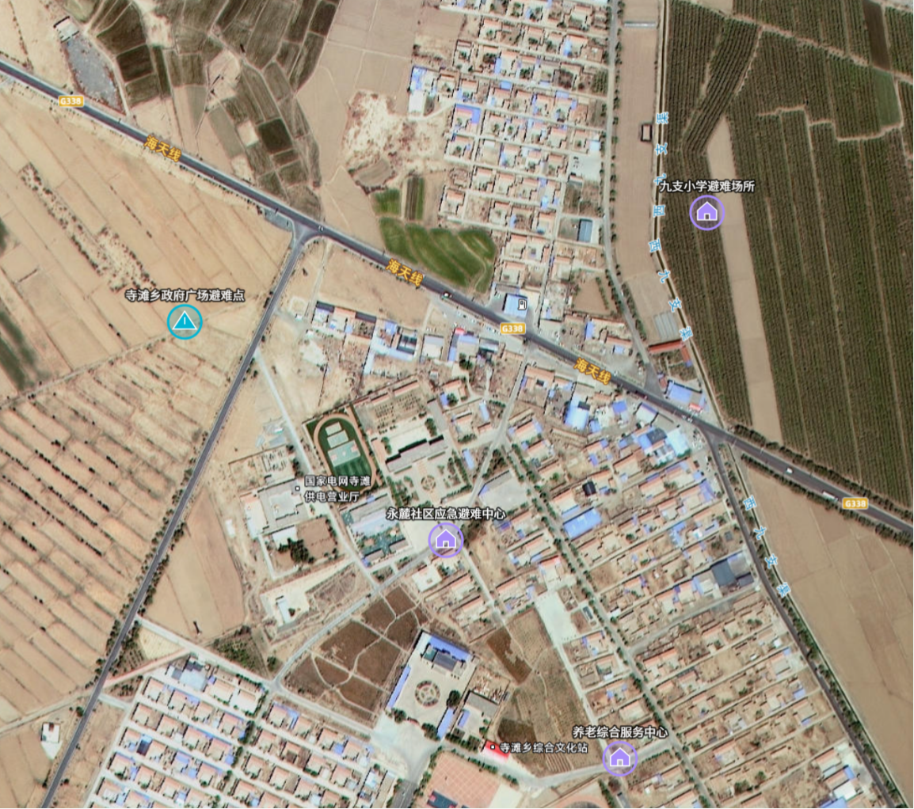
  

- 标注说明：
  ① 顶部应急资源卡片：避难场所、广播终端（含在线数/覆盖率/今日播报）、救援队伍、应急志愿者
  ② 避难场所和广播终端卡片可点击切换地图图层
  ③ 近期事件列表：展示搬迁、演练、检查、升级等应急相关事件
  ④ 底部主要灾害类型提示

---

##### 需要的数据

**面板数据：**

| 序号 | 数据项名称 | 必填/选填 | 数据说明/口径 | 是否能提供 | 备注 |
|------|------------|-----------|---------------|------------|------|
| 1 | 避难场所数量 | [x]必填 [ ]选填 | 乡镇应急避难场所总数 | [ ]能 [ ]部分能 [ ]不能 |  |
| 2 | 广播终端总数 | [x]必填 [ ]选填 | 乡村广播终端设备数量 | [ ]能 [ ]部分能 [ ]不能 |  |
| 3 | 在线广播终端数 | [x]必填 [ ]选填 | 当前在线的广播终端数 | [ ]能 [ ]部分能 [ ]不能 |  |
| 4 | 广播覆盖率 | [x]必填 [ ]选填 | 广播信号覆盖范围占比 | [ ]能 [ ]部分能 [ ]不能 |  |
| 5 | 今日播报次数 | [ ]必填 [x]选填 | 当日广播播报的次数 | [ ]能 [ ]部分能 [ ]不能 |  |
| 6 | 救援队伍数量 | [x]必填 [ ]选填 | 乡镇救援队伍数量 | [ ]能 [ ]部分能 [ ]不能 |  |
| 7 | 应急志愿者人数 | [x]必填 [ ]选填 | 注册应急志愿者总数 | [ ]能 [ ]部分能 [ ]不能 |  |
| 8 | 主要灾害类型 | [x]必填 [ ]选填 | 乡镇面临的主要自然灾害 | [ ]能 [ ]部分能 [ ]不能 |  |
| 9 | 近期事件列表 | [x]必填 [ ]选填 | 事件标题、类型、日期、描述 | [ ]能 [ ]部分能 [ ]不能 |  |

**地图图层数据（广播终端）：**

| 序号 | 数据项名称 | 必填/选填 | 数据说明/口径 | 是否能提供 | 备注 |
|------|------------|-----------|---------------|------------|------|
| 1 | 终端名称 | [x]必填 [ ]选填 | 广播站点名称 | [ ]能 [ ]部分能 [ ]不能 | 用于地图标点 |
| 2 | 终端坐标 | [x]必填 [ ]选填 | 广播终端经纬度 | [ ]能 [ ]部分能 [ ]不能 | 用于地图图层 |
| 3 | 终端状态 | [x]必填 [ ]选填 | 在线/离线/维护中 | [ ]能 [ ]部分能 [ ]不能 | 用于标点颜色 |
| 4 | 覆盖范围 | [ ]必填 [x]选填 | 该终端的信号覆盖范围 | [ ]能 [ ]部分能 [ ]不能 | 用于地图弹窗 |
| 5 | 安装日期 | [ ]必填 [x]选填 | 终端安装时间 | [ ]能 [ ]部分能 [ ]不能 | 用于地图弹窗 |

**地图图层数据（避难场所）：**

| 序号 | 数据项名称 | 必填/选填 | 数据说明/口径 | 是否能提供 | 备注 |
|------|------------|-----------|---------------|------------|------|
| 1 | 场所名称 | [x]必填 [ ]选填 | 避难场所名称 | [ ]能 [ ]部分能 [ ]不能 | 用于地图标点 |
| 2 | 场所坐标 | [x]必填 [ ]选填 | 避难场所经纬度 | [ ]能 [ ]部分能 [ ]不能 | 用于地图图层 |
| 3 | 场所类型 | [x]必填 [ ]选填 | 室内/室外 | [ ]能 [ ]部分能 [ ]不能 | 用于图标区分 |
| 4 | 容纳人数 | [x]必填 [ ]选填 | 场所最大容纳人数 | [ ]能 [ ]部分能 [ ]不能 | 用于地图弹窗 |
| 5 | 配套设施 | [ ]必填 [x]选填 | 应急物资、医疗点、发电机等 | [ ]能 [ ]部分能 [ ]不能 | 用于地图弹窗 |
| 6 | 联系电话 | [ ]必填 [x]选填 | 场所联系方式 | [ ]能 [ ]部分能 [ ]不能 | 用于地图弹窗 |

---

##### 确认项
- 功能是否需要： [ ] 需要  [ ] 不需要（原因：                ）
- 展示内容是否符合： [ ] 符合  [ ] 需调整（写明调整点：                ）
- 数据整体是否可落地： [ ] 可落地  [ ] 有风险（风险点：                ）

---

### 5.4 信息惠民模块

#### 5.4.1 功能名称：`数字便民`（所属模块：`信息惠民`）

**这页用来干啥（1句话）：**
展示便民服务网点分布、办理量统计及数字化效率提升成效。

---

##### 页面展示内容

- 系统界面：
  
  

- 标注说明：
  ① 顶部4个核心指标：服务网点数、月办理量、平均时长、满意度（点击可切换服务网点图层）
  ② 中部办理量趋势图，显示近12个月办理量变化及年增长率
  ③ 底部效率提升对比，展示数字化前后各项业务办理时长变化

---

##### 需要的数据

**面板数据：**

| 序号 | 数据项名称 | 必填/选填 | 数据说明/口径 | 是否能提供 | 备注 |
|------|------------|-----------|---------------|------------|------|
| 1 | 服务网点总数 | [x]必填 [ ]选填 | 便民服务点总数量 | [ ]能 [ ]部分能 [ ]不能 |  |
| 2 | 月办理量 | [x]必填 [ ]选填 | 当月办理业务总数量 | [ ]能 [ ]部分能 [ ]不能 |  |
| 3 | 平均办理时长 | [x]必填 [ ]选填 | 办理一项业务的平均耗时（分钟） | [ ]能 [ ]部分能 [ ]不能 |  |
| 4 | 满意度 | [x]必填 [ ]选填 | 群众满意度评分百分比 | [ ]能 [ ]部分能 [ ]不能 |  |
| 5 | 年增长率 | [ ]必填 [x]选填 | 办理量同比增长率 | [ ]能 [ ]部分能 [ ]不能 |  |
| 6 | 近12个月办理量 | [x]必填 [ ]选填 | 每月办理量，用于趋势图 | [ ]能 [ ]部分能 [ ]不能 | 用于趋势图 |
| 7 | 户籍办理时长（数字化前） | [x]必填 [ ]选填 | 数字化前户籍业务办理时长 | [ ]能 [ ]部分能 [ ]不能 | 用于效率对比 |
| 8 | 户籍办理时长（数字化后） | [x]必填 [ ]选填 | 数字化后户籍业务办理时长 | [ ]能 [ ]部分能 [ ]不能 | 用于效率对比 |
| 9 | 社保查询时长（数字化前） | [x]必填 [ ]选填 | 数字化前社保查询时长 | [ ]能 [ ]部分能 [ ]不能 | 用于效率对比 |
| 10 | 社保查询时长（数字化后） | [x]必填 [ ]选填 | 数字化后社保查询时长 | [ ]能 [ ]部分能 [ ]不能 | 用于效率对比 |
| 11 | 证明开具时长（数字化前） | [x]必填 [ ]选填 | 数字化前证明开具时长 | [ ]能 [ ]部分能 [ ]不能 | 用于效率对比 |
| 12 | 证明开具时长（数字化后） | [x]必填 [ ]选填 | 数字化后证明开具时长 | [ ]能 [ ]部分能 [ ]不能 | 用于效率对比 |
| 13 | 低保申请时长（数字化前） | [x]必填 [ ]选填 | 数字化前低保申请时长 | [ ]能 [ ]部分能 [ ]不能 | 用于效率对比 |
| 14 | 低保申请时长（数字化后） | [x]必填 [ ]选填 | 数字化后低保申请时长 | [ ]能 [ ]部分能 [ ]不能 | 用于效率对比 |
| 15 | 医保报销时长（数字化前） | [x]必填 [ ]选填 | 数字化前医保报销时长 | [ ]能 [ ]部分能 [ ]不能 | 用于效率对比 |
| 16 | 医保报销时长（数字化后） | [x]必填 [ ]选填 | 数字化后医保报销时长 | [ ]能 [ ]部分能 [ ]不能 | 用于效率对比 |

**地图图层数据（便民网点）：**

| 序号 | 数据项名称 | 必填/选填 | 数据说明/口径 | 是否能提供 | 备注 |
|------|------------|-----------|---------------|------------|------|
| 1 | 网点名称 | [x]必填 [ ]选填 | 便民服务点名称 | [ ]能 [ ]部分能 [ ]不能 | 用于地图标点 |
| 2 | 网点坐标 | [x]必填 [ ]选填 | 网点经纬度 | [ ]能 [ ]部分能 [ ]不能 | 用于地图图层 |
| 3 | 网点类型 | [x]必填 [ ]选填 | 政务服务中心/村级代办点/商业网点 | [ ]能 [ ]部分能 [ ]不能 | 用于图标区分 |
| 4 | 网点地址 | [x]必填 [ ]选填 | 网点详细地址 | [ ]能 [ ]部分能 [ ]不能 | 用于地图弹窗 |
| 5 | 可办服务事项 | [x]必填 [ ]选填 | 该网点可办理的业务列表 | [ ]能 [ ]部分能 [ ]不能 | 用于地图弹窗 |
| 6 | 营业时间 | [ ]必填 [x]选填 | 网点营业时间 | [ ]能 [ ]部分能 [ ]不能 | 用于地图弹窗 |
| 7 | 联系电话 | [ ]必填 [x]选填 | 网点联系方式 | [ ]能 [ ]部分能 [ ]不能 | 用于地图弹窗 |

---

##### 确认项
- 功能是否需要： [ ] 需要  [ ] 不需要（原因：                ）
- 展示内容是否符合： [ ] 符合  [ ] 需调整（写明调整点：                ）
- 数据整体是否可落地： [ ] 可落地  [ ] 有风险（风险点：                ）

---

#### 5.4.2 功能名称：`服务指南`（所属模块：`信息惠民`）

**这页用来干啥（1句话）：**
展示便民服务分类和热门办事事项排行，点击可查看办理详情。

---

##### 页面展示内容

- 系统界面：
  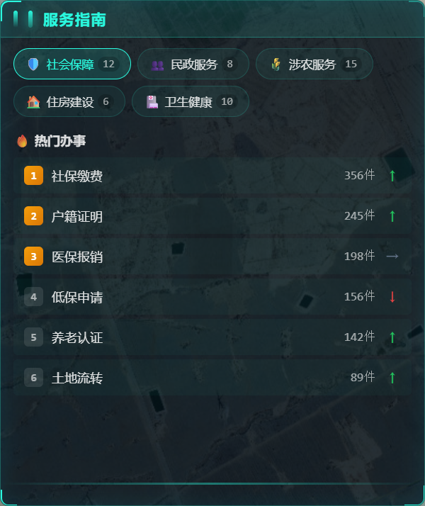
  

- 标注说明：
  ① 顶部服务分类标签：社会保障、民政服务、涉农服务、住房建设、卫生健康
  ② 热门办事排行榜：显示办理量Top6事项及趋势
  ③ 点击事项可弹出详情：显示所需材料、办理条件、办理流程

---

##### 需要的数据

| 序号 | 数据项名称 | 必填/选填 | 数据说明/口径 | 是否能提供 | 备注 |
|------|------------|-----------|---------------|------------|------|
| 1 | 事项名称 | [x]必填 [ ]选填 | 热门办事事项名称 | [ ]能 [ ]部分能 [ ]不能 | 用于排行榜 |
| 2 | 事项办理量 | [x]必填 [ ]选填 | 该事项当月办理数量 | [ ]能 [ ]部分能 [ ]不能 | 用于排行榜 |
| 3 | 办理量趋势 | [ ]必填 [x]选填 | 上升/下降/持平 | [ ]能 [ ]部分能 [ ]不能 | 用于趋势箭头 |
| 4 | 事项所需材料 | [x]必填 [ ]选填 | 办理该事项需要准备的材料清单 | [ ]能 [ ]部分能 [ ]不能 | 用于详情弹窗 |
| 5 | 事项办理条件 | [x]必填 [ ]选填 | 办理该事项需满足的条件 | [ ]能 [ ]部分能 [ ]不能 | 用于详情弹窗 |
| 6 | 事项办理流程 | [x]必填 [ ]选填 | 办理流程步骤说明 | [ ]能 [ ]部分能 [ ]不能 | 用于详情弹窗 |
| 7 | 平均办理时长 | [ ]必填 [x]选填 | 该事项平均办理耗时 | [ ]能 [ ]部分能 [ ]不能 | 用于详情弹窗 |

---

##### 确认项
- 功能是否需要： [ ] 需要  [ ] 不需要（原因：                ）
- 展示内容是否符合： [ ] 符合  [ ] 需调整（写明调整点：                ）
- 数据整体是否可落地： [ ] 可落地  [ ] 有风险（风险点：                ）

---

#### 5.4.3 功能名称：`养老服务`（所属模块：`信息惠民`）

**这页用来干啥（1句话）：**
展示乡镇65岁以上老年人口统计、健康状况、智能监测和养老补贴政策。

---

##### 页面展示内容

- 系统界面：
  
  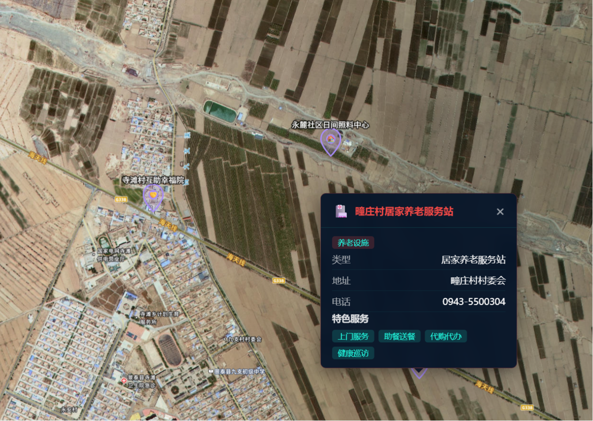

- 标注说明：
  ① 顶部老年人口概览：总人数、占比、体检完成率、养老保障覆盖率（点击可切换养老设施图层）
  ② 左中健康状况饼图：健康/亚健康/需护理分布
  ③ 右中年龄分布条形图：65-69岁、70-79岁、80-89岁、90岁以上
  ④ 智能监测卡片：设备数、在线数、告警数
  ⑤ 服务动态卡片：今日上门服务数、本周活动数

---

##### 需要的数据

**面板数据：**

| 序号 | 数据项名称 | 必填/选填 | 数据说明/口径 | 是否能提供 | 备注 |
|------|------------|-----------|---------------|------------|------|
| 1 | 65岁以上老人总数 | [x]必填 [ ]选填 | 65岁及以上老年人口数量 | [ ]能 [ ]部分能 [ ]不能 |  |
| 2 | 老年人口占比 | [x]必填 [ ]选填 | 老年人口占总人口的百分比 | [ ]能 [ ]部分能 [ ]不能 |  |
| 3 | 体检完成率 | [x]必填 [ ]选填 | 已完成年度体检的老人占比 | [ ]能 [ ]部分能 [ ]不能 |  |
| 4 | 养老保障覆盖率 | [x]必填 [ ]选填 | 享受养老保险的老人占比 | [ ]能 [ ]部分能 [ ]不能 |  |
| 5 | 健康老人数量 | [x]必填 [ ]选填 | 健康状况良好的老人数 | [ ]能 [ ]部分能 [ ]不能 | 用于饼图 |
| 6 | 亚健康老人数量 | [x]必填 [ ]选填 | 亚健康状态的老人数 | [ ]能 [ ]部分能 [ ]不能 | 用于饼图 |
| 7 | 需护理老人数量 | [x]必填 [ ]选填 | 需要护理照料的老人数 | [ ]能 [ ]部分能 [ ]不能 | 用于饼图 |
| 8 | 65-69岁人数 | [x]必填 [ ]选填 | 65-69岁老年人数量 | [ ]能 [ ]部分能 [ ]不能 | 用于条形图 |
| 9 | 70-79岁人数 | [x]必填 [ ]选填 | 70-79岁老年人数量 | [ ]能 [ ]部分能 [ ]不能 | 用于条形图 |
| 10 | 80-89岁人数 | [x]必填 [ ]选填 | 80-89岁老年人数量 | [ ]能 [ ]部分能 [ ]不能 | 用于条形图 |
| 11 | 90岁以上人数 | [x]必填 [ ]选填 | 90岁及以上老年人数量 | [ ]能 [ ]部分能 [ ]不能 | 用于条形图 |
| 12 | 智能设备总数 | [ ]必填 [x]选填 | 智能手环、呼叫器等设备数量 | [ ]能 [ ]部分能 [ ]不能 |  |
| 13 | 设备在线数 | [ ]必填 [x]选填 | 当前在线的设备数量 | [ ]能 [ ]部分能 [ ]不能 |  |
| 14 | 设备告警数 | [ ]必填 [x]选填 | 当前告警的设备数量 | [ ]能 [ ]部分能 [ ]不能 |  |
| 15 | 今日上门服务数 | [ ]必填 [x]选填 | 今日上门服务次数 | [ ]能 [ ]部分能 [ ]不能 |  |
| 16 | 本周活动数 | [ ]必填 [x]选填 | 本周组织的活动次数 | [ ]能 [ ]部分能 [ ]不能 |  |

**地图图层数据（养老设施）：**

| 序号 | 数据项名称 | 必填/选填 | 数据说明/口径 | 是否能提供 | 备注 |
|------|------------|-----------|---------------|------------|------|
| 1 | 设施名称 | [x]必填 [ ]选填 | 养老设施名称 | [ ]能 [ ]部分能 [ ]不能 | 用于地图标点 |
| 2 | 设施坐标 | [x]必填 [ ]选填 | 设施经纬度 | [ ]能 [ ]部分能 [ ]不能 | 用于地图图层 |
| 3 | 设施类型 | [x]必填 [ ]选填 | 养老院/日间照料中心/互助幸福院/居家养老服务站 | [ ]能 [ ]部分能 [ ]不能 | 用于图标区分 |
| 4 | 设施地址 | [x]必填 [ ]选填 | 设施详细地址 | [ ]能 [ ]部分能 [ ]不能 | 用于地图弹窗 |
| 5 | 床位数 | [ ]必填 [x]选填 | 设施床位数量（如适用） | [ ]能 [ ]部分能 [ ]不能 | 用于地图弹窗 |
| 6 | 收费标准 | [ ]必填 [x]选填 | 设施收费标准 | [ ]能 [ ]部分能 [ ]不能 | 用于地图弹窗 |
| 7 | 服务特色 | [ ]必填 [x]选填 | 设施特色服务项目 | [ ]能 [ ]部分能 [ ]不能 | 用于地图弹窗 |
| 8 | 联系电话 | [ ]必填 [x]选填 | 设施联系方式 | [ ]能 [ ]部分能 [ ]不能 | 用于地图弹窗 |

---

##### 确认项
- 功能是否需要： [ ] 需要  [ ] 不需要（原因：                ）
- 展示内容是否符合： [ ] 符合  [ ] 需调整（写明调整点：                ）
- 数据整体是否可落地： [ ] 可落地  [ ] 有风险（风险点：                ）

---

#### 5.4.4 功能名称：`文化地图`（所属模块：`信息惠民`）

**这页用来干啥（1句话）：**
展示乡镇文化设施分布、非遗资源介绍、近期活动日历和乡村风采。

---

##### 页面展示内容

- 系统界面：
  
  

- 标注说明：
  ① 顶部文化设施统计：乡镇文化站、农家书屋、村史馆、文化广场、非遗传承点、历史古迹（点击可切换文化设施图层）
  ② 非遗资源轮播卡片：显示非遗名称、级别、传承人、简介，支持左右切换
  ③ 近期活动日历：显示活动日期、名称、地点和状态

---

##### 需要的数据

**面板数据：**

| 序号 | 数据项名称 | 必填/选填 | 数据说明/口径 | 是否能提供 | 备注 |
|------|------------|-----------|---------------|------------|------|
| 1 | 非遗项目名称 | [x]必填 [ ]选填 | 非遗项目名称 | [ ]能 [ ]部分能 [ ]不能 | 用于轮播卡片 |
| 2 | 非遗级别 | [x]必填 [ ]选填 | 国家级/省级/市级/县级 | [ ]能 [ ]部分能 [ ]不能 | 用于轮播卡片 |
| 3 | 非遗类别 | [x]必填 [ ]选填 | 传统舞蹈/传统技艺/传统美术等 | [ ]能 [ ]部分能 [ ]不能 | 用于轮播卡片 |
| 4 | 非遗传承人 | [ ]必填 [x]选填 | 传承人姓名 | [ ]能 [ ]部分能 [ ]不能 | 用于轮播卡片 |
| 5 | 非遗简介 | [x]必填 [ ]选填 | 非遗项目简要介绍 | [ ]能 [ ]部分能 [ ]不能 | 用于轮播卡片 |
| 6 | 活动名称 | [x]必填 [ ]选填 | 文化活动名称 | [ ]能 [ ]部分能 [ ]不能 | 用于活动日历 |
| 7 | 活动日期 | [x]必填 [ ]选填 | 活动举办日期 | [ ]能 [ ]部分能 [ ]不能 | 用于活动日历 |
| 8 | 活动地点 | [x]必填 [ ]选填 | 活动举办地点 | [ ]能 [ ]部分能 [ ]不能 | 用于活动日历 |
| 9 | 活动状态 | [x]必填 [ ]选填 | 即将开始/进行中/已结束 | [ ]能 [ ]部分能 [ ]不能 | 用于活动日历 |

**地图图层数据（文化设施）：**

| 序号 | 数据项名称 | 必填/选填 | 数据说明/口径 | 是否能提供 | 备注 |
|------|------------|-----------|---------------|------------|------|
| 1 | 设施名称 | [x]必填 [ ]选填 | 文化设施名称 | [ ]能 [ ]部分能 [ ]不能 | 用于地图标点 |
| 2 | 设施坐标 | [x]必填 [ ]选填 | 设施经纬度 | [ ]能 [ ]部分能 [ ]不能 | 用于地图图层 |
| 3 | 设施类型 | [x]必填 [ ]选填 | 文化站/农家书屋/村史馆/文化广场/非遗传承点/历史古迹 | [ ]能 [ ]部分能 [ ]不能 | 用于图标区分 |
| 4 | 设施地址 | [x]必填 [ ]选填 | 设施详细地址 | [ ]能 [ ]部分能 [ ]不能 | 用于地图弹窗 |
| 5 | 设施简介 | [ ]必填 [x]选填 | 设施简要介绍 | [ ]能 [ ]部分能 [ ]不能 | 用于地图弹窗 |
| 6 | 开放时间 | [ ]必填 [x]选填 | 设施开放时间 | [ ]能 [ ]部分能 [ ]不能 | 用于地图弹窗 |

---

##### 确认项
- 功能是否需要： [ ] 需要  [ ] 不需要（原因：                ）
- 展示内容是否符合： [ ] 符合  [ ] 需调整（写明调整点：                ）
- 数据整体是否可落地： [ ] 可落地  [ ] 有风险（风险点：                ）

---

#### 5.4.5 功能名称：`典型案例`（所属模块：`信息惠民`）

**这页用来干啥（1句话）：**
展示养老服务和便民服务的典型案例，宣传惠民工作成效。

---

##### 页面展示内容

- 系统界面：
  
  
  

- 标注说明：
  ① 顶部案例分类切换：全部/养老服务/便民服务
  ② 案例卡片：显示案例类型、日期、标题、摘要、受益人数
  ③ 支持左右翻页切换不同案例

---

##### 需要的数据

| 序号 | 数据项名称 | 必填/选填 | 数据说明/口径 | 是否能提供 | 备注 |
|------|------------|-----------|---------------|------------|------|
| 1 | 案例标题 | [x]必填 [ ]选填 | 案例标题 | [ ]能 [ ]部分能 [ ]不能 |  |
| 2 | 案例类型 | [x]必填 [ ]选填 | 养老服务/便民服务 | [ ]能 [ ]部分能 [ ]不能 |  |
| 3 | 案例日期 | [x]必填 [ ]选填 | 案例发生日期 | [ ]能 [ ]部分能 [ ]不能 |  |
| 4 | 案例摘要 | [x]必填 [ ]选填 | 案例内容概要，200字以内 | [ ]能 [ ]部分能 [ ]不能 |  |
| 5 | 案例内容 | [x]必填 [ ]选填 | 案例内容概要，200字以内 | [ ]能 [ ]部分能 [ ]不能 |  |
| 6 | 受益人数 | [x]必填 [ ]选填 | 该案例惠及的群众人数 | [ ]能 [ ]部分能 [ ]不能 |  |
| 7 | 案例图片 | [ ]必填 [x]选填 | 案例配图 | [ ]能 [ ]部分能 [ ]不能 |  |

---

##### 确认项
- 功能是否需要： [ ] 需要  [ ] 不需要（原因：                ）
- 展示内容是否符合： [ ] 符合  [ ] 需调整（写明调整点：                ）
- 数据整体是否可落地： [ ] 可落地  [ ] 有风险（风险点：                ）

---

### 5.5 文旅全景模块

> 所属：农文旅融合一张图

#### 5.5.1 功能名称：`景点分布`（所属模块：`文旅全景`）

**这页用来干啥（1句话）：**
展示辖区内旅游景点的分布情况，支持按级别和类型筛选，可查看景点详情并进入全景漫游。

---

##### 页面展示内容

- 系统界面：
  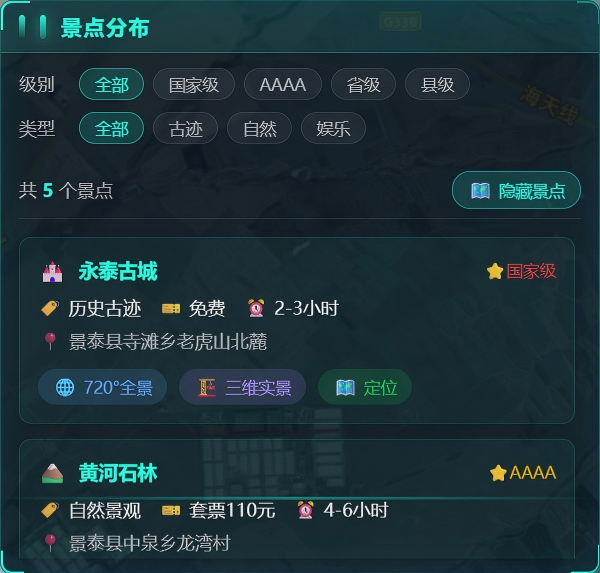
  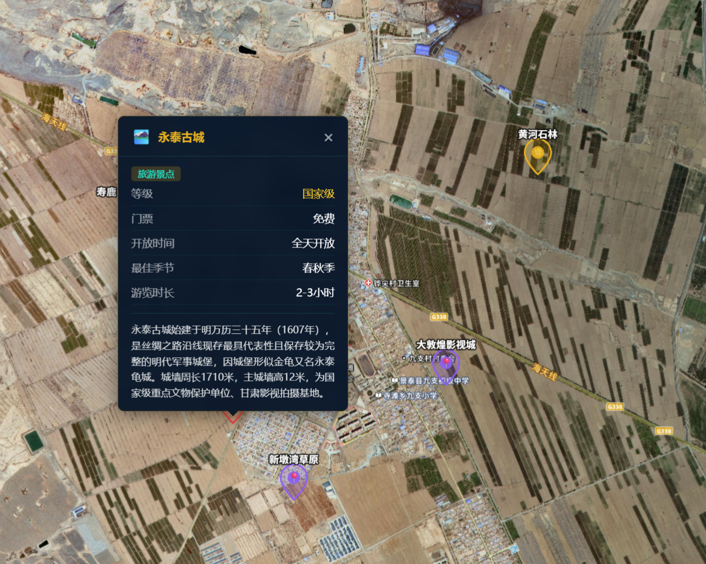

- 标注说明：
  ① 顶部为筛选区，可按景点级别（国家级/AAAA/省级/县级）和类型（古迹/自然/娱乐）筛选
  ② 中部显示筛选后的景点数量统计，并可控制地图图层显示/隐藏
  ③ 下方为景点卡片列表，展示景点名称、级别、类型、门票、游玩时长、地址等信息，支持720°全景和三维实景入口

---

##### 需要的数据

**面板数据：**

| 序号 | 数据项名称（用户能理解） | 必填/选填 | 数据说明/口径（人话） | 是否能提供（勾选） | 备注 |
|---|---|---|---|---|---|
| 1 | 景点名称 | [x]必填 [ ]选填 | 景点的正式名称 | [ ]能 [ ]部分能 [ ]不能 |  |
| 2 | 景点级别 | [x]必填 [ ]选填 | 国家级/AAAAA/AAAA/省级/县级 | [ ]能 [ ]部分能 [ ]不能 |  |
| 3 | 景点类型 | [x]必填 [ ]选填 | 历史古迹/自然景观/休闲娱乐/农业观光等 | [ ]能 [ ]部分能 [ ]不能 |  |
| 4 | 门票价格 | [x]必填 [ ]选填 | 景点门票价格，如"免费"或"110元" | [ ]能 [ ]部分能 [ ]不能 |  |
| 5 | 开放时间 | [ ]必填 [x]选填 | 景点的开放时间段 | [ ]能 [ ]部分能 [ ]不能 |  |
| 6 | 建议游玩时长 | [x]必填 [ ]选填 | 如"2-3小时"、"4-6小时" | [ ]能 [ ]部分能 [ ]不能 |  |
| 7 | 景点地址 | [x]必填 [ ]选填 | 景点的详细地址 | [ ]能 [ ]部分能 [ ]不能 |  |
| 8 | 最佳季节 | [ ]必填 [x]选填 | 最佳游览季节，如"4-10月" | [ ]能 [ ]部分能 [ ]不能 |  |
| 9 | 景点简介 | [ ]必填 [x]选填 | 景点的详细描述说明 | [ ]能 [ ]部分能 [ ]不能 |  |
| 10 | 交通指引 | [ ]必填 [x]选填 | 到达景点的交通方式说明 | [ ]能 [ ]部分能 [ ]不能 |  |
| 11 | 景点图片 | [ ]必填 [x]选填 | 景点风光照片 | [ ]能 [ ]部分能 [ ]不能 |  |
| 12 | 配套设施 | [ ]必填 [x]选填 | 停车场/卫生间/餐饮/住宿等设施 | [ ]能 [ ]部分能 [ ]不能 |  |

**地图图层数据（景点标注）：**

| 序号 | 数据项名称（用户能理解） | 必填/选填 | 数据说明/口径（人话） | 是否能提供（勾选） | 备注 |
|---|---|---|---|---|---|
| 1 | 景点坐标 | [x]必填 [ ]选填 | 经纬度，用于在地图上标点 | [ ]能 [ ]部分能 [ ]不能 | 用于地图图层 |

---

##### 确认项
- 功能是否需要： [ ] 需要  [ ] 不需要（原因：                ）
- 展示内容是否符合： [ ] 符合  [ ] 需调整（写明调整点：                ）
- 数据整体是否可落地： [ ] 可落地  [ ] 有风险（风险点：                ）

---

#### 5.5.2 功能名称：`全景漫游`（所属模块：`文旅全景`）

**这页用来干啥（1句话）：**
提供720°全景和三维实景的沉浸式体验入口，让用户身临其境感受景点风光。

---

##### 页面展示内容

- 系统界面：
  
  

- 标注说明：
  ① 顶部为功能切换标签，可切换"720°全景"和"三维实景"两种模式
  ② 中部为全景/三维资源的网格列表，显示缩略图和名称
  ③ 点击后弹出全景/三维查看器，支持拖拽旋转和缩放操作

---

##### 确认项
- 功能是否需要： [ ] 需要  [ ] 不需要（原因：                ）
- 展示内容是否符合： [ ] 符合  [ ] 需调整（写明调整点：                ）
- 数据整体是否可落地： [ ] 可落地  [ ] 有风险（风险点：                ）

---

#### 5.5.3 功能名称：`精品路线`（所属模块：`文旅全景`）

**这页用来干啥（1句话）：**
展示精心设计的旅游路线，包括休闲游、摄影采风、研学游、亲子游等多种类型，方便游客规划行程。

---

##### 页面展示内容

- 系统界面：
  
  
  
  

- 标注说明：
  ① 顶部为路线类型筛选（休闲/摄影/研学/亲子）和图层控制按钮
  ② 路线卡片展示路线名称、类型、时长、难度、价格、描述、行程节点和亮点标签
  ③ 支持查看路线详情和在地图上显示路线轨迹

---

##### 需要的数据

**面板数据：**

| 序号 | 数据项名称（用户能理解） | 必填/选填 | 数据说明/口径（人话） | 是否能提供（勾选） | 备注 |
|---|---|---|---|---|---|
| 1 | 路线名称 | [x]必填 [ ]选填 | 旅游路线的名称 | [ ]能 [ ]部分能 [ ]不能 |  |
| 2 | 路线类型 | [x]必填 [ ]选填 | 休闲度假/摄影采风/研学游/亲子游等 | [ ]能 [ ]部分能 [ ]不能 |  |
| 3 | 游玩时长 | [x]必填 [ ]选填 | 如"1天"、"2天" | [ ]能 [ ]部分能 [ ]不能 |  |
| 4 | 难度等级 | [x]必填 [ ]选填 | 1-5星，表示路线难易程度 | [ ]能 [ ]部分能 [ ]不能 |  |
| 5 | 参考价格 | [x]必填 [ ]选填 | 路线的参考费用，如"168元起" | [ ]能 [ ]部分能 [ ]不能 |  |
| 6 | 路线描述 | [x]必填 [ ]选填 | 路线的详细介绍说明 | [ ]能 [ ]部分能 [ ]不能 |  |
| 7 | 最佳季节 | [ ]必填 [x]选填 | 推荐出行的季节 | [ ]能 [ ]部分能 [ ]不能 |  |
| 8 | 行程节点列表 | [x]必填 [ ]选填 | 路线经过的各个景点/站点 | [ ]能 [ ]部分能 [ ]不能 |  |
| 9 | 节点名称 | [x]必填 [ ]选填 | 各站点的名称 | [ ]能 [ ]部分能 [ ]不能 | 行程节点属性 |
| 10 | 节点停留时长 | [x]必填 [ ]选填 | 在该站点的建议停留时间 | [ ]能 [ ]部分能 [ ]不能 | 行程节点属性 |
| 11 | 节点描述 | [ ]必填 [x]选填 | 该站点的活动/体验说明 | [ ]能 [ ]部分能 [ ]不能 | 行程节点属性 |
| 12 | 亮点标签 | [ ]必填 [x]选填 | 路线的特色亮点，如"影视体验"、"草原风光" | [ ]能 [ ]部分能 [ ]不能 |  |
| 13 | 路线配图 | [ ]必填 [x]选填 | 路线的宣传配图 | [ ]能 [ ]部分能 [ ]不能 |  |

**地图图层数据（旅游路线）：**

| 序号 | 数据项名称（用户能理解） | 必填/选填 | 数据说明/口径（人话） | 是否能提供（勾选） | 备注 |
|---|---|---|---|---|---|
| 1 | 节点坐标 | [x]必填 [ ]选填 | 各行程节点的经纬度 | [ ]能 [ ]部分能 [ ]不能 | 用于地图图层 |
| 2 | 路线轨迹 | [ ]必填 [x]选填 | 连接各节点的路线坐标序列 | [ ]能 [ ]部分能 [ ]不能 | 用于地图图层 |

**地图图层数据（民宿农家）：**

| 序号 | 数据项名称（用户能理解） | 必填/选填 | 数据说明/口径（人话） | 是否能提供（勾选） | 备注 |
|---|---|---|---|---|---|
| 1 | 民宿名称 | [x]必填 [ ]选填 | 民宿/农家乐的名称 | [ ]能 [ ]部分能 [ ]不能 |  |
| 2 | 民宿类型 | [x]必填 [ ]选填 | 民宿/农家乐/度假村 | [ ]能 [ ]部分能 [ ]不能 |  |
| 3 | 民宿坐标 | [x]必填 [ ]选填 | 经纬度，用于在地图上标点 | [ ]能 [ ]部分能 [ ]不能 | 用于地图图层 |
| 4 | 价格区间 | [x]必填 [ ]选填 | 如"150-300元/晚" | [ ]能 [ ]部分能 [ ]不能 |  |
| 5 | 联系电话 | [x]必填 [ ]选填 | 预订联系电话 | [ ]能 [ ]部分能 [ ]不能 |  |
| 6 | 特色服务 | [ ]必填 [x]选填 | 如"滑沙体验"、"采摘活动"等 | [ ]能 [ ]部分能 [ ]不能 |  |
| 7 | 特色菜品 | [ ]必填 [x]选填 | 如"手抓羊肉"、"黄河鲤鱼"等 | [ ]能 [ ]部分能 [ ]不能 |  |
| 8 | 接待容量 | [ ]必填 [x]选填 | 可容纳的游客人数 | [ ]能 [ ]部分能 [ ]不能 |  |
| 9 | 评分 | [ ]必填 [x]选填 | 游客评分，1-5分 | [ ]能 [ ]部分能 [ ]不能 |  |
| 10 | 民宿照片 | [x]必填 [ ]选填 | 民宿/农家乐的名称 | [ ]能 [ ]部分能 [ ]不能 |  |

---

##### 确认项
- 功能是否需要： [ ] 需要  [ ] 不需要（原因：                ）
- 展示内容是否符合： [ ] 符合  [ ] 需调整（写明调整点：                ）
- 数据整体是否可落地： [ ] 可落地  [ ] 有风险（风险点：                ）

---

### 5.6 农旅融合模块

#### 5.6.1 功能名称：`农业基地`（所属模块：`农旅融合`）

**这页用来干啥（1句话）：**
展示辖区内农业种植、果园、牧场、农场等基地的分布和详细信息。

---

##### 页面展示内容

- 系统界面：
  
  
  

- 标注说明：
  ① 顶部可按基地类型筛选（种植/果园/牧场/农场）
  ② 每个基地卡片展示面积、产量、季节、主要产品、特色介绍
  ③ 可点击"定位"在地图上显示位置，点击"详情"查看完整信息

---

##### 需要的数据

**面板数据：**

| 序号 | 数据项名称（用户能理解） | 必填/选填 | 数据说明/口径（人话） | 是否能提供（勾选） | 备注 |
|------|--------------------------|-----------|----------------------|-------------------|------|
| 1 | 基地名称 | [x]必填 [ ]选填 | 农业基地的名称 | [ ]能 [ ]部分能 [ ]不能 |  |
| 2 | 基地类型 | [x]必填 [ ]选填 | 种植基地/果园/牧场/农场 | [ ]能 [ ]部分能 [ ]不能 |  |
| 3 | 种植/养殖面积 | [x]必填 [ ]选填 | 基地面积，如"1.2万亩" | [ ]能 [ ]部分能 [ ]不能 |  |
| 4 | 年产量 | [x]必填 [ ]选填 | 年产量说明，如"年产籽瓜籽800吨" | [ ]能 [ ]部分能 [ ]不能 |  |
| 5 | 主要产品 | [x]必填 [ ]选填 | 基地的主要农产品列表 | [ ]能 [ ]部分能 [ ]不能 | 多个产品 |
| 6 | 最佳季节 | [x]必填 [ ]选填 | 采摘/参观最佳时间，如"7-9月" | [ ]能 [ ]部分能 [ ]不能 |  |
| 7 | 特色介绍 | [x]必填 [ ]选填 | 基地的特色亮点描述 | [ ]能 [ ]部分能 [ ]不能 |  |
| 8 | 基地图片 | [ ]必填 [x]选填 | 基地实景图片 | [ ]能 [ ]部分能 [ ]不能 |  |

**地图图层数据：**

| 序号 | 数据项名称（用户能理解） | 必填/选填 | 数据说明/口径（人话） | 是否能提供（勾选） | 备注 |
|------|--------------------------|-----------|----------------------|-------------------|------|
| 1 | 位置坐标 | [x]必填 [ ]选填 | 经纬度坐标，用于地图标点 | [ ]能 [ ]部分能 [ ]不能 | 用于地图定位 |

---

##### 确认项
- 功能是否需要： [ ] 需要  [ ] 不需要（原因：                ）
- 展示内容是否符合： [ ] 符合  [ ] 需调整（写明调整点：                ）
- 数据整体是否可落地： [ ] 可落地  [ ] 有风险（风险点：                ）

---

#### 5.6.2 功能名称：`特色农产`（所属模块：`农旅融合`）

**这页用来干啥（1句话）：**
展示地方特色农产品信息，包含价格、产地、文化故事和购买渠道。

---

##### 页面展示内容

- 系统界面：
  
  

- 标注说明：
  ① 顶部展示"景礼品牌"国家地理标志产品标识
  ② 产品卡片展示名称、价格、分类

---

##### 需要的数据

**面板数据：**

| 序号 | 数据项名称（用户能理解） | 必填/选填 | 数据说明/口径（人话） | 是否能提供（勾选） | 备注 |
|------|--------------------------|-----------|----------------------|-------------------|------|
| 1 | 产品名称 | [x]必填 [ ]选填 | 农产品名称，如"景泰枸杞" | [ ]能 [ ]部分能 [ ]不能 |  |
| 2 | 产品分类 | [x]必填 [ ]选填 | 农特产品/手工艺品/纪念品 | [ ]能 [ ]部分能 [ ]不能 |  |
| 3 | 参考价格 | [x]必填 [ ]选填 | 市场参考价格，如"128元/袋" | [ ]能 [ ]部分能 [ ]不能 | 价格可能波动 |
| 4 | 产品描述 | [x]必填 [ ]选填 | 产品特点介绍 | [ ]能 [ ]部分能 [ ]不能 |  |
| 5 | 产地 | [x]必填 [ ]选填 | 产品原产地 | [ ]能 [ ]部分能 [ ]不能 |  |
| 6 | 文化故事 | [ ]必填 [x]选填 | 产品背后的文化故事 | [ ]能 [ ]部分能 [ ]不能 |  |
| 7 | 产品图片 | [x]必填 [ ]选填 | 产品展示图片 | [ ]能 [ ]部分能 [ ]不能 |  |
| 8 | 联系电话 | [ ]必填 [x]选填 | 销售联系电话 | [ ]能 [ ]部分能 [ ]不能 |  |
| 9 | 线下销售点 | [ ]必填 [x]选填 | 销售点名称、地址、电话、营业时间 | [ ]能 [ ]部分能 [ ]不能 | 多个销售点 |
| 10 | 电商平台链接 | [ ]必填 [x]选填 | 淘宝/京东/拼多多/抖音等店铺链接 | [ ]能 [ ]部分能 [ ]不能 | 多个平台 |

---

##### 确认项
- 功能是否需要： [ ] 需要  [ ] 不需要（原因：                ）
- 展示内容是否符合： [ ] 符合  [ ] 需调整（写明调整点：                ）
- 数据整体是否可落地： [ ] 可落地  [ ] 有风险（风险点：                ）

---

#### 5.6.3 功能名称：`采摘体验`（所属模块：`农旅融合`）

**这页用来干啥（1句话）：**
展示当季可体验的采摘项目，包括时间、价格、时长和温馨提示。

---

##### 页面展示内容

- 系统界面：
  

- 标注说明：
  ① 顶部显示当前月份和当季可体验项目数量
  ② 每个采摘项目展示可采摘月份、价格、预计时长、体验描述
  ③ 非当季项目有标识提示

---

##### 需要的数据

**面板数据：**

| 序号 | 数据项名称（用户能理解） | 必填/选填 | 数据说明/口径（人话） | 是否能提供（勾选） | 备注 |
|------|--------------------------|-----------|----------------------|-------------------|------|
| 1 | 体验项目名称 | [x]必填 [ ]选填 | 采摘体验名称，如"籽瓜采摘体验" | [ ]能 [ ]部分能 [ ]不能 |  |
| 2 | 可体验月份 | [x]必填 [ ]选填 | 开放采摘的月份，如"7月、8月、9月" | [ ]能 [ ]部分能 [ ]不能 | 多个月份 |
| 3 | 体验价格 | [x]必填 [ ]选填 | 每人价格，如"50元/人" | [ ]能 [ ]部分能 [ ]不能 |  |
| 4 | 预计时长 | [x]必填 [ ]选填 | 体验时长，如"2-3小时" | [ ]能 [ ]部分能 [ ]不能 |  |
| 5 | 体验描述 | [x]必填 [ ]选填 | 采摘体验的详细介绍 | [ ]能 [ ]部分能 [ ]不能 |  |
| 6 | 温馨提示 | [ ]必填 [x]选填 | 注意事项，如"穿舒适鞋子"、"自备防晒" | [ ]能 [ ]部分能 [ ]不能 | 多条提示 |
| 7 | 关联农业基地 | [x]必填 [ ]选填 | 采摘体验所在的农业基地 | [ ]能 [ ]部分能 [ ]不能 |  |
| 8 | 体验图片 | [ ]必填 [x]选填 | 采摘体验宣传图 | [ ]能 [ ]部分能 [ ]不能 |  |

---

##### 确认项
- 功能是否需要： [ ] 需要  [ ] 不需要（原因：                ）
- 展示内容是否符合： [ ] 符合  [ ] 需调整（写明调整点：                ）
- 数据整体是否可落地： [ ] 可落地  [ ] 有风险（风险点：                ）

---

#### 5.6.4 功能名称：`民宿农家`（所属模块：`农旅融合`）

**这页用来干啥（1句话）：**
展示辖区内民宿、农家乐、度假村等住宿餐饮资源。

---

##### 页面展示内容

- 系统界面：
  
  

- 标注说明：
  ① 顶部可按类型筛选（民宿/农家乐/度假村）
  ② 每个卡片展示名称、评分、类型、价格、特色服务
  ③ 可点击地图按钮定位，电话按钮直接联系

---

##### 需要的数据

**面板数据：**

| 序号 | 数据项名称（用户能理解） | 必填/选填 | 数据说明/口径（人话） | 是否能提供（勾选） | 备注 |
|------|--------------------------|-----------|----------------------|-------------------|------|
| 1 | 名称 | [x]必填 [ ]选填 | 民宿/农家乐名称 | [ ]能 [ ]部分能 [ ]不能 |  |
| 2 | 类型 | [x]必填 [ ]选填 | 民宿/农家乐/度假村 | [ ]能 [ ]部分能 [ ]不能 |  |
| 3 | 价格 | [x]必填 [ ]选填 | 住宿或人均消费价格 | [ ]能 [ ]部分能 [ ]不能 | 价格可能波动 |
| 4 | 联系电话 | [x]必填 [ ]选填 | 预订联系电话 | [ ]能 [ ]部分能 [ ]不能 |  |
| 5 | 特色服务 | [x]必填 [ ]选填 | 如"滑沙体验"、"窑洞住宿"等 | [ ]能 [ ]部分能 [ ]不能 | 多个特色 |
| 6 | 特色菜品 | [ ]必填 [x]选填 | 招牌菜品，农家乐适用 | [ ]能 [ ]部分能 [ ]不能 | 多个菜品 |
| 7 | 容纳人数 | [ ]必填 [x]选填 | 最大接待人数 | [ ]能 [ ]部分能 [ ]不能 |  |
| 8 | 评分 | [x]必填 [ ]选填 | 用户评分，如4.5分 | [ ]能 [ ]部分能 [ ]不能 |  |
| 9 | 图片 | [ ]必填 [x]选填 | 民宿/农家乐实景图 | [ ]能 [ ]部分能 [ ]不能 |  |

**地图图层数据：**

| 序号 | 数据项名称（用户能理解） | 必填/选填 | 数据说明/口径（人话） | 是否能提供（勾选） | 备注 |
|------|--------------------------|-----------|----------------------|-------------------|------|
| 1 | 位置坐标 | [x]必填 [ ]选填 | 经纬度坐标，用于地图标点 | [ ]能 [ ]部分能 [ ]不能 | 用于地图定位 |

---

##### 确认项
- 功能是否需要： [ ] 需要  [ ] 不需要（原因：                ）
- 展示内容是否符合： [ ] 符合  [ ] 需调整（写明调整点：                ）
- 数据整体是否可落地： [ ] 可落地  [ ] 有风险（风险点：                ）

---

#### 5.6.5 功能名称：`农事活动`（所属模块：`农旅融合`）

**这页用来干啥（1句话）：**
展示农事节庆、体验活动、丰收季等农业主题活动安排。

---

##### 页面展示内容

- 系统界面：
  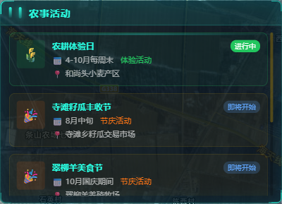
  

- 标注说明：
  ① 活动按状态排序（进行中 > 即将开始 > 已结束）
  ② 每个活动展示名称、状态、日期、活动类型、地点
  ③ 不同状态用颜色区分

---

##### 需要的数据

**面板数据：**

| 序号 | 数据项名称（用户能理解） | 必填/选填 | 数据说明/口径（人话） | 是否能提供（勾选） | 备注 |
|------|--------------------------|-----------|----------------------|-------------------|------|
| 1 | 活动名称 | [x]必填 [ ]选填 | 农事活动名称，如"寺滩籽瓜丰收节" | [ ]能 [ ]部分能 [ ]不能 |  |
| 2 | 活动类型 | [x]必填 [ ]选填 | 节庆活动/体验活动/丰收季 | [ ]能 [ ]部分能 [ ]不能 |  |
| 3 | 活动日期 | [x]必填 [ ]选填 | 活动举办日期，如"8月中旬"、"4-10月每周末" | [ ]能 [ ]部分能 [ ]不能 |  |
| 4 | 活动地点 | [x]必填 [ ]选填 | 活动举办地点 | [ ]能 [ ]部分能 [ ]不能 |  |
| 5 | 活动描述 | [x]必填 [ ]选填 | 活动的详细介绍 | [ ]能 [ ]部分能 [ ]不能 |  |
| 6 | 活动亮点 | [x]必填 [ ]选填 | 活动亮点项目，如"瓜王评选"、"篝火晚会" | [ ]能 [ ]部分能 [ ]不能 | 多个亮点 |
| 7 | 活动状态 | [x]必填 [ ]选填 | 进行中/即将开始/已结束 | [ ]能 [ ]部分能 [ ]不能 | 根据日期计算 |
| 8 | 活动图片 | [ ]必填 [x]选填 | 活动宣传图或往期照片 | [ ]能 [ ]部分能 [ ]不能 |  |

---

##### 确认项
- 功能是否需要： [ ] 需要  [ ] 不需要（原因：                ）
- 展示内容是否符合： [ ] 符合  [ ] 需调整（写明调整点：                ）
- 数据整体是否可落地： [ ] 可落地  [ ] 有风险（风险点：                ）

---

## 6. 附录

### 6.1 数据汇总统计

| 模块 | 面板数量 | 数据项总数 | 地图图层数 |
|------|----------|------------|------------|
| 乡情概览 | 6 | 约75项 | 4个 |
| 联村共治 | 6 | 约55项 | 4个 |
| 宜居乡村 | 5 | 约60项 | 5个 |
| 信息惠民 | 5 | 约70项 | 4个 |
| 文旅全景 | 3 | 约45项 | 4个 |
| 农旅融合 | 5 | 约45项 | 2个 |

### 6.2 地图图层清单

**乡情概览模块：**

| 图层名称 | 数据来源 | 默认显示 |
|----------|----------|----------|
| 村庄边界 | store:villages | 否 |
| 公共设施 | store:facilities | 是 |
| 种植分布 | store:agriculture | 否 |
| 养殖小区 | store:agriculture | 否 |

**联村共治模块：**

| 图层名称 | 数据来源 | 默认显示 |
|----------|----------|----------|
| 联村片区 | /api/united/zones | 否 |
| 综治网格 | store:grid | 是 |
| 综治事件 | /api/united/governance-events | 否 |
| 监控点位 | /api/united/monitors | 否 |

**宜居乡村模块：**

| 图层名称 | 数据来源 | 默认显示 |
|----------|----------|----------|
| 生态资源 | /api/eco/resources | 否 |
| 居住点分布 | /api/homestead/land | 是 |
| 曝光点位 | /api/exposure/points | 否 |
| 广播终端 | /api/emergency/broadcasts | 否 |
| 避难场所 | /api/emergency/shelters | 否 |

**信息惠民模块：**

| 图层名称 | 数据来源 | 默认显示 |
|----------|----------|----------|
| 便民网点 | /api/convenience/points | 是 |
| 养老设施 | /api/elderly/facilities | 否 |
| 文化设施 | /api/culture/facilities | 否 |
| 智能终端 | /api/elderly/terminals | 否 |

**文旅全景模块：**

| 图层名称 | 数据来源 | 默认显示 |
|----------|----------|----------|
| 景点标注 | tourism:scenics | 是 |
| 旅游路线 | tourism:routes | 是（带动画） |
| 民宿农家 | tourism:farmstays | 否 |
| 配套设施 | tourism:facilities | 否 |

**农旅融合模块：**

| 图层名称 | 数据来源 | 默认显示 |
|----------|----------|----------|
| 农业基地 | agri:bases | 是 |
| 民宿点位 | agri:farmstays | 否 |

### 6.3 数据敏感性说明

以下数据涉及个人隐私，需进行脱敏处理：
1. **重点人群信息**：姓名显示为"张XX"格式，不显示完整姓名
2. **网格员联系方式**：手机号中间4位用*号代替
3. **人员居住地**：仅显示到村组级别，不精确到门牌号
4. **户主信息**：居住点分布中户主姓名需脱敏处理
5. **联系电话**：所有联系方式中间4位用*号代替

### 6.4 技术字段与用户名称映射表

**联村共治模块：**

| 技术字段 | 用户名称 | 说明 |
|----------|----------|------|
| monthlyEvents | 本月事件数 | 当月上报的综治事件总数 |
| resolveRate | 处置率 | 已处置事件占比 |
| mediationCount | 调解总数 | 累计调解成功数量 |
| keyPopulation | 重点人群数 | 重点关注人员总数 |
| totalGrids | 网格总数 | 村级+组级网格数量 |
| totalMembers | 网格员总数 | 在册网格员人数 |
| avgResponseTime | 平均响应时间 | 事件响应平均时长 |

**宜居乡村模块：**

| 技术字段 | 用户名称 | 说明 |
|----------|----------|------|
| forestArea | 林地面积 | 乡镇林地总面积，单位万亩 |
| waterResources | 水资源总量 | 年径流量或可用水资源 |
| protectedArea | 保护区面积 | 自然保护区面积，单位公顷 |
| forestCoverage | 森林覆盖率 | 森林覆盖面积占比 |
| totalHouseholds | 总户数 | 乡镇总户籍数 |
| registeredRate | 登记率 | 已登记户数占比 |
| monthlyTotal | 本月曝光数 | 当月曝光的问题总数 |
| resolved | 已整改数 | 已完成整改的问题数 |
| resolveRate | 整改率 | 已整改占比 |
| shelterCount | 避难场所数 | 应急避难场所总数 |
| broadcastTotal | 广播终端数 | 广播终端设备数量 |
| onlineCount | 在线数 | 当前在线的广播终端数 |
| coverageRate | 覆盖率 | 广播信号覆盖范围占比 |

**信息惠民模块：**

| 技术字段 | 用户名称 | 说明 |
|----------|----------|------|
| servicePoints | 服务网点数 | 便民服务点总数量 |
| monthlyCount | 月办理量 | 当月办理业务总数量 |
| avgDuration | 平均办理时长 | 办理一项业务的平均耗时 |
| satisfactionRate | 满意度 | 群众满意度评分百分比 |
| yearGrowth | 年增长率 | 办理量同比增长率 |
| elderlyTotal | 65岁以上老人总数 | 老年人口数量 |
| elderlyPercentage | 老年人口占比 | 老年人口占总人口比例 |
| checkupRate | 体检完成率 | 已完成年度体检的老人占比 |
| insuranceRate | 养老保障覆盖率 | 享受养老保险的老人占比 |
| smartDevices | 智能设备 | 智能手环、呼叫器等设备数量 |
| onlineDevices | 在线设备数 | 当前在线的设备数量 |
| alertDevices | 告警设备数 | 当前告警的设备数量 |
| facilitySummary | 文化设施统计 | 各类文化设施数量 |
| heritageItems | 非遗资源 | 非遗项目列表 |
| activities | 近期活动 | 文化活动列表 |

**文旅全景模块：**

| 技术字段 | 用户名称 | 说明 |
|----------|----------|------|
| level | 景点级别 | national/aaaa/provincial/county |
| type | 景点类型 | historic/natural/entertainment等 |
| ticket | 门票价格 | 景点门票信息 |
| duration | 建议游玩时长 | 游览所需时间 |
| coords | 景点坐标 | 经纬度数组 |
| panoramaId | 全景ID | 关联的全景资源标识 |
| model3dId | 三维实景ID | 关联的三维模型标识 |
| routeType | 路线类型 | leisure/photography/study/family |
| difficulty | 难度等级 | 1-5星评级 |
| nodes | 行程节点 | 路线途经站点列表 |
| highlights | 亮点标签 | 路线特色亮点数组 |
| farmstayType | 民宿类型 | homestay/farmhouse/resort |

**农旅融合模块：**

| 技术字段 | 用户名称 | 说明 |
|----------|----------|------|
| type | 基地类型 | plantation/orchard/ranch/farm |
| area | 种植面积 | 面积文本描述 |
| output | 年产量 | 产量文本描述 |
| products | 主要产品 | 产品名称数组 |
| feature | 特色介绍 | 特色描述 |
| season | 最佳季节 | 季节范围 |
| months | 可体验月份 | 月份数字数组 |
| duration | 体验时长 | 时长描述 |
| tips | 温馨提示 | 提示数组 |
| baseId | 关联基地 | 采摘体验关联的农业基地ID |
| eventType | 活动类型 | festival/experience/harvest |
| status | 活动状态 | upcoming/ongoing/ended |
| highlights | 活动亮点 | 亮点数组 |
| farmstayType | 民宿类型 | homestay/farmhouse/resort |
| rating | 评分 | 1-5分 |
| capacity | 容纳人数 | 人数 |
| dishes | 特色菜品 | 菜品数组 |
| ecommerceLinks | 电商链接 | 平台、店铺名、链接 |
| salesPoints | 销售点 | 名称、地址、电话、营业时间 |

### 6.5 确认签字

| 项目 | 签字 | 日期 |
|------|------|------|
| 业主方确认人 |  |  |
| 开发方负责人 |  |  |
| 会议记录人 |  |  |
