# 数治乡村 - 管理端 - 系统原型走读与需求确认文档

## 0. 版本信息

| 项目 | 内容 |
|------|------|
| 项目名称 | 数治乡村 |
| 文档版本 | v1.0 |
| 编写日期 | 2026-01-15 |
| 编写人 | |
| 审核人 | |
| 确认范围 | 管理端（首页模块、综治模块、服务模块、三务模块） |

---

## 1. 系统是做什么的

**一句话说明**：数治乡村管理端是面向网格员/村委工作人员的数字化治理工作台，用于处理随手拍工单、管理考勤、发布信息、管理培训等乡村治理工作。

**谁在使用**：
- **网格员**：处理工单派单、查看考勤统计、处理异常打卡初审、管理培训报名、发布信息
- **村委领导/乡镇领导**：审批异常考勤、终审曝光台、发布预警信息、查看数据统计

---

## 2. 本次确认范围

| 模块 | 页面数量 | 说明 |
|------|----------|------|
| 首页模块 | 6 | 工作台主界面，包含工作概览、待办事项、快捷操作等功能区块 |
| 综治模块 | 6 | 综治首页(1) + 重点人员列表(1) + 人员详情(1) + 新增/编辑人员(1) + 人员分布地图(1) + 批量导入(1) |
| 服务模块 | 8 | 服务首页(1) + 用工监管(4) + 培训管理(3) |
| 三务模块 | 10 | 三务首页(1) + 信息发布管理(3) + 曝光台管理(3) + 预警信息推送(3) |
| 积分模块 | 8 | 积分首页(1) + 积分发放/扣除(1) + 规则配置(1) + 商品管理(2) + 订单管理(2) + 数据统计(1) |
| 我的模块 | 6 | 我的首页(1) + 编辑资料(1) + 消息通知设置(1) + 帮助中心(1) + 关于我们(1) + 注销账号(1) |
| **合计** | **44** | - |

---

## 3. 走读方式

1. 按页面卡片顺序，逐一查看原型截图
2. 对照「需要的数据」表格，确认数据来源
3. 在「确认项」处勾选结论，有问题直接标注
4. 走读完成后签字确认

---

## 4. 角色与责任

| 角色 | 姓名 | 职责 |
|------|------|------|
| 产品负责人 | | 确认功能需求 |
| 业务负责人 | | 确认数据来源 |
| 技术负责人 | | 确认技术可行性 |
| 记录人 | | 记录会议结论 |

---

## 5. 页面卡片

### 5.1 首页模块

---

#### 5.1.1 功能名称：`首页整体布局`（所属模块：`管理端首页`）

**这页用来干啥（1句话）：**
网格员/村委/乡镇工作人员打开管理端后看到的工作主界面，一眼掌握工作全貌。
注：通过“我的”模块，可以切换到管理端，或者切换到农户端。

---

##### 页面展示内容

- 原型截图：
  

- 标注说明：
  ① 从底部导航栏点击"首页"进入，或登录后默认进入此页面
  ② 页面采用蓝绿清新风格，自定义导航栏融入整体设计
  ③ 内容区域可滚动，底部导航栏固定
  ④ 页面支持下拉刷新更新数据

---

##### 确认项
- 功能是否需要： [ ] 需要  [ ] 不需要（原因：                ）
- 展示内容是否符合： [ ] 符合  [ ] 需调整（写明调整点：                ）
- 数据整体是否可落地： [ ] 可落地  [ ] 有风险（风险点：                ）

---

#### 5.1.2 功能名称：`统一导航栏`（所属模块：`管理端首页`）

**这页用来干啥（1句话）：**
显示当前登录用户的姓名、角色和负责的网格区域，方便快速确认身份

---

##### 页面展示内容

- 原型截图：
  

- 标注说明：
  ① 作为首页的组成部分，随首页一起显示，位于页面顶部固定位置
  ② 采用管理端专属主题（蓝色系）
  ③ 显示用户姓名
  ④ 显示角色标签和负责的网格区域范围

---

##### 确认项
- 功能是否需要： [ ] 需要  [ ] 不需要（原因：                ）
- 展示内容是否符合： [ ] 符合  [ ] 需调整（写明调整点：                ）
- 数据整体是否可落地： [ ] 可落地  [ ] 有风险（风险点：                ）

---

#### 5.1.3 功能名称：`工作概览`（所属模块：`管理端首页`）

**这页用来干啥（1句话）：**
用红黄绿三色指标展示工单状态，加上今日进度和本周绩效，让管理员一眼看清工作情况

---

##### 页面展示内容

- 原型截图：
  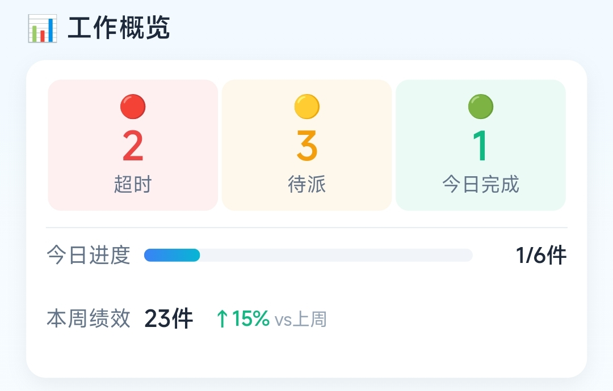

- 标注说明：
  ① 作为首页的组成部分，位于导航栏下方，滚动区域顶部
  ② 红色指标（🔴）：超时待办数量，点击可跳转到超时工单列表
  ③ 黄色指标（🟡）：待派单数量，点击可跳转到待派单列表
  ④ 绿色指标（🟢）：今日已完成数量
  ⑤ 进度条显示今日完成进度百分比
  ⑥ 本周绩效显示完成数量及与上周同期对比

---

##### 确认项
- 功能是否需要： [ ] 需要  [ ] 不需要（原因：                ）
- 展示内容是否符合： [ ] 符合  [ ] 需调整（写明调整点：                ）
- 数据整体是否可落地： [ ] 可落地  [ ] 有风险（风险点：                ）

---

#### 5.1.4 功能名称：`待办事项列表`（所属模块：`管理端首页`）

**这页用来干啥（1句话）：**
展示最紧急、最需要立即处理的工单任务，点击可直接进入处理

---

##### 页面展示内容

- 原型截图：
  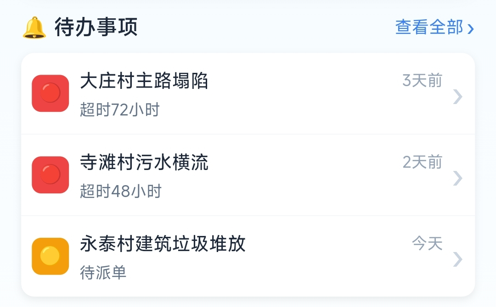

- 标注说明：
  ① 作为首页的组成部分，位于工作概览下方，展示最紧急的待办任务
  ② 按优先级排序：红色（紧急/超时）> 黄色（重要/待派单）
  ③ 每条待办显示：优先级图标、标题、状态说明、上报时间
  ④ 点击单条可跳转到工单详情页进行处理
  ⑤ 点击"查看全部"跳转到随手拍工单列表页

---

##### 需要的数据

**列表显示规则：**

| 规则项 | 说明 |
|--------|------|
| 显示条数 | 首页最多显示3条最紧急的待办 |
| 排序规则 | 超时工单优先 > 待派单 > 其他，同级别按时间倒序 |
| 更新频率 | 页面加载时刷新，支持下拉刷新 |

---

##### 确认项
- 功能是否需要： [ ] 需要  [ ] 不需要（原因：                ）
- 展示内容是否符合： [ ] 符合  [ ] 需调整（写明调整点：                ）
- 数据整体是否可落地： [ ] 可落地  [ ] 有风险（风险点：                ）

---

#### 5.1.5 功能名称：`快捷操作入口`（所属模块：`管理端首页`）

**这页用来干啥（1句话）：**
提供随手拍派单、户籍列表、乡村大喇叭三个常用功能的快捷入口

---

##### 页面展示内容

- 原型截图：
  

- 标注说明：
  ① 作为首页的组成部分，位于待办事项列表下方，提供常用功能快捷入口
  ② 三宫格横向排列，等宽分布
  ③ 每个卡片显示角标数字（如待派单数量、户数、设备数）
  ④ 点击卡片跳转到对应功能页面

---

##### 需要的数据

**各操作角标数据来源：**

| 操作 | 角标数据说明 |
|------|-------------|
| 随手拍派单 | 当前待派单的工单数量 |
| 户籍列表 | 负责网格内/辖区内的总户数 |
| 乡村大喇叭 | 负责区域内的大喇叭设备数量 |

---

##### 确认项
- 功能是否需要： [ ] 需要  [ ] 不需要（原因：                ）
- 展示内容是否符合： [ ] 符合  [ ] 需调整（写明调整点：                ）
- 数据整体是否可落地： [ ] 可落地  [ ] 有风险（风险点：                ）

---
#### 5.1.6 功能名称：`乡村大喇叭列表`（所属模块：`管理端首页`）

**这页用来干啥（1句话）：**
查看管辖区域内所有大喇叭设备，支持按村庄/状态筛选，可快速拨打设备号码进行广播

---

##### 页面展示内容

- 原型截图：
  

- 标注说明：
  ① 从首页"快捷操作入口"的"乡村大喇叭"卡片点击进入
  ② 顶部有搜索框，支持按设备编号、村名、位置、负责人搜索
  ③ 村庄筛选横向滚动标签，状态筛选显示各状态数量
  ④ 设备卡片显示编号、村名、位置、覆盖范围、负责人、设备号码
  ⑤ 卡片右侧有"广播"按钮，点击可拨打设备号码进行广播

---

##### 需要的数据

**设备卡片数据：**

| 序号 | 数据项名称 | 必填/选填 | 数据说明/口径 | 是否能提供 | 备注 |
|------|-----------|----------|--------------|-----------|------|
| 1 | 所属村庄 | [x]必填 [ ]选填 | 设备所在村庄名称，如"寺滩村" | [ ]能 [ ]部分能 [ ]不能 | 列表展示 |
| 2 | 安装位置 | [x]必填 [ ]选填 | 设备具体安装位置，如"村委会办公楼顶" | [ ]能 [ ]部分能 [ ]不能 | 列表展示 |
| 3 | 覆盖范围 | [x]必填 [ ]选填 | 设备广播覆盖区域，如"全村主要居住区" | [ ]能 [ ]部分能 [ ]不能 | 列表展示 |
| 4 | 设备状态 | [x]必填 [ ]选填 | 正常(绿色)/故障(红色)/维护中(黄色) | [ ]能 [ ]部分能 [ ]不能 | 状态标签 |
| 5 | 负责人姓名 | [x]必填 [ ]选填 | 设备管理负责人姓名 | [ ]能 [ ]部分能 [ ]不能 | 列表展示 |
| 6 | 设备号码 | [x]必填 [ ]选填 | 大喇叭设备的电话号码，拨打后可通过大喇叭广播 | [ ]能 [ ]部分能 [ ]不能 | 核心功能 |

---

##### 确认项
- 功能是否需要： [ ] 需要  [ ] 不需要（原因：                ）
- 展示内容是否符合： [ ] 符合  [ ] 需调整（写明调整点：                ）
- 数据整体是否可落地： [ ] 可落地  [ ] 有风险（风险点：                ）

---

#### 5.1.7 功能名称：`乡村大喇叭详情`（所属模块：`管理端首页`）

**这页用来干啥（1句话）：**
查看大喇叭设备的详细信息，可拨打设备号码进行广播通知

---

##### 页面展示内容

- 原型截图：
  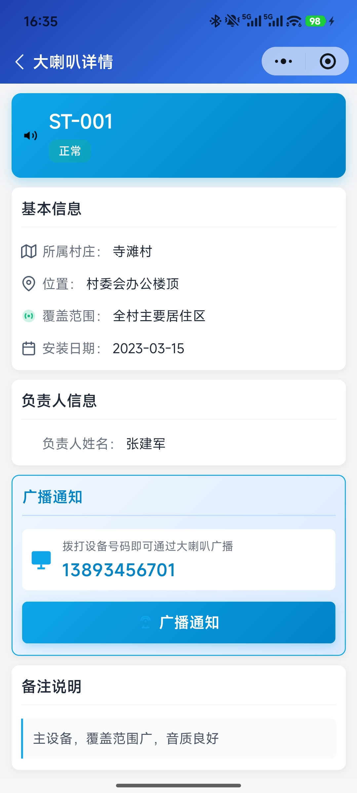

- 标注说明：
  ① 从"乡村大喇叭列表"页面点击设备卡片进入
  ② 顶部显示设备编号和当前状态标签
  ③ 基本信息卡片显示所属村庄、安装位置、覆盖范围、安装日期
  ④ 负责人信息卡片显示设备管理负责人姓名
  ⑤ 广播通知卡片高亮显示设备号码，有"立即广播"按钮
  ⑥ 备注信息卡片显示设备相关备注（如有）

---

##### 需要的数据

**设备基本信息：**

| 序号 | 数据项名称 | 必填/选填 | 数据说明/口径 | 是否能提供 | 备注 |
|------|-----------|----------|--------------|-----------|------|
| 1 | 设备状态 | [x]必填 [ ]选填 | 正常/故障/维护中 | [ ]能 [ ]部分能 [ ]不能 | 状态标签 |
| 2 | 所属村庄 | [x]必填 [ ]选填 | 设备所在村庄名称 | [ ]能 [ ]部分能 [ ]不能 | 基本信息 |
| 3 | 安装位置 | [x]必填 [ ]选填 | 设备具体安装位置描述 | [ ]能 [ ]部分能 [ ]不能 | 基本信息 |
| 4 | 覆盖范围 | [x]必填 [ ]选填 | 设备广播覆盖区域描述 | [ ]能 [ ]部分能 [ ]不能 | 基本信息 |
| 5 | 安装日期 | [x]必填 [ ]选填 | 设备安装时间，格式如"2023-03-15" | [ ]能 [ ]部分能 [ ]不能 | 基本信息 |

**负责人信息：**

| 序号 | 数据项名称 | 必填/选填 | 数据说明/口径 | 是否能提供 | 备注 |
|------|-----------|----------|--------------|-----------|------|
| 6 | 负责人姓名 | [x]必填 [ ]选填 | 设备管理负责人姓名 | [ ]能 [ ]部分能 [ ]不能 | 负责人信息 |

**广播通知功能：**

| 序号 | 数据项名称 | 必填/选填 | 数据说明/口径 | 是否能提供 | 备注 |
|------|-----------|----------|--------------|-----------|------|
| 7 | 设备号码 | [x]必填 [ ]选填 | 大喇叭设备的电话号码，拨打后可通过大喇叭广播通知村民 | [ ]能 [ ]部分能 [ ]不能 | 核心功能 |

**备注信息：**

| 序号 | 数据项名称 | 必填/选填 | 数据说明/口径 | 是否能提供 | 备注 |
|------|-----------|----------|--------------|-----------|------|
| 9 | 备注说明 | [ ]必填 [x]选填 | 设备相关备注，如维护记录、特殊说明等 | [ ]能 [ ]部分能 [ ]不能 | 有则显示 |

---

##### 确认项
- 功能是否需要： [ ] 需要  [ ] 不需要（原因：                ）
- 展示内容是否符合： [ ] 符合  [ ] 需调整（写明调整点：                ）
- 数据整体是否可落地： [ ] 可落地  [ ] 有风险（风险点：                ）

---

#### 5.1.8 功能名称：`底部导航栏`（所属模块：`管理端首页`）

**这页用来干啥（1句话）：**
管理端专用的底部导航栏，提供各主要功能模块的切换入口

---

##### 页面展示内容

- 原型截图：
  

- 标注说明：
  ① 作为全局导航组件，在管理端所有主要页面底部显示，提供首页、综治、服务、三务、积分、我的六大模块切换入口
  ② 固定在页面底部，不随内容滚动
  ③ 当前所在页面的图标高亮显示

---

##### 确认项
- 功能是否需要： [ ] 需要  [ ] 不需要（原因：                ）
- 展示内容是否符合： [ ] 符合  [ ] 需调整（写明调整点：                ）
- 数据整体是否可落地： [ ] 可落地  [ ] 有风险（风险点：                ）

---

### 5.2 综治模块


#### 5.2.1 功能名称：`综合治理首页`（所属模块：`综治模块`）

**这页用来干啥（1句话）：**
综治Tab的入口工作台，整合随手拍管理和重点人员管理两大功能入口

---

##### 页面展示内容

- 原型截图：

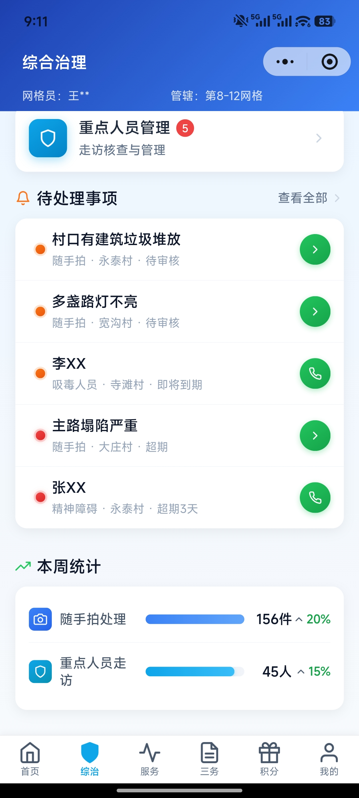

- 标注说明：
  ① 从底部导航栏点击"综治"进入此页面，这是综治模块的总入口
  ② 顶部显示用户姓名和网格区域
  ③ 今日概览：随手拍待审核数、待核查人员数、本周走访数
  ④ 本周统计：随手拍处理进度、重点人员核查进度
  ⑤ 待处理事项列表：混合显示随手拍待审核和重点人员待核查事项
  ⑥ 点击"随手拍"相关数据跳转随手拍列表，点击"重点人员"相关数据跳转重点人员管理首页

---

##### 确认项
- 功能是否需要： [ ] 需要  [ ] 不需要（原因：                ）
- 展示内容是否符合： [ ] 符合  [ ] 需调整（写明调整点：                ）
- 数据整体是否可落地： [ ] 可落地  [ ] 有风险（风险点：                ）

---

#### 5.2.2 功能名称：`随手拍列表`（所属模块：`综治模块`）

**这页用来干啥（1句话）：**
展示所有随手拍工单列表，支持搜索、筛选和状态切换，方便快速查找目标工单

---

##### 页面展示内容

- 原型截图：


- 标注说明：
  ① 从综合治理首页点击"随手拍"相关数据或按钮进入
  ② 顶部搜索栏支持按工单号、标题、类型、村庄搜索
  ③ 状态：全部、超时、待派单、处理中、待审核、已完成
  ④ 筛选器支持按类型、紧急程度、村庄、排序方式筛选
  ⑤ 工单卡片展示标题、状态、紧急程度、位置、创建时间
---

##### 确认项
- 功能是否需要： [ ] 需要  [ ] 不需要（原因：                ）
- 展示内容是否符合： [ ] 符合  [ ] 需调整（写明调整点：                ）
- 数据整体是否可落地： [ ] 可落地  [ ] 有风险（风险点：                ）

---

#### 5.2.3 功能名称：`随手拍详情/派单`（所属模块：`综治模块`）

**这页用来干啥（1句话）：**
查看随手拍工单详细信息，并执行派单操作（选择网格员、设置紧急程度、调整分类）

---

##### 页面展示内容

- 原型截图：
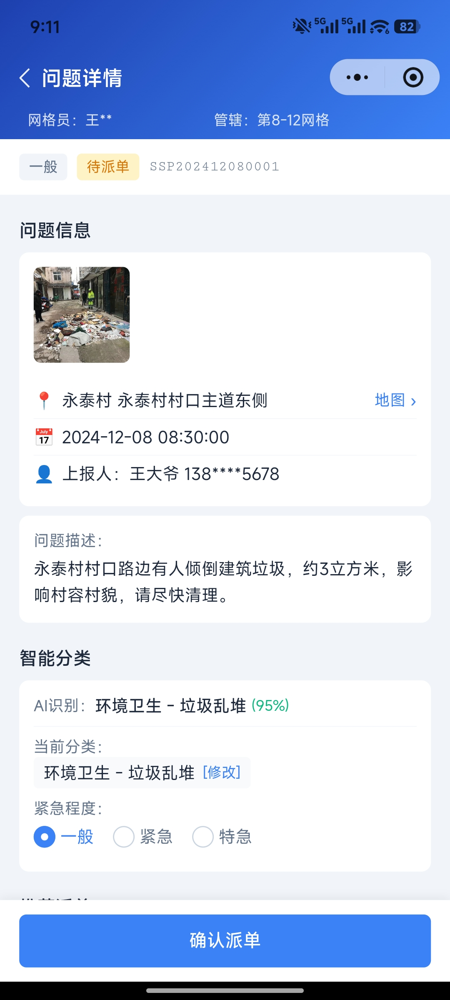


- 标注说明：
  ① 从随手拍列表点击工单卡片进入
  ② 顶部显示问题标题、状态、紧急程度
  ③ 问题信息卡片：类型、位置、描述、上报图片
  ④ 处理进度条：已上报→已派单→处理中→已完成
  ⑤ 派单区域：网格员选择（推荐优先）、紧急程度调整、问题分类调整、备注
  ⑥ 底部操作按钮：确认派单

---

##### 需要的数据


**请确认是否正确-工单处理流程：**

| 序号 | 处理流程 | 处理人 | 备注 |
|------|-----------|----------|--------------|
| 1 | 派单 | 乡镇/村管理人员 | |
| 2 | 现场处理 | 网格员 | |
| 3 | 处理完成后拍照上报 | 网格员 | |
| 4 | 完成情况审核 | 乡镇/村管理人员 | |

---

##### 确认项
- 功能是否需要： [ ] 需要  [ ] 不需要（原因：                ）
- 展示内容是否符合： [ ] 符合  [ ] 需调整（写明调整点：                ）
- 数据整体是否可落地： [ ] 可落地  [ ] 有风险（风险点：                ）

---

#### 5.2.4 功能名称：`随手拍审核`（所属模块：`综治模块`）

**这页用来干啥（1句话）：**
审核已处置的随手拍工单，支持整改前后对比，可通过或驳回

---

##### 页面展示内容

- 原型截图：


- 标注说明：
  ① 从随手拍列表点击"待审核"状态的工单进入，或从综合治理首页点击待审核数进入
  ② 对比区域：左右对比模式展示整改前/后照片
  ③ 问题信息：标题、类型、位置、处置说明
  ④ 底部操作：驳回（选择原因）、通过（可选加入曝光台）

---

##### 确认项
- 功能是否需要： [ ] 需要  [ ] 不需要（原因：                ）
- 展示内容是否符合： [ ] 符合  [ ] 需调整（写明调整点：                ）
- 数据整体是否可落地： [ ] 可落地  [ ] 有风险（风险点：                ）

---

#### 5.2.5 功能名称：`随手拍进度`（所属模块：`综治模块`）

**这页用来干啥（1句话）：**
网格员填写处理进度，上传处置照片，提交处置完成

---

##### 页面展示内容

- 原型截图：


- 标注说明：
  ① 从随手拍列表点击"处理中"状态工单的操作按钮进入
  ② 顶部显示问题基本信息：标题、紧急程度、状态
  ③ 进度输入：文本域输入处理进度内容
  ④ 图片上传：支持拍照或相册选择，最多9张
  ⑤ 完成选项：勾选"标记为处置完成"后需填写处置说明
  ⑥ 提交按钮：提交进度或提交完成（进入审核流程）

---

##### 确认项
- 功能是否需要： [ ] 需要  [ ] 不需要（原因：                ）
- 展示内容是否符合： [ ] 符合  [ ] 需调整（写明调整点：                ）
- 数据整体是否可落地： [ ] 可落地  [ ] 有风险（风险点：                ）

---

#### 5.2.6 功能名称：`随手拍统计`（所属模块：`综治模块`）

**这页用来干啥（1句话）：**
展示随手拍工单的数据统计，包括概览、分类统计、村庄统计、网格员绩效

---

##### 页面展示内容

- 原型截图：

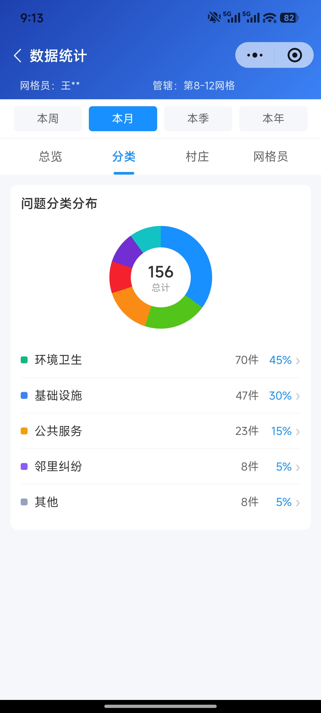
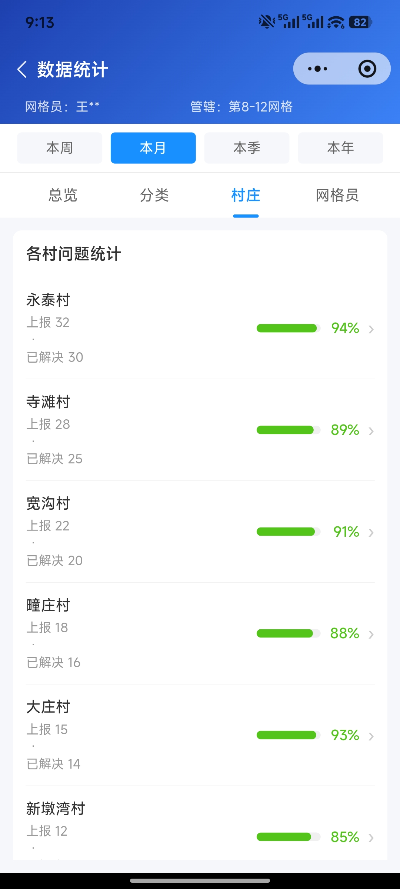


- 标注说明：
  ① 从综合治理首页点击"数据统计"入口进入
  ② 顶部标签切换：概览、分类统计、村庄统计、网格员绩效
  ③ 日期范围选择：本周/本月/本季度/本年
  ④ 概览：总上报数、已解决数、解决率、待处理数、处理中、待审核、平均响应时间
  ⑤ 分类统计：饼图展示各类型问题占比
  ⑥ 村庄统计：各村上报数、解决数、解决率排行
  ⑦ 网格员绩效：处理数、平均响应时间、好评率排行

---

##### 确认项
- 功能是否需要： [ ] 需要  [ ] 不需要（原因：                ）
- 展示内容是否符合： [ ] 符合  [ ] 需调整（写明调整点：                ）
- 数据整体是否可落地： [ ] 可落地  [ ] 有风险（风险点：                ）

---

#### 5.2.7 功能名称：`重点人员管理首页`（所属模块：`综治模块`）

**这页用来干啥（1句话）：**
重点人员管理的工作台入口，展示各类人员统计、村庄分布和待核查提醒

---

##### 页面展示内容

- 原型截图：
  
  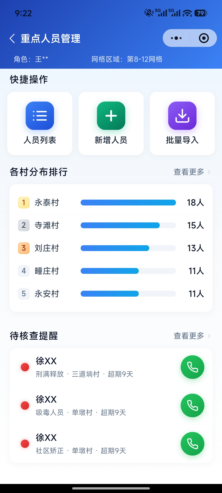

- 标注说明：
  ① 从综合治理首页点击"重点人员管理"卡片进入此页面
  ② 顶部统计概览卡片展示总人数、高风险、需关注三大指标
  ③ 类型统计网格显示各类重点人员数量（精神障碍、吸毒人员、刑释人员等）
  ④ 各村分布排行以进度条形式展示Top5村庄
  ⑤ 待核查提醒列表显示超期和即将到期的人员，支持快速拨号

---

##### 确认项
- 功能是否需要： [ ] 需要  [ ] 不需要（原因：                ）
- 展示内容是否符合： [ ] 符合  [ ] 需调整（写明调整点：                ）
- 数据整体是否可落地： [ ] 可落地  [ ] 有风险（风险点：                ）

---

#### 5.2.8 功能名称：`重点人员列表`（所属模块：`综治模块`）

**这页用来干啥（1句话）：**
展示所有重点人员列表，支持搜索和多维度筛选，方便快速查找目标人员

---

##### 页面展示内容

- 原型截图：
  

- 标注说明：
  ① 从重点人员管理首页点击"人员列表"快捷操作进入，或从类型统计点击具体类型、从各村排行点击村名进入（带筛选参数）
  ② 顶部搜索栏支持按姓名或村庄搜索
  ③ 类型标签支持按人员类型快速筛选
  ④ 筛选器支持按村庄、风险等级、核查状态组合筛选
  ⑤ 列表卡片展示人员姓名、类型标签、风险等级、最后核查日期
  ⑥ 卡片右侧支持快速拨号操作

---

##### 需要的数据

| 序号 | 数据项名称 | 必填/选填 | 数据说明/口径 | 是否能提供 | 备注 |
|------|-----------|----------|--------------|-----------|------|
| 1 | 人员姓名 | [x]必填 [ ]选填 | 重点人员的姓名 | [ ]能 [ ]部分能 [ ]不能 | |
| 2 | 人员类型 | [x]必填 [ ]选填 | 人员类型（精神障碍/吸毒人员/刑释人员等） | [ ]能 [ ]部分能 [ ]不能 | 显示类型标签 |
| 3 | 风险等级 | [x]必填 [ ]选填 | 高/中/低三级，用红黄绿颜色标识 | [ ]能 [ ]部分能 [ ]不能 | |
| 4 | 所属村庄 | [x]必填 [ ]选填 | 人员所在村庄名称 | [ ]能 [ ]部分能 [ ]不能 | |
| 5 | 最后核查日期 | [x]必填 [ ]选填 | 最近一次核查的日期 | [ ]能 [ ]部分能 [ ]不能 | |
| 6 | 核查状态 | [x]必填 [ ]选填 | 是否超期、超期天数、是否即将到期 | [ ]能 [ ]部分能 [ ]不能 | |
| 7 | 联系电话 | [ ]必填 [x]选填 | 本人或监护人电话 | [ ]能 [ ]部分能 [ ]不能 | 用于快速拨号 |

---

##### 确认项
- 功能是否需要： [ ] 需要  [ ] 不需要（原因：                ）
- 展示内容是否符合： [ ] 符合  [ ] 需调整（写明调整点：                ）
- 数据整体是否可落地： [ ] 可落地  [ ] 有风险（风险点：                ）

---

#### 5.2.9 功能名称：`人员详情`（所属模块：`综治模块`）

**这页用来干啥（1句话）：**
展示重点人员的完整档案信息，支持查看位置、联系本人/监护人、登记核查

---

##### 页面展示内容

- 原型截图：
  
  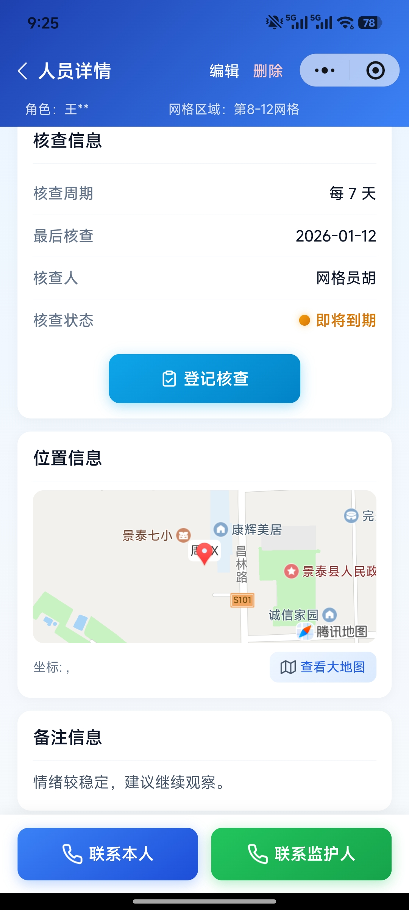
  

- 标注说明：
  ① 从重点人员列表页点击具体人员卡片进入，或从综合治理首页待处理列表点击人员进入
  ② 头部显示人员姓名、类型、风险等级、当前状态
  ③ 基本信息卡片：性别、年龄、身份证号、村庄、详细地址
  ④ 联系方式卡片：本人电话、监护人、监护人电话，支持点击拨号
  ⑤ 核查信息卡片：核查周期、最后核查日期、核查状态，支持登记核查
  ⑥ 位置信息：小地图预览，可跳转大地图查看

---

##### 需要的数据

**基本信息数据：**

| 序号 | 数据项名称 | 必填/选填 | 数据说明/口径 | 是否能提供 | 备注 |
|------|-----------|----------|--------------|-----------|------|
| 1 | 人员姓名 | [x]必填 [ ]选填 | 重点人员的姓名 | [ ]能 [ ]部分能 [ ]不能 | |
| 2 | 人员类型 | [x]必填 [ ]选填 | 人员所属类型 | [ ]能 [ ]部分能 [ ]不能 | |
| 3 | 风险等级 | [x]必填 [ ]选填 | 高/中/低 | [ ]能 [ ]部分能 [ ]不能 | |
| 4 | 当前状态 | [x]必填 [ ]选填 | 正常/需关注/预警 | [ ]能 [ ]部分能 [ ]不能 | |
| 5 | 性别 | [x]必填 [ ]选填 | 男/女 | [ ]能 [ ]部分能 [ ]不能 | |
| 6 | 年龄 | [x]必填 [ ]选填 | 人员年龄 | [ ]能 [ ]部分能 [ ]不能 | |
| 7 | 身份证号 | [x]必填 [ ]选填 | 身份证号码（脱敏显示） | [ ]能 [ ]部分能 [ ]不能 | |
| 8 | 所属村庄 | [x]必填 [ ]选填 | 人员所在村庄 | [ ]能 [ ]部分能 [ ]不能 | |
| 9 | 详细地址 | [x]必填 [ ]选填 | 具体居住地址 | [ ]能 [ ]部分能 [ ]不能 | |

**联系方式数据：**

| 序号 | 数据项名称 | 必填/选填 | 数据说明/口径 | 是否能提供 | 备注 |
|------|-----------|----------|--------------|-----------|------|
| 10 | 本人电话 | [ ]必填 [x]选填 | 人员本人的手机号码 | [ ]能 [ ]部分能 [ ]不能 | |
| 11 | 监护人姓名 | [ ]必填 [x]选填 | 监护人的姓名 | [ ]能 [ ]部分能 [ ]不能 | |
| 12 | 监护人电话 | [ ]必填 [x]选填 | 监护人的手机号码 | [ ]能 [ ]部分能 [ ]不能 | |

**位置信息数据：**

| 序号 | 数据项名称 | 必填/选填 | 数据说明/口径 | 是否能提供 | 备注 |
|------|-----------|----------|--------------|-----------|------|
| 17 | 经度 | [ ]必填 [x]选填 | 人员居住地的经度坐标 | [ ]能 [ ]部分能 [ ]不能 | 用于地图标点 |
| 18 | 纬度 | [ ]必填 [x]选填 | 人员居住地的纬度坐标 | [ ]能 [ ]部分能 [ ]不能 | 用于地图标点 |
| 19 | 备注信息 | [ ]必填 [x]选填 | 其他需要记录的信息 | [ ]能 [ ]部分能 [ ]不能 | |

---

##### 确认项
- 功能是否需要： [ ] 需要  [ ] 不需要（原因：                ）
- 展示内容是否符合： [ ] 符合  [ ] 需调整（写明调整点：                ）
- 数据整体是否可落地： [ ] 可落地  [ ] 有风险（风险点：                ）

---

#### 5.2.10 功能名称：`新增/编辑人员`（所属模块：`综治模块`）

**这页用来干啥（1句话）：**
录入或修改重点人员信息，支持基本信息、联系方式、位置信息的填写

---

##### 页面展示内容

- 原型截图：
  
  
  

- 标注说明：
  ① 新增模式：从重点人员管理首页点击"新增人员"快捷操作进入；编辑模式：从人员详情页点击"编辑"按钮进入
  ② 基本信息：姓名、性别、年龄、身份证号、人员类型、风险等级、当前状态
  ③ 地址信息：所属村庄（下拉选择）、详细地址
  ④ 联系方式：本人电话、监护人姓名、监护人电话
  ⑤ 位置信息：经纬度输入，支持地图选点和获取当前位置
  ⑥ 其他信息：备注文本域

---

##### 确认项
- 功能是否需要： [ ] 需要  [ ] 不需要（原因：                ）
- 展示内容是否符合： [ ] 符合  [ ] 需调整（写明调整点：                ）
- 数据整体是否可落地： [ ] 可落地  [ ] 有风险（风险点：                ）

---

#### 5.2.11 功能名称：`人员分布地图`（所属模块：`综治模块`）

**这页用来干啥（1句话）：**
在地图上直观展示重点人员分布情况，支持村级/人员两种视图模式

---

##### 页面展示内容

- 原型截图：
  
  
  

- 标注说明：
  ① 从重点人员管理首页点击"查看地图"按钮进入，或从人员详情页点击"位置"查看大地图
  ② 地图支持缩放、拖动、定位操作
  ③ 村级视图：显示各村聚合标记，标注村名和人数
  ④ 人员视图：显示每个人员的单独标记
  ⑤ 点击村级标记展示该村人员列表面板
  ⑥ 点击人员标记展示人员信息卡片

---

##### 确认项
- 功能是否需要： [ ] 需要  [ ] 不需要（原因：                ）
- 展示内容是否符合： [ ] 符合  [ ] 需调整（写明调整点：                ）
- 数据整体是否可落地： [ ] 可落地  [ ] 有风险（风险点：                ）

---

#### 5.2.12 功能名称：`批量导入`（所属模块：`综治模块`）

**这页用来干啥（1句话）：**
通过Excel文件批量导入重点人员数据，支持模板下载、数据预览和错误提示

---

##### 页面展示内容

- 原型截图：
  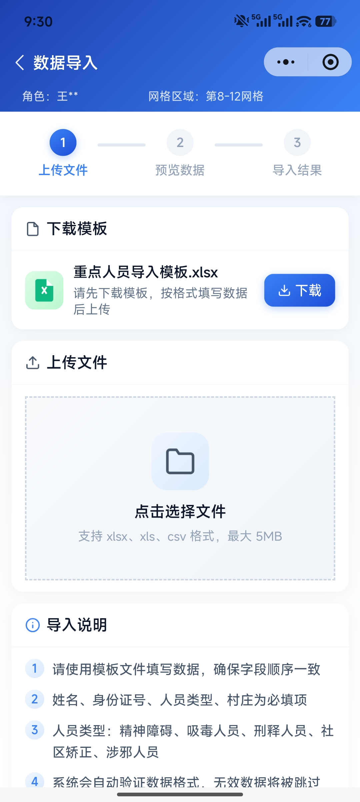

- 标注说明：
  ① 从重点人员管理首页点击"批量导入"快捷操作进入
  ② 顶部步骤指示器显示当前所在步骤（1上传文件→2预览数据→3导入结果）
  ③ 步骤1：提供模板下载，支持xlsx/xls/csv格式上传，最大5MB
  ④ 步骤2：显示有效/无效数据统计，列出错误数据的行号和原因
  ⑤ 步骤2：预览表格显示数据内容和验证状态
  ⑥ 步骤3：显示导入成功条数和跳过条数

---


##### 确认项
- 功能是否需要： [ ] 需要  [ ] 不需要（原因：                ）
- 展示内容是否符合： [ ] 符合  [ ] 需调整（写明调整点：                ）
- 数据整体是否可落地： [ ] 可落地  [ ] 有风险（风险点：                ）

---

### 5.3 服务模块

---

#### 5.3.1 功能名称：`服务首页`（所属模块：`服务模块`）

**这页用来干啥（1句话）：**
服务模块入口，展示今日数据概览、待审批异常、快捷入口和近期培训

---

##### 页面展示内容

- 原型截图：
  

- 标注说明：
  ① 从底部导航栏点击"服务"进入此页面
  ② 顶部导航栏显示用户姓名、角色、网格区域
  ③ 今日数据统计卡片支持点击跳转到对应功能页面
  ④ 待审批事项仅显示最新3条，点击"更多"查看全部

---

##### 确认项
- 功能是否需要： [ ] 需要  [ ] 不需要（原因：                ）
- 展示内容是否符合： [ ] 符合  [ ] 需调整（写明调整点：                ）
- 数据整体是否可落地： [ ] 可落地  [ ] 有风险（风险点：                ）

---

#### 5.3.2 功能名称：`用工监管首页`（所属模块：`用工监管`）

**这页用来干啥（1句话）：**
展示今日考勤统计数据、异常打卡列表和各工作点打卡情况

---

##### 页面展示内容

- 原型截图：
  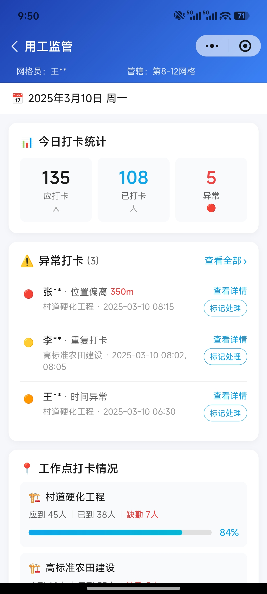
  

- 标注说明：
  ① 从服务首页点击"今日打卡"统计数字进入，或点击"用工监管"快捷入口进入
  ② 顶部显示当前日期（年月日 星期）
  ③ 统计卡片显示应到人数、已到人数、异常数量
  ④ 异常列表仅显示最新3条，可点击查看全部

---

##### 确认项
- 功能是否需要： [ ] 需要  [ ] 不需要（原因：                ）
- 展示内容是否符合： [ ] 符合  [ ] 需调整（写明调整点：                ）
- 数据整体是否可落地： [ ] 可落地  [ ] 有风险（风险点：                ）

---

#### 5.3.3 功能名称：`考勤记录查询`（所属模块：`用工监管`）

**这页用来干啥（1句话）：**
按日期、工作点、状态筛选查询所有村民的考勤打卡记录

---

##### 页面展示内容

- 原型截图：
  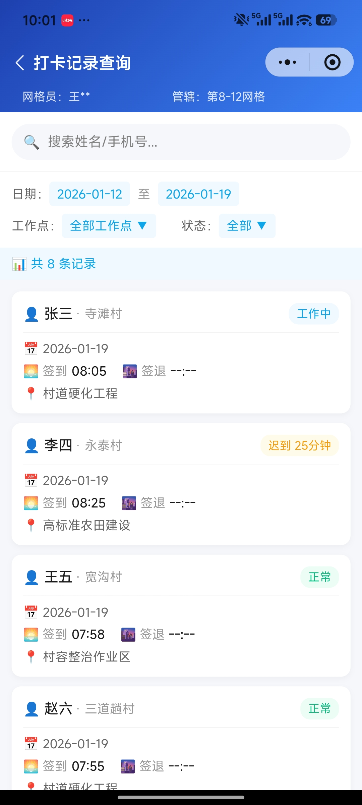

- 标注说明：
  ① 从用工监管首页点击"详细记录"进入
  ② 支持按姓名、手机号搜索村民
  ③ 支持日期范围、工作点、打卡状态多条件筛选
  ④ 记录列表显示村民基本信息和上下班打卡时间

---

##### 确认项
- 功能是否需要： [ ] 需要  [ ] 不需要（原因：                ）
- 展示内容是否符合： [ ] 符合  [ ] 需调整（写明调整点：                ）
- 数据整体是否可落地： [ ] 可落地  [ ] 有风险（风险点：                ）

---

#### 5.3.4 功能名称：`异常打卡列表`（所属模块：`用工监管`）

**这页用来干啥（1句话）：**
按处理状态分类展示所有异常打卡记录，支持标签页切换

---

##### 页面展示内容

- 原型截图：
  

- 标注说明：
  ① 从用工监管首页点击异常打卡列表"查看全部"进入，或从服务首页待审批事项点击“更多”进入
  ② 标签页显示各状态的记录数量
  ③ 不同异常类型用不同颜色图标区分
  ④ 已处理的记录显示网格员意见和领导审批结果

---

##### 确认项
- 功能是否需要： [ ] 需要  [ ] 不需要（原因：                ）
- 展示内容是否符合： [ ] 符合  [ ] 需调整（写明调整点：                ）
- 数据整体是否可落地： [ ] 可落地  [ ] 有风险（风险点：                ）

---

#### 5.3.5 功能名称：`异常打卡详情处理`（所属模块：`用工监管`）

**这页用来干啥（1句话）：**
查看异常打卡详情，网格员填写初审意见提交领导审批，领导进行最终审批

---

##### 页面展示内容

- 原型截图：
  
  

- 标注说明：
  ① 从异常打卡列表点击具体异常记录卡片进入，或从服务首页待审批事项点击具体项进入
  ② 异常信息卡片显示村民姓名、电话、打卡时间、工作点
  ③ 位置偏离类型显示偏离距离和允许范围
  ④ 网格员角色显示初审表单，领导角色显示最终审批表单

---

##### 确认项
- 功能是否需要： [ ] 需要  [ ] 不需要（原因：                ）
- 展示内容是否符合： [ ] 符合  [ ] 需调整（写明调整点：                ）
- 数据整体是否可落地： [ ] 可落地  [ ] 有风险（风险点：                ）

---

### 5.2.3 培训管理

#### 5.3.6 功能名称：`培训管理列表`（所属模块：`培训管理`）

**这页用来干啥（1句话）：**
查看所有培训活动列表，支持按状态筛选，管理培训和查看报名情况

---

##### 页面展示内容

- 原型截图：
  

- 标注说明：
  ① 从服务首页点击"培训场次"统计数字进入，或点击"培训管理"快捷入口进入，或点击近期培训列表"更多"进入
  ② 右上角"+"按钮可创建新培训
  ③ 标签页显示各状态的培训数量
  ④ 培训卡片显示报名进度条，支持查看报名和编辑操作

---

##### 需要的数据

**培训卡片信息：**

| 序号 | 数据项名称 | 必填/选填 | 数据说明/口径 | 是否能提供 | 备注 |
|------|-----------|----------|--------------|-----------|------|
| 1 | 培训名称 | [x]必填 [ ]选填 | 培训主题标题 | [ ]能 [ ]部分能 [ ]不能 | 后台配置 |
| 2 | 培训分类 | [x]必填 [ ]选填 | 如"种植技术"/"养殖技术"/"技能培训" | [ ]能 [ ]部分能 [ ]不能 | 后台配置 |
| 3 | 培训日期 | [x]必填 [ ]选填 | 培训举办日期 | [ ]能 [ ]部分能 [ ]不能 | 后台配置 |
| 4 | 培训时间 | [x]必填 [ ]选填 | 培训开始和结束时间，如"09:00-12:00" | [ ]能 [ ]部分能 [ ]不能 | 后台配置 |
| 5 | 培训地点 | [x]必填 [ ]选填 | 培训举办地点 | [ ]能 [ ]部分能 [ ]不能 | 后台配置 |
| 6 | 讲师姓名 | [x]必填 [ ]选填 | 培训讲师姓名 | [ ]能 [ ]部分能 [ ]不能 | 后台配置 |
| 7 | 讲师职称 | [ ]必填 [x]选填 | 讲师的职称/头衔 | [ ]能 [ ]部分能 [ ]不能 | 后台配置 |
| 8 | 最大报名人数 | [x]必填 [ ]选填 | 培训可容纳的最大人数 | [ ]能 [ ]部分能 [ ]不能 | 后台配置 |

---

##### 确认项
- 功能是否需要： [ ] 需要  [ ] 不需要（原因：                ）
- 展示内容是否符合： [ ] 符合  [ ] 需调整（写明调整点：                ）
- 数据整体是否可落地： [ ] 可落地  [ ] 有风险（风险点：                ）

---

#### 5.3.7 功能名称：`创建/编辑培训`（所属模块：`培训管理`）

**这页用来干啥（1句话）：**
填写培训基本信息、时间地点、讲师信息等，发布新培训或编辑现有培训

---

##### 页面展示内容

- 原型截图：
  
  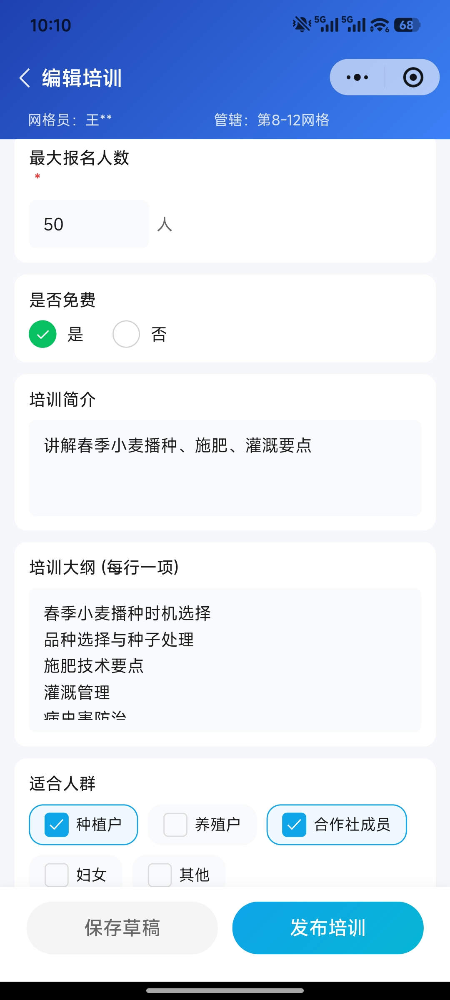

- 标注说明：
  ① 新增模式：从服务首页点击"新增培训"快捷操作进入，或从培训管理列表点击右上角"+"按钮进入；编辑模式：从培训管理列表点击培训卡片的"编辑"按钮进入
  ② 带*号的为必填项（培训主题、分类、时间、地点、讲师、报名人数）
  ③ 底部有"保存草稿"和"发布"两个操作按钮
  ④ 编辑模式时自动填充现有培训数据

---

##### 需要的数据

**培训基本信息（表单输入）：**

| 序号 | 数据项名称 | 必填/选填 | 数据说明/口径 | 是否能提供 | 备注 |
|------|-----------|----------|--------------|-----------|------|
| 1 | 培训主题 | [x]必填 [ ]选填 | 培训的名称/标题 | [ ]能 [ ]部分能 [ ]不能 | 用户输入 |
| 2 | 培训分类 | [x]必填 [ ]选填 | 下拉选择：种植技术/养殖技术/技能培训/政策宣讲/其他 | [ ]能 [ ]部分能 [ ]不能 | 用户选择 |
| 3 | 培训日期 | [x]必填 [ ]选填 | 培训举办的日期 | [ ]能 [ ]部分能 [ ]不能 | 用户选择 |
| 4 | 开始时间 | [x]必填 [ ]选填 | 培训开始时间，如"09:00" | [ ]能 [ ]部分能 [ ]不能 | 用户选择 |
| 5 | 结束时间 | [x]必填 [ ]选填 | 培训结束时间，如"12:00" | [ ]能 [ ]部分能 [ ]不能 | 用户选择 |
| 6 | 培训地点 | [x]必填 [ ]选填 | 培训举办的具体地点 | [ ]能 [ ]部分能 [ ]不能 | 用户输入 |
| 7 | 讲师姓名 | [x]必填 [ ]选填 | 培训讲师的姓名 | [ ]能 [ ]部分能 [ ]不能 | 用户输入 |
| 8 | 讲师职称 | [ ]必填 [x]选填 | 讲师的职称/头衔 | [ ]能 [ ]部分能 [ ]不能 | 用户输入 |
| 9 | 最大报名人数 | [x]必填 [ ]选填 | 培训可容纳的最大人数，默认50 | [ ]能 [ ]部分能 [ ]不能 | 用户输入 |
| 10 | 是否免费 | [ ]必填 [x]选填 | 是/否，默认是 | [ ]能 [ ]部分能 [ ]不能 | 用户选择 |
| 11 | 培训简介 | [ ]必填 [x]选填 | 培训内容的简要描述 | [ ]能 [ ]部分能 [ ]不能 | 用户输入 |
| 12 | 培训大纲 | [ ]必填 [x]选填 | 培训内容大纲，每行一项 | [ ]能 [ ]部分能 [ ]不能 | 用户输入 |
| 13 | 适合人群 | [ ]必填 [x]选填 | 多选：种植户/养殖户/合作社成员/妇女/其他 | [ ]能 [ ]部分能 [ ]不能 | 用户选择 |
---

##### 确认项
- 功能是否需要： [ ] 需要  [ ] 不需要（原因：                ）
- 展示内容是否符合： [ ] 符合  [ ] 需调整（写明调整点：                ）
- 数据整体是否可落地： [ ] 可落地  [ ] 有风险（风险点：                ）

---

#### 5.3.8 功能名称：`查看报名`（所属模块：`培训管理`）

**这页用来干啥（1句话）：**
查看指定培训的报名统计和报名人员列表，支持搜索筛选和一键拨打电话

---

##### 页面展示内容

- 原型截图：
  

- 标注说明：
  ① 从培训管理列表点击培训卡片的"查看报名"按钮进入，或从服务首页近期培训列表点击具体培训项进入
  ② 顶部显示培训的基本信息（分类、标题、时间地点）
  ③ 统计卡片显示已报名人数和剩余名额
  ④ 人员列表每项支持点击电话图标一键拨打

---

##### 确认项
- 功能是否需要： [ ] 需要  [ ] 不需要（原因：                ）
- 展示内容是否符合： [ ] 符合  [ ] 需调整（写明调整点：                ）
- 数据整体是否可落地： [ ] 可落地  [ ] 有风险（风险点：                ）

---


#### 5.3.9 功能名称：`户籍管理列表`（所属模块：`户籍管理`）

**这页用来干啥（1句话）：**
按村庄和惠民政策筛选查看辖区内所有户籍信息，快速搜索定位特定住户

---

##### 页面展示内容

- 原型截图：
  

- 标注说明：
  ① 从服务首页点击"户籍管理"快捷入口进入
  ② 搜索栏支持按户主姓名、电话号码搜索
  ③ 顶部村庄标签支持横向滚动，快速切换村庄筛选
  ④ 统计卡片实时显示筛选结果的总户数、总人口、行政村数量
  ⑤ 户籍卡片点击后弹出详情弹窗

---

##### 需要的数据


**户籍卡片列表：**

| 序号 | 数据项名称 | 必填/选填 | 数据说明/口径 | 是否能提供 | 备注 |
|------|-----------|----------|--------------|-----------|------|
| 1 | 户主姓名 | [x]必填 [ ]选填 | 该户的户主姓名 | [ ]能 [ ]部分能 [ ]不能 | 来自户籍数据 |
| 2 | 所属村庄 | [x]必填 [ ]选填 | 户籍所在村庄名称 | [ ]能 [ ]部分能 [ ]不能 | 来自户籍数据 |
| 3 | 组号 | [x]必填 [ ]选填 | 村内组别，如"1组"/"2组" | [ ]能 [ ]部分能 [ ]不能 | 来自户籍数据 |
| 4 | 门牌号 | [x]必填 [ ]选填 | 住户门牌号 | [ ]能 [ ]部分能 [ ]不能 | 来自户籍数据 |
| 5 | 详细地址 | [x]必填 [ ]选填 | 完整地址（村+组+门牌号） | [ ]能 [ ]部分能 [ ]不能 | 拼接生成 |
| 6 | 家庭人数 | [x]必填 [ ]选填 | 该户家庭成员总数 | [ ]能 [ ]部分能 [ ]不能 | 来自户籍数据 |
| 7 | 联系电话 | [x]必填 [ ]选填 | 户主联系电话 | [ ]能 [ ]部分能 [ ]不能 | 来自户籍数据 |
| 8 | 电话脱敏显示 | [x]必填 [ ]选填 | 脱敏后的电话号码，如"159****1234" | [ ]能 [ ]部分能 [ ]不能 | 前端处理 |
| 9 | 惠民政策标签 | [ ]必填 [x]选填 | 该户享受的惠民政策列表 | [ ]能 [ ]部分能 [ ]不能 | 来自政策关联 |

---

##### 确认项
- 功能是否需要： [ ] 需要  [ ] 不需要（原因：                ）
- 展示内容是否符合： [ ] 符合  [ ] 需调整（写明调整点：                ）
- 数据整体是否可落地： [ ] 可落地  [ ] 有风险（风险点：                ）

---

#### 5.3.10 功能名称：`户籍详情`（所属模块：`户籍管理`）

**这页用来干啥（1句话）：**
查看住户完整信息，包括家庭成员构成、惠民政策和备注信息

---

##### 页面展示内容

- 原型截图：
  

- 标注说明：
  ① 从户籍管理列表点击任意户籍卡片，弹出详情弹窗
  ② 基本信息区显示户主姓名、详细地址、家庭人数、联系电话
  ③ 家庭成员区按列表展示每位成员的姓名、与户主关系、年龄
  ④ 惠民政策区显示该户享受的所有政策标签
  ⑤ 电话号码可点击直接拨打

---

##### 需要的数据

**基本信息：**

| 序号 | 数据项名称 | 必填/选填 | 数据说明/口径 | 是否能提供 | 备注 |
|------|-----------|----------|--------------|-----------|------|
| 1 | 户主姓名 | [x]必填 [ ]选填 | 该户的户主姓名 | [ ]能 [ ]部分能 [ ]不能 | 来自户籍数据 |
| 2 | 详细地址 | [x]必填 [ ]选填 | 完整地址（村+组+门牌号） | [ ]能 [ ]部分能 [ ]不能 | 来自户籍数据 |
| 3 | 家庭人数 | [x]必填 [ ]选填 | 该户家庭成员总数 | [ ]能 [ ]部分能 [ ]不能 | 来自户籍数据 |
| 4 | 联系电话 | [x]必填 [ ]选填 | 户主联系电话（用于拨打） | [ ]能 [ ]部分能 [ ]不能 | 来自户籍数据 |
| 5 | 电话脱敏显示 | [x]必填 [ ]选填 | 脱敏后的电话号码显示 | [ ]能 [ ]部分能 [ ]不能 | 前端处理 |

**家庭成员列表：**

| 序号 | 数据项名称 | 必填/选填 | 数据说明/口径 | 是否能提供 | 备注 |
|------|-----------|----------|--------------|-----------|------|
| 1 | 成员姓名 | [x]必填 [ ]选填 | 家庭成员的姓名 | [ ]能 [ ]部分能 [ ]不能 | 来自户籍数据 |
| 2 | 与户主关系 | [x]必填 [ ]选填 | 如"户主"/"配偶"/"子女"/"父母" | [ ]能 [ ]部分能 [ ]不能 | 来自户籍数据 |
| 3 | 成员年龄 | [x]必填 [ ]选填 | 家庭成员的年龄 | [ ]能 [ ]部分能 [ ]不能 | 来自户籍数据 |

**惠民政策：**

| 序号 | 数据项名称 | 必填/选填 | 数据说明/口径 | 是否能提供 | 备注 |
|------|-----------|----------|--------------|-----------|------|
| 1 | 政策名称 | [ ]必填 [x]选填 | 如"低保户"/"残疾人补贴"/"医疗保险" | [ ]能 [ ]部分能 [ ]不能 | 来自政策配置 |

**备注信息：**

| 序号 | 数据项名称 | 必填/选填 | 数据说明/口径 | 是否能提供 | 备注 |
|------|-----------|----------|--------------|-----------|------|
| 1 | 备注内容 | [ ]必填 [x]选填 | 该户的备注信息，如"优秀文明家庭" | [ ]能 [ ]部分能 [ ]不能 | 来自户籍数据 |

---

##### 确认项
- 功能是否需要： [ ] 需要  [ ] 不需要（原因：                ）
- 展示内容是否符合： [ ] 符合  [ ] 需调整（写明调整点：                ）
- 数据整体是否可落地： [ ] 可落地  [ ] 有风险（风险点：                ）

---

### 5.4 三务模块

---

#### 5.4.1 功能名称：`三务首页`（所属模块：`三务`）

**这页用来干啥（1句话）：**
展示综治模块的整体概览，提供各功能入口和快捷操作。

---

##### 页面展示内容

- 原型截图：
  
  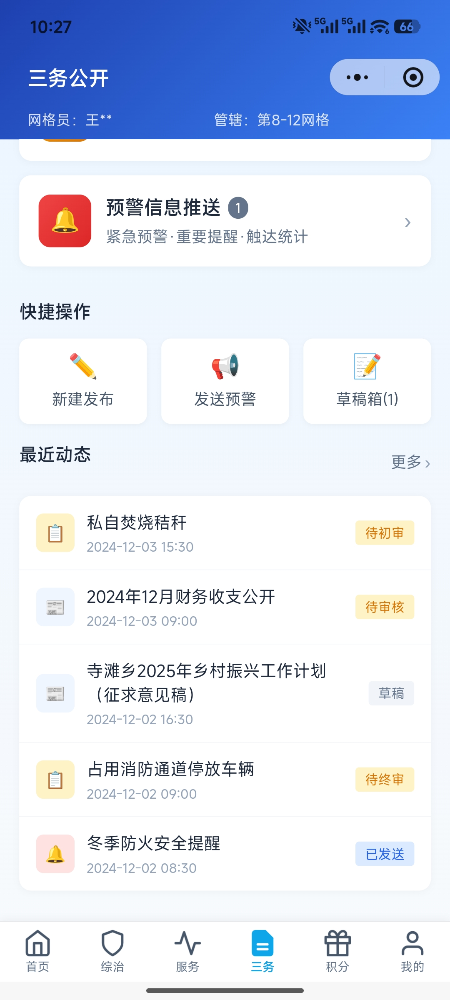

- 标注说明：
  ① 从底部导航栏点击"三务"进入此页面
  ② 统计卡片显示待审核、已发布、本月发布三项数据
  ③ 功能入口带待处理数字角标提醒
  ④ 最近动态展示信息发布、曝光台、预警信息的最新5条记录

---

##### 确认项
- 功能是否需要： [ ] 需要  [ ] 不需要（原因：                ）
- 展示内容是否符合： [ ] 符合  [ ] 需调整（写明调整点：                ）
- 数据整体是否可落地： [ ] 可落地  [ ] 有风险（风险点：                ）

---

#### 5.4.2 功能名称：`信息发布列表`（所属模块：`信息发布管理`）

**这页用来干啥（1句话）：**
管理所有政策公告和阳光村务信息，支持筛选、搜索和状态切换。

---

##### 页面展示内容

- 原型截图：
  

- 标注说明：
  ① 从三务首页点击"信息发布管理"功能卡片进入，或从三务首页快捷操作点击"草稿箱"进入（带草稿筛选参数）
  ② 标签栏带待审核/草稿数字角标
  ③ 支持按类型筛选（政策公告/阳光村务等），可以通过标题或内容进行搜索
  ④ 不同状态显示不同操作按钮

---

##### 确认项
- 功能是否需要： [ ] 需要  [ ] 不需要（原因：                ）
- 展示内容是否符合： [ ] 符合  [ ] 需调整（写明调整点：                ）
- 数据整体是否可落地： [ ] 可落地  [ ] 有风险（风险点：                ）

---

#### 5.4.3 功能名称：`新建/编辑信息发布`（所属模块：`信息发布管理`）

**这页用来干啥（1句话）：**
创建或编辑政策公告/阳光村务信息，支持富文本编辑和附件上传。

---

##### 页面展示内容

- 原型截图：
  
  

- 标注说明：
  ① 新增模式：从三务首页快捷操作点击"新增发布"进入；编辑模式：从信息发布列表点击"编辑"按钮进入
  ② 类型选择：政策公告/阳光村务等，后续可增加
  ③ 富文本编辑器支持加粗、斜体、下划线、列表、插入图片
  ④ 底部操作：保存草稿/提交审核

---

##### 需要的数据

| 序号 | 数据项名称 | 必填/选填 | 数据说明/口径 | 是否能提供 | 备注 |
|---|---|---|---|---|---|
| 1 | 信息类型 | [x]必填 [ ]选填 | 政策公告/阳光村务 | [ ]能 [ ]部分能 [ ]不能 | 用户选择 |
| 2 | 标题 | [x]必填 [ ]选填 | 最多50字 | [ ]能 [ ]部分能 [ ]不能 | 用户输入 |
| 3 | 摘要 | [ ]必填 [x]选填 | 最多100字 | [ ]能 [ ]部分能 [ ]不能 | 用户输入 |
| 4 | 正文内容 | [x]必填 [ ]选填 | 富文本HTML格式 | [ ]能 [ ]部分能 [ ]不能 | 用户编辑 |
| 5 | 生效日期 | [ ]必填 [x]选填 | 信息开始生效的日期 | [ ]能 [ ]部分能 [ ]不能 | 用户选择 |
| 6 | 失效日期 | [ ]必填 [x]选填 | 信息自动下架的日期 | [ ]能 [ ]部分能 [ ]不能 | 用户选择 |
| 7 | 标签 | [ ]必填 [x]选填 | 最多5个标签 | [ ]能 [ ]部分能 [ ]不能 | 用户添加 |
| 8 | 附件 | [ ]必填 [x]选填 | 最多5个附件 | [ ]能 [ ]部分能 [ ]不能 | 用户上传 |
---

##### 确认项
- 功能是否需要： [ ] 需要  [ ] 不需要（原因：                ）
- 展示内容是否符合： [ ] 符合  [ ] 需调整（写明调整点：                ）
- 数据整体是否可落地： [ ] 可落地  [ ] 有风险（风险点：                ）

---

#### 5.4.4 功能名称：`信息审核/详情`（所属模块：`信息发布管理`）

**这页用来干啥（1句话）：**
查看信息详情，审核待发布的信息（通过/驳回）。

---

##### 页面展示内容

- 原型截图：
  
  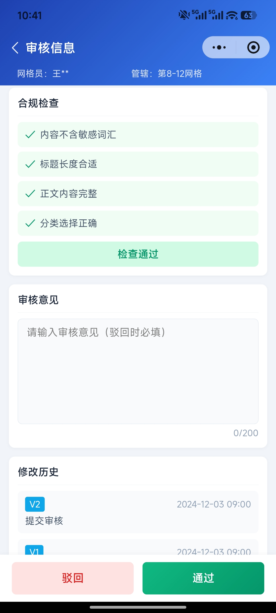

- 标注说明：
  ① 从信息发布列表点击"待审核"状态的信息项进入，或从三务首页最近动态点击待审核项进入
  ② 合规检查显示敏感词、标题长度等检测结果
  ③ 驳回时必须填写驳回原因
  ④ 历史版本记录信息的修改历程

---

##### 确认项
- 功能是否需要： [ ] 需要  [ ] 不需要（原因：                ）
- 展示内容是否符合： [ ] 符合  [ ] 需调整（写明调整点：                ）
- 数据整体是否可落地： [ ] 可落地  [ ] 有风险（风险点：                ）

---

#### 5.4.5 功能名称：`曝光台列表`（所属模块：`曝光台管理`）

**这页用来干啥（1句话）：**
管理所有曝光信息，支持按状态筛选和处理各类审核、申诉。

---

##### 页面展示内容

- 原型截图：
  

- 标注说明：
  ① 从三务首页点击"曝光台管理"功能卡片进入
  ② 统计卡片显示各状态的数量，点击可快速筛选
  ③ 曝光类型分为黑榜（⚫）和红榜（🔴）

---

##### 需要的数据

| 序号 | 数据项名称 | 必填/选填 | 数据说明/口径 | 是否能提供 | 备注 |
|---|---|---|---|---|---|
| 1 | 曝光类型 | [x]必填 [ ]选填 | 黑榜/红榜 | [ ]能 [ ]部分能 [ ]不能 | |
| 2 | 标题 | [x]必填 [ ]选填 | 曝光标题 | [ ]能 [ ]部分能 [ ]不能 | |
| 3 | 问题描述 | [x]必填 [ ]选填 | 问题的详细描述 | [ ]能 [ ]部分能 [ ]不能 | |
| 4 | 举报时间 | [x]必填 [ ]选填 | 举报的时间 | [ ]能 [ ]部分能 [ ]不能 | |
| 5 | 图片列表 | [ ]必填 [x]选填 | 举报图片的URL数组 | [ ]能 [ ]部分能 [ ]不能 | |
| 6 | 曝光到期日期 | [ ]必填 [x]选填 | 曝光自动下架的日期 | [ ]能 [ ]部分能 [ ]不能 | |

---

##### 确认项
- 功能是否需要： [ ] 需要  [ ] 不需要（原因：                ）
- 展示内容是否符合： [ ] 符合  [ ] 需调整（写明调整点：                ）
- 数据整体是否可落地： [ ] 可落地  [ ] 有风险（风险点：                ）

---

#### 5.4.6 功能名称：`曝光台审核`（所属模块：`曝光台管理`）

**这页用来干啥（1句话）：**
对举报信息进行初审或终审，决定是否发布到曝光台。

---

##### 页面展示内容

- 原型截图：
  
  
  
  

- 标注说明：
  ① 初审：从曝光台列表点击"待初审"状态的曝光项进入；终审：从曝光台列表点击"待终审"状态的曝光项进入
  ② 初审需填写行为描述和处理建议
  ③ 终审需选择曝光类型（黑榜/红榜）和曝光天数
  ④ 曝光天数可选7天/15天/30天或自定义

---

##### 确认项
- 功能是否需要： [ ] 需要  [ ] 不需要（原因：                ）
- 展示内容是否符合： [ ] 符合  [ ] 需调整（写明调整点：                ）
- 数据整体是否可落地： [ ] 可落地  [ ] 有风险（风险点：                ）

---

#### 5.4.7 功能名称：`申诉处理`（所属模块：`曝光台管理`）

**这页用来干啥（1句话）：**
处理被曝光人提交的申诉，核实后决定维持、调整或下架曝光。

---

##### 页面展示内容

- 原型截图：
  
  

- 标注说明：
  ① 从曝光台列表点击"申诉中"状态的曝光项进入，或从三务首页最近动态点击申诉项进入
  ② 申诉信息卡片高亮显示便于识别
  ③ 处理方式三选一：维持曝光、调整内容、提前下架
  ④ 选择"调整内容"时显示调整表单

---

##### 确认项
- 功能是否需要： [ ] 需要  [ ] 不需要（原因：                ）
- 展示内容是否符合： [ ] 符合  [ ] 需调整（写明调整点：                ）
- 数据整体是否可落地： [ ] 可落地  [ ] 有风险（风险点：                ）

---

#### 5.4.8 功能名称：`预警信息列表`（所属模块：`预警信息推送`）

**这页用来干啥（1句话）：**
管理所有预警信息，查看发送状态和触达统计。

---

##### 页面展示内容

- 原型截图：
  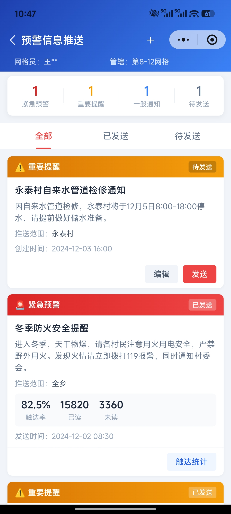

- 标注说明：
  ① 从三务首页点击"预警信息推送"功能卡片进入
  ② 预警级别用不同颜色和图标区分（🚨紧急/⚠️重要/ℹ️一般）
  ③ 已发送的预警显示触达率、已读数、未读数
  ④ 待发送的预警可编辑和发送

---

##### 需要的数据

| 序号 | 数据项名称 | 必填/选填 | 数据说明/口径 | 是否能提供 | 备注 |
|---|---|---|---|---|---|
| 1 | 预警级别 | [x]必填 [ ]选填 | 紧急预警/重要提醒/一般通知 | [ ]能 [ ]部分能 [ ]不能 | |
| 2 | 预警标题 | [x]必填 [ ]选填 | 预警标题，最多30字 | [ ]能 [ ]部分能 [ ]不能 | |
| 3 | 预警内容 | [x]必填 [ ]选填 | 预警内容预览 | [ ]能 [ ]部分能 [ ]不能 | |
| 4 | 推送范围 | [x]必填 [ ]选填 | 全乡/指定村庄/指定人群 | [ ]能 [ ]部分能 [ ]不能 | |

---

##### 确认项
- 功能是否需要： [ ] 需要  [ ] 不需要（原因：                ）
- 展示内容是否符合： [ ] 符合  [ ] 需调整（写明调整点：                ）
- 数据整体是否可落地： [ ] 可落地  [ ] 有风险（风险点：                ）

---

#### 5.4.9 功能名称：`新建/编辑预警`（所属模块：`预警信息推送`）

**这页用来干啥（1句话）：**
创建或编辑预警信息，设置级别、推送范围和内容。

---

##### 页面展示内容

- 原型截图：
  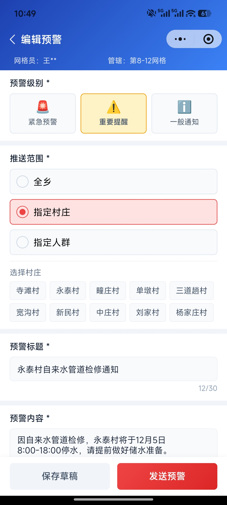
  

- 标注说明：
  ① 新增模式：从三务首页快捷操作点击"新增预警"进入，或从预警信息列表点击"新增"按钮进入；编辑模式：从预警信息列表点击"待发送"状态的预警项的"编辑"按钮进入
  ② 预警级别：🚨紧急预警、⚠️重要提醒、ℹ️一般通知
  ③ 选择"指定村庄"或"指定人群"时显示多选列表
  ④ 底部有实时预览效果卡片

---

##### 需要的数据

| 序号 | 数据项名称 | 必填/选填 | 数据说明/口径 | 是否能提供 | 备注 |
|---|---|---|---|---|---|
| 1 | 预警级别 | [x]必填 [ ]选填 | 紧急预警/重要提醒/一般通知 | [ ]能 [ ]部分能 [ ]不能 | 用户选择 |
| 2 | 推送范围 | [x]必填 [ ]选填 | 全乡/指定村庄/指定人群 | [ ]能 [ ]部分能 [ ]不能 | 用户选择 |
| 3 | 指定村庄列表 | [ ]必填 [x]选填 | 选中的村庄ID数组 | [ ]能 [ ]部分能 [ ]不能 | 选择指定村庄时需要 |
| 4 | 指定人群列表 | [ ]必填 [x]选填 | 选中的人群ID数组 | [ ]能 [ ]部分能 [ ]不能 | 选择指定人群时需要 |
| 5 | 预警标题 | [x]必填 [ ]选填 | 最多30字 | [ ]能 [ ]部分能 [ ]不能 | 用户输入 |
| 6 | 预警内容 | [x]必填 [ ]选填 | 最多500字 | [ ]能 [ ]部分能 [ ]不能 | 用户输入 |

---

##### 确认项
- 功能是否需要： [ ] 需要  [ ] 不需要（原因：                ）
- 展示内容是否符合： [ ] 符合  [ ] 需调整（写明调整点：                ）
- 数据整体是否可落地： [ ] 可落地  [ ] 有风险（风险点：                ）

---

#### 5.4.10 功能名称：`预警触达统计`（所属模块：`预警信息推送`）

**这页用来干啥（1句话）：**
查看预警的触达情况，支持二次推送和安排上门通知。

---

##### 页面展示内容

- 原型截图：
  
  

- 标注说明：
  ① 从预警信息列表点击"已发送"状态的预警项进入，或点击预警卡片的"触达统计"按钮进入
  ② 总体触达率用圆形进度图展示
  ③ 分村触达率用进度条展示，显示已读/总数
  ④ 未读名单显示用户姓名、村庄、电话

---

##### 确认项
- 功能是否需要： [ ] 需要  [ ] 不需要（原因：                ）
- 展示内容是否符合： [ ] 符合  [ ] 需调整（写明调整点：                ）
- 数据整体是否可落地： [ ] 可落地  [ ] 有风险（风险点：                ）

---

### 5.5 积分模块

---

#### 5.5.1 功能名称：`积分管理首页`（所属模块：`积分模块`）

**这页用来干啥（1句话）：**
积分管理的工作入口，展示数据概览、快捷操作和待处理事项

---

##### 页面展示内容

- 原型截图：
  

- 标注说明：
  ① 从底部导航栏点击"积分"进入此页面
  ② 数据概览卡片展示本月发放、本月兑换、待审核订单、库存预警四大指标
  ③ 快捷操作区域提供发放积分、扣除积分、商品管理、订单审核、规则配置、数据统计六个入口
  ④ 待处理事项按紧急程度用红黄绿三色图标区分

---

##### 确认项
- 功能是否需要： [ ] 需要  [ ] 不需要（原因：                ）
- 展示内容是否符合： [ ] 符合  [ ] 需调整（写明调整点：                ）
- 数据整体是否可落地： [ ] 可落地  [ ] 有风险（风险点：                ）

---

#### 5.5.2 功能名称：`积分发放/扣除`（所属模块：`积分模块`）

**这页用来干啥（1句话）：**
管理员手动给村民发放或扣除积分，支持单人和批量操作

---

##### 页面展示内容

- 原型截图：
  
  

- 标注说明：
  ① 发放模式：从积分首页点击"发放积分"快捷操作进入；扣除模式：从积分首页点击"扣除积分"快捷操作进入
  ② 顶部标签切换"发放积分"和"扣除积分"两种模式
  ③ 支持单人选择和批量选择两种模式
  ④ 村民列表显示当前积分余额，便于判断

---

##### 确认项
- 功能是否需要： [ ] 需要  [ ] 不需要（原因：                ）
- 展示内容是否符合： [ ] 符合  [ ] 需调整（写明调整点：                ）
- 数据整体是否可落地： [ ] 可落地  [ ] 有风险（风险点：                ）

---

#### 5.5.3 功能名称：`商品管理列表`（所属模块：`积分模块`）

**这页用来干啥（1句话）：**
管理积分商城的兑换商品，支持上下架、库存管理和筛选查看

---

##### 页面展示内容

- 原型截图：
  

- 标注说明：
  ① 从积分首页点击"商品管理"快捷操作进入此页面
  ② 状态标签支持全部、已上架、已下架、库存预警四种筛选
  ③ 商品卡片显示图片、名称、状态、积分、库存、已兑换数量
  ④ 库存低于预警值时显示⚠️图标，卡片有特殊边框样式

---

##### 需要的数据


**商品列表数据：**

| 序号 | 数据项名称 | 必填/选填 | 数据说明/口径 | 是否能提供 | 备注 |
|------|-----------|----------|--------------|-----------|------|
| 1 | 商品图片 | [x]必填 [ ]选填 | 商品展示图片URL | [ ]能 [ ]部分能 [ ]不能 | |
| 2 | 商品名称 | [x]必填 [ ]选填 | 商品名称 | [ ]能 [ ]部分能 [ ]不能 | |
| 3 | 商品分类 | [x]必填 [ ]选填 | 商品所属分类名称 | [ ]能 [ ]部分能 [ ]不能 | |
| 4 | 所需积分 | [x]必填 [ ]选填 | 兑换该商品需要的积分数 | [ ]能 [ ]部分能 [ ]不能 | |
| 5 | 库存数量 | [x]必填 [ ]选填 | 当前剩余库存数量 | [ ]能 [ ]部分能 [ ]不能 | |

---

##### 确认项
- 功能是否需要： [ ] 需要  [ ] 不需要（原因：                ）
- 展示内容是否符合： [ ] 符合  [ ] 需调整（写明调整点：                ）
- 数据整体是否可落地： [ ] 可落地  [ ] 有风险（风险点：                ）

---

#### 5.5.4 功能名称：`新增/编辑商品`（所属模块：`积分模块`）

**这页用来干啥（1句话）：**
新增或编辑积分商城商品，设置商品信息和领取规则

---

##### 页面展示内容

- 原型截图：
  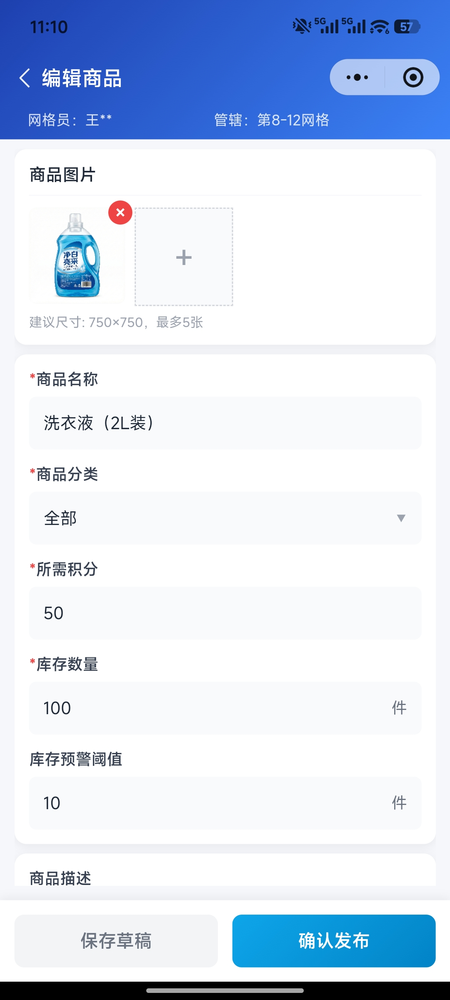
  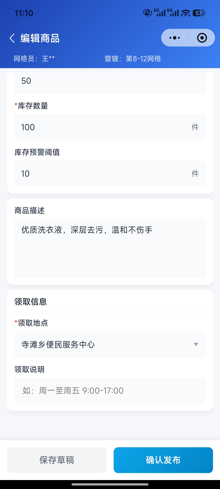

- 标注说明：
  ① 新增模式：从商品管理列表点击右上角"添加商品"按钮进入；编辑模式：从商品管理列表点击商品卡片进入
  ② 商品图片最多上传5张，第一张为主图
  ③ 必填项用红色星号标注（商品名称、分类、所需积分、库存、领取地点）
  ④ 底部提供"保存草稿"和"确认发布"两个操作

---

##### 需要的数据

**商品基本信息：**

| 序号 | 数据项名称 | 必填/选填 | 数据说明/口径 | 是否能提供 | 备注 |
|------|-----------|----------|--------------|-----------|------|
| 1 | 商品图片列表 | [x]必填 [ ]选填 | 商品图片URL数组，最多5张 | [ ]能 [ ]部分能 [ ]不能 | 用户上传 |
| 2 | 商品名称 | [x]必填 [ ]选填 | 最多50字 | [ ]能 [ ]部分能 [ ]不能 | 用户输入 |
| 3 | 商品分类 | [x]必填 [ ]选填 | 从分类列表中选择 | [ ]能 [ ]部分能 [ ]不能 | 用户选择 |
| 4 | 所需积分 | [x]必填 [ ]选填 | 兑换该商品需要的积分数 | [ ]能 [ ]部分能 [ ]不能 | 用户输入 |
| 5 | 库存数量 | [x]必填 [ ]选填 | 商品初始/当前库存数量 | [ ]能 [ ]部分能 [ ]不能 | 用户输入 |
| 6 | 商品描述 | [ ]必填 [x]选填 | 商品详细描述，最多500字 | [ ]能 [ ]部分能 [ ]不能 | 用户输入 |

**领取信息：**

| 序号 | 数据项名称 | 必填/选填 | 数据说明/口径 | 是否能提供 | 备注 |
|------|-----------|----------|--------------|-----------|------|
| 7 | 领取地点 | [x]必填 [ ]选填 | 从地点列表中选择 | [ ]能 [ ]部分能 [ ]不能 | 用户选择 |
| 8 | 领取说明 | [ ]必填 [x]选填 | 领取注意事项，最多100字 | [ ]能 [ ]部分能 [ ]不能 | 用户输入 |

---

##### 确认项
- 功能是否需要： [ ] 需要  [ ] 不需要（原因：                ）
- 展示内容是否符合： [ ] 符合  [ ] 需调整（写明调整点：                ）
- 数据整体是否可落地： [ ] 可落地  [ ] 有风险（风险点：                ）

---

#### 5.5.5 功能名称：`订单审核列表`（所属模块：`积分模块`）

**这页用来干啥（1句话）：**
审核村民的积分兑换申请，支持单个和批量审核操作

---

##### 页面展示内容

- 原型截图：
  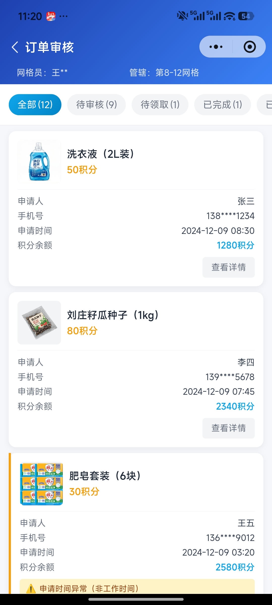
  

- 标注说明：
  ① 从积分首页点击"订单审核"快捷操作进入，或点击"待审核订单"统计数字进入此页面
  ② 待审核状态显示批量操作栏，支持全选和批量通过/驳回
  ③ 异常订单（如余额不足）有特殊标记和边框

---

##### 确认项
- 功能是否需要： [ ] 需要  [ ] 不需要（原因：                ）
- 展示内容是否符合： [ ] 符合  [ ] 需调整（写明调整点：                ）
- 数据整体是否可落地： [ ] 可落地  [ ] 有风险（风险点：                ）

---

#### 5.5.6 功能名称：`订单详情`（所属模块：`积分模块`）

**这页用来干啥（1句话）：**
查看兑换订单的完整信息，进行审核或确认领取操作

---

##### 页面展示内容

- 原型截图：
  
  

- 标注说明：
  ① 从订单审核列表点击具体订单卡片进入此页面
  ② 顶部状态横幅根据订单状态显示不同颜色和提示文字
  ③ 驳回状态显示驳回原因和积分退还信息
  ④ 底部操作记录以时间轴形式展示订单流转过程

---

##### 确认项
- 功能是否需要： [ ] 需要  [ ] 不需要（原因：                ）
- 展示内容是否符合： [ ] 符合  [ ] 需调整（写明调整点：                ）
- 数据整体是否可落地： [ ] 可落地  [ ] 有风险（风险点：                ）

---

#### 5.5.7 功能名称：`积分规则配置`（所属模块：`积分模块`）

**这页用来干啥（1句话）：**
配置积分获取规则和使用规则，管理积分有效期和兑换限制

---

##### 页面展示内容

- 原型截图：
  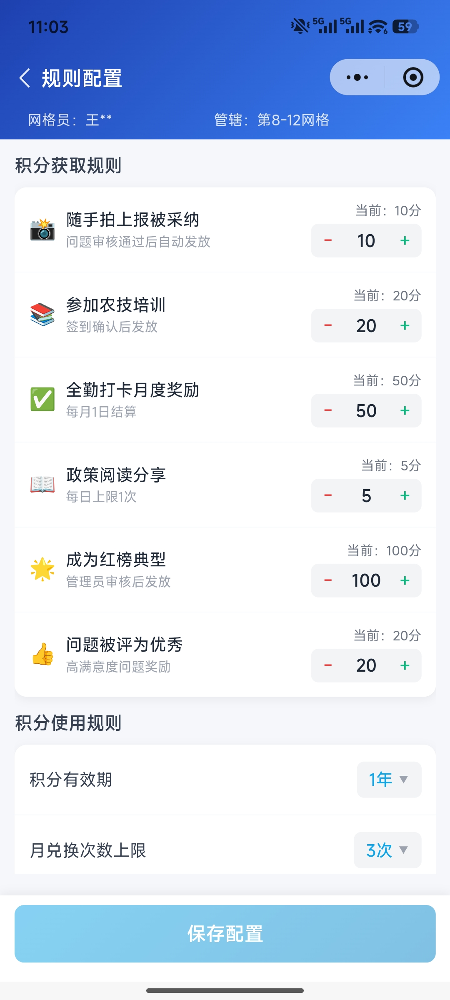
  

- 标注说明：
  ① 从积分首页点击"规则配置"快捷操作进入此页面
  ② 积分获取规则每项显示行为名称、描述和可调节的积分数值
  ③ 积分使用规则包含有效期、月兑换次数上限、单次兑换积分上限

---

##### 确认项
- 功能是否需要： [ ] 需要  [ ] 不需要（原因：                ）
- 展示内容是否符合： [ ] 符合  [ ] 需调整（写明调整点：                ）
- 数据整体是否可落地： [ ] 可落地  [ ] 有风险（风险点：                ）

---

#### 5.5.8 功能名称：`积分数据统计`（所属模块：`积分模块`）

**这页用来干啥（1句话）：**
查看积分发放和兑换的统计数据，包括渠道分布、商品热度、用户排行和趋势图

---

##### 页面展示内容

- 原型截图：
  
  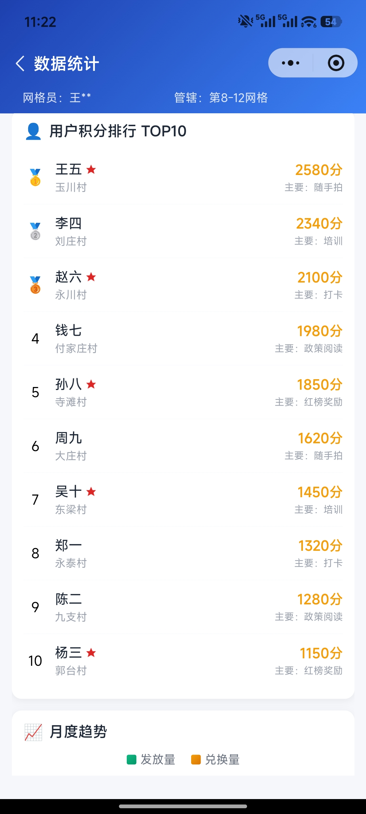
  

- 标注说明：
  ① 从积分首页点击"数据统计"快捷操作进入此页面
  ② 时间筛选支持本月、近3月、近半年、今年等选项
  ③ 发放统计用条形进度条展示各渠道占比
  ④ 用户排行前三名用金银铜奖牌图标展示

---

##### 确认项
- 功能是否需要： [ ] 需要  [ ] 不需要（原因：                ）
- 展示内容是否符合： [ ] 符合  [ ] 需调整（写明调整点：                ）
- 数据整体是否可落地： [ ] 可落地  [ ] 有风险（风险点：                ）

---

### 5.6 我的模块

---

#### 5.6.1 功能名称：`我的首页`（所属模块：`管理端我的`）

**这页用来干啥（1句话）：**
网格员查看个人信息、快速进入各项设置和功能操作的入口页面

---

##### 页面展示内容

- 原型截图：
  

- 标注说明：
  ① 从底部导航栏点击"我的"进入此页面
  ② 顶部显示用户基本信息（姓名、手机号、角色标签、负责网格区域）
  ③ 功能菜单列表包含：编辑资料、消息通知、帮助中心、关于我们、切换到农户端、退出登录
  ④ 底部固定导航栏，"我的"为当前选中状态

---

##### 确认项
- 功能是否需要： [ ] 需要  [ ] 不需要（原因：                ）
- 展示内容是否符合： [ ] 符合  [ ] 需调整（写明调整点：                ）
- 数据整体是否可落地： [ ] 可落地  [ ] 有风险（风险点：                ）

---

#### 5.6.2 功能名称：`编辑资料`（所属模块：`管理端我的`）

**这页用来干啥（1句话）：**
网格员修改自己的姓名等基本信息

---

##### 页面展示内容

- 原型截图：
  

- 标注说明：
  ① 从我的首页点击"编辑资料"菜单进入此页面
  ② 姓名为可编辑输入框
  ③ 手机号、角色、负责网格区域为只读展示（灰色背景或禁用状态）
  ④ 底部有保存按钮

---

##### 确认项
- 功能是否需要： [ ] 需要  [ ] 不需要（原因：                ）
- 展示内容是否符合： [ ] 符合  [ ] 需调整（写明调整点：                ）
- 数据整体是否可落地： [ ] 可落地  [ ] 有风险（风险点：                ）

---

#### 5.6.3 功能名称：`消息通知设置`（所属模块：`管理端我的`）

**这页用来干啥（1句话）：**
网格员配置各类消息推送的开关，控制是否接收特定类型的通知

---

##### 页面展示内容

- 原型截图：
  

- 标注说明：
  ① 从我的首页点击"消息通知"菜单进入此页面
  ② 每个通知项包含标题、描述说明和开关控件
  ③ 开关采用橙色主题色（#F97316）
  ④ 设置即时生效，无需额外保存操作

---

##### 确认项
- 功能是否需要： [ ] 需要  [ ] 不需要（原因：                ）
- 展示内容是否符合： [ ] 符合  [ ] 需调整（写明调整点：                ）
- 数据整体是否可落地： [ ] 可落地  [ ] 有风险（风险点：                ）

---

#### 5.6.4 功能名称：`帮助中心`（所属模块：`管理端我的`）

**这页用来干啥（1句话）：**
网格员查看常见问题解答、提交意见反馈、快速联系村委

---

##### 页面展示内容

- 原型截图：
  

- 标注说明：
  ① 从我的首页点击"帮助中心"菜单进入此页面
  ② FAQ列表支持点击展开/收起答案
  ③ 意见反馈点击后弹出弹窗，可输入反馈内容和联系方式
  ④ 联系村委显示电话号码，点击可直接拨打

---


##### 确认项
- 功能是否需要： [ ] 需要  [ ] 不需要（原因：                ）
- 展示内容是否符合： [ ] 符合  [ ] 需调整（写明调整点：                ）
- 数据整体是否可落地： [ ] 可落地  [ ] 有风险（风险点：                ）

---

#### 5.6.5 功能名称：`关于我们`（所属模块：`管理端我的`）

**这页用来干啥（1句话）：**
展示应用信息、查看协议政策、检查版本更新、进入账号注销流程

---

##### 页面展示内容

- 原型截图：
  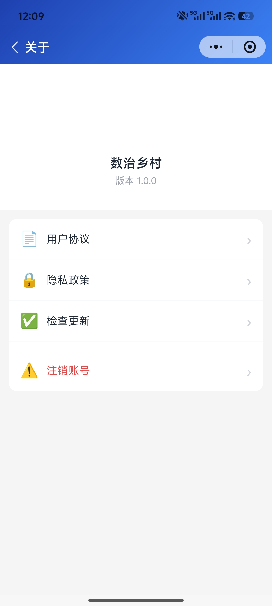

- 标注说明：
  ① 从我的首页点击"关于我们"菜单进入此页面
  ② 顶部居中显示应用Logo、名称和版本号
  ③ 菜单项包含：用户协议、隐私政策、检查更新、注销账号
  ④ 注销账号为红色危险操作样式

---

##### 确认项
- 功能是否需要： [ ] 需要  [ ] 不需要（原因：                ）
- 展示内容是否符合： [ ] 符合  [ ] 需调整（写明调整点：                ）
- 数据整体是否可落地： [ ] 可落地  [ ] 有风险（风险点：                ）

---

## 6. 附录

### 6.1 术语说明

| 术语 | 说明 |
|------|------|
| 网格员 | 负责特定区域村务管理的基层工作人员 |
| 村委领导 | 村级管理人员，负责审批村务相关事项 |
| 乡镇领导 | 乡镇级管理人员，负责更高级别审批 |
| 工作点 | 村民上工打卡的具体项目或地点 |
| 异常打卡 | 位置偏离、重复打卡等不符合正常打卡规则的记录 |
| 位置偏离 | 打卡位置与工作点距离超过允许范围 |
| 重复打卡 | 短时间内多次打卡的行为 |
| 曝光台 | 公示不文明行为或违规事项的功能模块 |
| 预警信息 | 需及时推送给村民的安全、气象等警示信息 |
| 积分发放 | 管理员向村民账户增加积分的操作 |
| 积分扣除 | 管理员从村民账户减少积分的操作 |
| 积分兑换 | 村民使用积分换取商品的行为 |
| 库存预警 | 商品库存低于预设阈值时的提醒 |
| 兑换订单 | 村民提交的积分兑换商品申请记录 |
| 兑换码 | 订单审核通过后生成的商品领取凭证 |
| 消息通知 | 系统推送给用户的各类提醒消息 |
| FAQ | 常见问题解答，帮助用户快速解决常见疑问 |
| 意见反馈 | 用户提交的问题、建议或投诉 |
| 账号注销 | 用户主动删除账号及相关数据的操作 |
| 验证码 | 用于身份验证的短信验证码 |

### 6.2 页面路径汇总

**首页模块：**

| 页面名称 | 文件路径 |
|----------|---------|
| 管理端首页 | `pages/manager/home/index` |

**服务模块：**

| 页面名称 | 文件路径 |
|----------|---------|
| 服务首页 | `pages/manager/services/index/index` |
| 用工监管首页 | `pages/manager/services/attendance/index` |
| 考勤记录查询 | `pages/manager/services/attendance/records` |
| 异常考勤列表 | `pages/manager/services/attendance/abnormal` |
| 异常考勤详情处理 | `pages/manager/services/attendance/abnormal-detail/index` |
| 培训管理列表 | `pages/manager/services/training/index` |
| 创建/编辑培训 | `pages/manager/services/training/create` |
| 报名管理 | `pages/manager/services/training/enrollments` |

**三务模块：**

| 页面名称 | 文件路径 |
|----------|---------|
| 三务首页 | `pages/manager/affairs/index` |
| 信息发布列表 | `pages/manager/governance/info-publish/index` |
| 创建/编辑公告 | `pages/manager/governance/info-publish/edit` |
| 信息发布详情 | `pages/manager/governance/info-publish/detail` |
| 曝光台列表 | `pages/manager/governance/exposure/index` |
| 创建曝光记录 | `pages/manager/governance/exposure/create` |
| 曝光台详情 | `pages/manager/governance/exposure/detail` |
| 预警信息列表 | `pages/manager/governance/warning/index` |
| 创建/编辑预警 | `pages/manager/governance/warning/edit` |
| 预警信息详情 | `pages/manager/governance/warning/detail` |

**积分模块：**

| 页面名称 | 文件路径 |
|----------|---------|
| 积分管理首页 | `pages/manager/points/index` |
| 积分发放/扣除 | `pages/manager/points/grant/index` |
| 积分规则配置 | `pages/manager/points/rules-config/index` |
| 商品管理列表 | `pages/manager/points/products/index` |
| 新增/编辑商品 | `pages/manager/points/product-edit/index` |
| 订单审核列表 | `pages/manager/points/orders/index` |
| 订单详情 | `pages/manager/points/order-detail/index` |
| 积分数据统计 | `pages/manager/points/statistics/index` |

**我的模块：**

| 页面名称 | 文件路径 |
|----------|---------|
| 我的首页 | `pages/manager/profile/index` |
| 编辑资料 | `pages/manager/profile/edit/index` |
| 消息通知设置 | `pages/manager/profile/notification/index` |
| 帮助中心 | `pages/manager/profile/help/index` |
| 关于我们 | `pages/manager/profile/about/index` |
| 注销账号 | `pages/manager/profile/delete-account/index` |

### 6.3 数据来源说明

| 数据来源 | 说明 |
|----------|------|
| 用户信息系统 | 网格员、村民的基本信息（姓名、电话、角色等） |
| 考勤系统 | 村民上工打卡相关数据 |
| 培训系统 | 培训活动和报名相关数据 |
| 信息发布系统 | 公告、通知的发布和阅读记录 |
| 曝光台系统 | 曝光记录及处理状态 |
| 预警系统 | 预警信息的发布和推送记录 |
| 工作点配置 | 各工作点的基础信息和打卡范围配置 |
| 审批流程 | 异常考勤的审批流转记录 |
| 积分账户系统 | 村民积分余额、发放记录、消费记录 |
| 积分商城系统 | 兑换商品信息、库存、分类配置 |
| 积分订单系统 | 兑换订单的申请、审核、领取记录 |
| 积分规则配置 | 获取规则、使用规则、有效期等配置项 |
| 通知设置存储 | 用户的消息通知偏好设置（本地存储） |
| FAQ配置系统 | 帮助中心的常见问题和答案 |
| 反馈收集系统 | 用户提交的意见反馈记录 |
| 应用配置 | 应用名称、版本号、Logo等基础配置 |
| 验证码服务 | 手机验证码发送和验证 |

### 6.4 状态流转说明

**异常考勤审批流程：**
```
待处理(pending) → 网格员提交 → 待审批(submitted) → 领导审批 → 已通过(approved) / 已驳回(rejected)
```

**曝光台处理流程：**
```
待处理(pending) → 处理中(processing) → 已整改(resolved) / 已关闭(closed)
```

**预警信息状态：**
```
草稿(draft) → 已发布(published) → 已过期(expired)
```

**培训活动状态：**
```
即将开始(upcoming) → 进行中(ongoing) → 已结束(completed)
```

**积分兑换订单状态：**
```
待审核(pending) → 管理员审核 → 待领取(approved) / 已驳回(rejected)
待领取(approved) → 确认领取 → 已完成(completed)
已驳回(rejected) → 积分自动退还至用户账户
```

**商品状态：**
```
已上架(on) ↔ 已下架(off)
```

**账号注销流程：**
```
发起注销 → 短信验证 → 二次确认 → 账号注销完成 → 跳转登录页
```

---

## 7. 签字确认

| 角色 | 姓名 | 签字 | 日期 |
|------|------|------|------|
| 产品负责人 | | | |
| 业务负责人 | | | |
| 技术负责人 | | | |
| 记录人 | | | |

**备注：**

---

*文档生成时间：2025-01-15*
