# 数治乡村 - 系统原型走读与需求确认文档

## 0. 版本信息

| 项目 | 内容 |
|------|------|
| 项目名称 | 数治乡村 |
| 文档版本 | v1.0 |
| 编写日期 | 2025-01-15 |
| 编写人 | |
| 审核人 | |
| 确认范围 | 农户端-首页模块、服务模块、三务模块、农旅模块、我的模块 |

---

## 1. 系统是做什么的

**一句话说明**：数治乡村是一款面向乡镇的数字化治理微信小程序，帮助村民便捷参与村务、获取信息、使用便民服务。

**谁在使用**：
- **农户端**：寺滩乡村民，用于随手拍上报、查看村务公开、兑换积分商品、参与培训等
- **管理端**：网格员/村委工作人员，用于处理随手拍、管理积分、发布公告等

---

## 2. 本次确认范围

| 模块 | 页面数量 | 说明 |
|------|----------|------|
| 农户端-首页 | 1 | 农户端入口首页，包含快捷入口、通知、动态等 |
| 农户端-服务 | 11 | 便民服务模块，包含上工打卡、办事指南、培训知识库、文化云享 |
| 农户端-三务 | 7 | 三务公开模块，包含政策公告、阳光村务、曝光台 |
| 农户端-农旅 | 10 | 农旅游览模块，包含景点、特产、民宿、活动等 |
| 农户端-我的 | 15 | 个人中心模块，包含用户信息、我的积分（9个子页面）、资料编辑、通知设置、帮助反馈、关于、注销 |

---

## 3. 走读方式

1. 按页面卡片顺序，逐一查看原型截图
2. 对照「需要的数据」表格，确认数据来源
3. 在「确认项」处勾选结论，有问题直接标注
4. 走读完成后签字确认

---

## 4. 角色与责任

| 角色 | 姓名 | 职责 |
|------|------|------|
| 产品负责人 | | 确认功能需求 |
| 业务负责人 | | 确认数据来源 |
| 技术负责人 | | 确认技术可行性 |
| 记录人 | | 记录会议结论 |

---

## 5. 页面卡片

### 5.1 农户端 - 首页模块

---

#### 5.1.1 功能名称：`首页整体布局`（所属模块：`农户端首页`）

**这页用来干啥（1句话）：**
村民打开小程序后看到的主界面，可快速访问各项功能

---

##### 页面展示内容

- 原型截图：
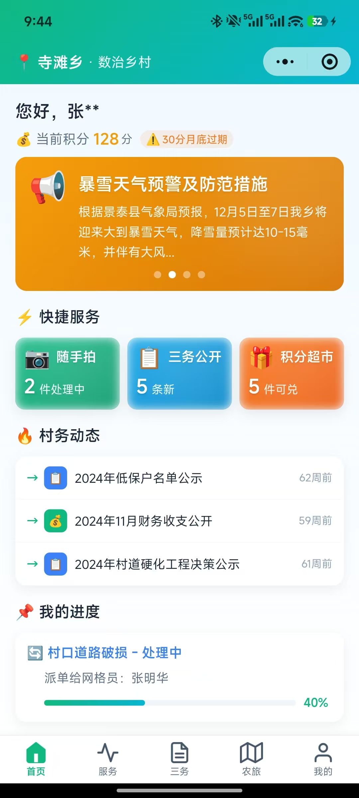

- 标注说明：
  ① 页面采用沉浸式设计，自定义导航栏融入整体风格
  ② 内容区域可滚动，底部导航栏固定
  ③ 页面支持下拉刷新

---

##### 确认项
- 功能是否需要： [ ] 需要  [ ] 不需要（原因：                ）
- 展示内容是否符合： [ ] 符合  [ ] 需调整（写明调整点：                ）
- 数据整体是否可落地： [ ] 可落地  [ ] 有风险（风险点：                ）

---

#### 5.1.2 功能名称：`问候与积分展示`（所属模块：`农户端首页`）

**这页用来干啥（1句话）：**
展示用户问候语和当前积分信息，提醒即将过期积分

---

##### 页面展示内容

- 原型截图：

- 标注说明：
  ① 问候语根据时间动态变化（如"您好"）
  ② 积分点击可跳转到积分详情页
  ③ 有即将过期积分时显示橙色警告提示

---

##### 确认项
- 功能是否需要： [ ] 需要  [ ] 不需要（原因：                ）
- 展示内容是否符合： [ ] 符合  [ ] 需调整（写明调整点：                ）
- 数据整体是否可落地： [ ] 可落地  [ ] 有风险（风险点：                ）

---

#### 5.1.3 功能名称：`轮播横幅通知`（所属模块：`农户端首页`）

**这页用来干啥（1句话）：**
以轮播形式展示紧急通知、政策公告、活动预告等重要信息

---

##### 页面展示内容

- 原型截图：

- 标注说明：
  ① 轮播自动切换，间隔5秒
  ② 不同类型通知使用不同背景色区分（紧急-红色、政策-紫色、活动-蓝色）
  ③ 点击横幅可跳转到详情页

---

##### 确认项
- 功能是否需要： [ ] 需要  [ ] 不需要（原因：                ）
- 展示内容是否符合： [ ] 符合  [ ] 需调整（写明调整点：                ）
- 数据整体是否可落地： [ ] 可落地  [ ] 有风险（风险点：                ）

---

#### 5.1.4 功能名称：`快捷服务入口`（所属模块：`农户端首页`）

**这页用来干啥（1句话）：**
提供随手拍、三务公开、积分超市三个核心功能的快捷入口

---

##### 页面展示内容

- 原型截图：

- 标注说明：
  ① 三宫格横向排列，等宽分布
  ② 每个卡片右上角显示角标数字（如待处理数量）
  ③ 点击卡片跳转到对应功能页面

---

##### 需要的数据

**各服务角标数据来源：**

| 服务 | 角标数据说明 |
|------|-------------|
| 随手拍 | 当前用户已上报且处理中的问题数量 |
| 三务公开 | 最近N天内新发布的公开信息条数 |
| 积分超市 | 当前积分可兑换的商品数量 |

---

##### 确认项
- 功能是否需要： [ ] 需要  [ ] 不需要（原因：                ）
- 展示内容是否符合： [ ] 符合  [ ] 需调整（写明调整点：                ）
- 数据整体是否可落地： [ ] 可落地  [ ] 有风险（风险点：                ）

---

#### 5.1.5 功能名称：`村务动态`（所属模块：`农户端首页`）

**这页用来干啥（1句话）：**
滚动轮播展示三务公开（党务/村务/财务）最新动态

---

##### 页面展示内容

- 原型截图：

- 标注说明：
  ① 纵向滚动轮播，同时显示3条。从三务公开信息中获取最新的动态。
  ② 不同类型用不同颜色图标区分（党务-红色、村务-蓝色、财务-绿色）
  ③ 点击动态条目跳转到对应详情页

---

##### 确认项
- 功能是否需要： [ ] 需要  [ ] 不需要（原因：                ）
- 展示内容是否符合： [ ] 符合  [ ] 需调整（写明调整点：                ）
- 数据整体是否可落地： [ ] 可落地  [ ] 有风险（风险点：                ）

---

#### 5.1.6 功能名称：`我的进度`（所属模块：`农户端首页`）

**这页用来干啥（1句话）：**
展示用户最近一次随手拍上报的处理进度

---

##### 页面展示内容

- 原型截图：

- 标注说明：
  ① 仅在有"处理中"状态的上报时显示此区块
  ② 进度条动态显示处理进度百分比
  ③ 点击卡片跳转到随手拍详情页

---

##### 确认项
- 功能是否需要： [ ] 需要  [ ] 不需要（原因：                ）
- 展示内容是否符合： [ ] 符合  [ ] 需调整（写明调整点：                ）
- 数据整体是否可落地： [ ] 可落地  [ ] 有风险（风险点：                ）

---

#### 5.1.7 功能名称：`底部导航栏`（所属模块：`农户端首页`）

**这页用来干啥（1句话）：**
农户端底部固定导航，快速切换主要功能模块

---

##### 页面展示内容

- 原型截图：

- 标注说明：
  ① 固定在页面底部，不随页面滚动
  ② 当前模块高亮显示

---

##### 确认项
- 功能是否需要： [ ] 需要  [ ] 不需要（原因：                ）
- 展示内容是否符合： [ ] 符合  [ ] 需调整（写明调整点：                ）
- 数据整体是否可落地： [ ] 可落地  [ ] 有风险（风险点：                ）

---

### 5.2 农户端 - 随手拍模块

---

#### 5.2.1 功能名称：`随手拍首页`（所属模块：`随手拍`）

**这页用来干啥（1句话）：**
随手拍模块主入口，提供问题上报入口和查看个人上报记录

---

##### 页面展示内容

- 原型截图：

- 标注说明：
  ① 从农户端首页点击"随手拍"进入此页面
  ② 点击“立即上报”按钮可直接进入问题上报流程
  ③ 快捷入口包括"我的上报"和"热门问题"两个功能入口

---

##### 确认项
- 功能是否需要： [ ] 需要  [ ] 不需要（原因：                ）
- 展示内容是否符合： [ ] 符合  [ ] 需调整（写明调整点：                ）
- 数据整体是否可落地： [ ] 可落地  [ ] 有风险（风险点：                ）

---

#### 5.2.2 功能名称：`问题上报 - 拍照步骤`（所属模块：`随手拍`）

**这页用来干啥（1句话）：**
问题上报第一步：拍摄或选择照片，自动获取定位信息

---

##### 页面展示内容

- 原型截图：
 

- 标注说明：
  ① 从随手拍首页点击"立即上报"进入此页面
  ② 支持相机拍照和相册选择，最多上传9张照片
  ③ 自动获取当前位置，支持手动刷新定位

---

##### 确认项
- 功能是否需要： [ ] 需要  [ ] 不需要（原因：                ）
- 展示内容是否符合： [ ] 符合  [ ] 需调整（写明调整点：                ）
- 数据整体是否可落地： [ ] 可落地  [ ] 有风险（风险点：                ）

---

#### 5.2.3 功能名称：`问题上报 - 描述步骤`（所属模块：`随手拍`）

**这页用来干啥（1句话）：**
问题上报第二步：选择问题类型，填写问题描述或语音输入

---

##### 页面展示内容

- 原型截图：

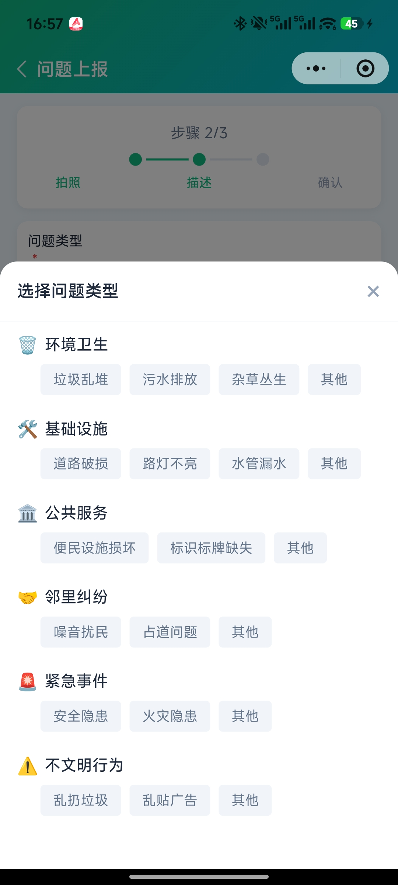

- 标注说明：
  ① 在步骤1完成后点击"下一步"进入
  ② 问题类型支持快捷标签选择或展开详细分类选择
  ③ 支持文字描述（最多500字）和语音描述（最长60秒）

---

##### 确认项
- 功能是否需要： [ ] 需要  [ ] 不需要（原因：                ）
- 展示内容是否符合： [ ] 符合  [ ] 需调整（写明调整点：                ）
- 数据整体是否可落地： [ ] 可落地  [ ] 有风险（风险点：                ）

---

#### 5.2.4 功能名称：`问题上报 - 确认提交`（所属模块：`随手拍`）

**这页用来干啥（1句话）：**
问题上报第三步：确认上报信息并提交，设置进度提醒

---

##### 页面展示内容

- 原型截图：

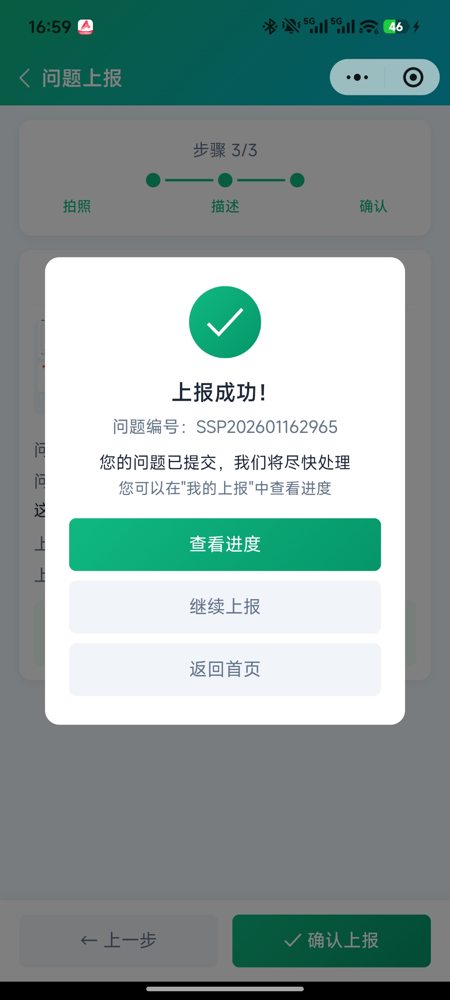

- 标注说明：
  ① 在步骤2完成后点击"下一步"进入
  ② 展示所有已填写信息供用户确认
  ③ 可开启进度提醒，问题状态变更时推送通知

---

##### 确认项
- 功能是否需要： [ ] 需要  [ ] 不需要（原因：                ）
- 展示内容是否符合： [ ] 符合  [ ] 需调整（写明调整点：                ）
- 数据整体是否可落地： [ ] 可落地  [ ] 有风险（风险点：                ）

---

#### 5.2.5 功能名称：`问题详情页`（所属模块：`随手拍`）

**这页用来干啥（1句话）：**
查看上报问题的详细信息和处置进度，已解决的可查看整改对比

---

##### 页面展示内容

- 原型截图：

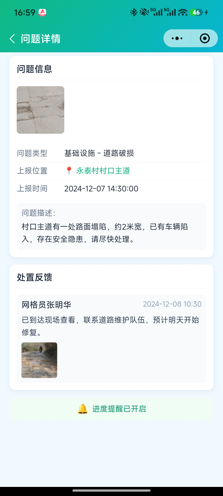
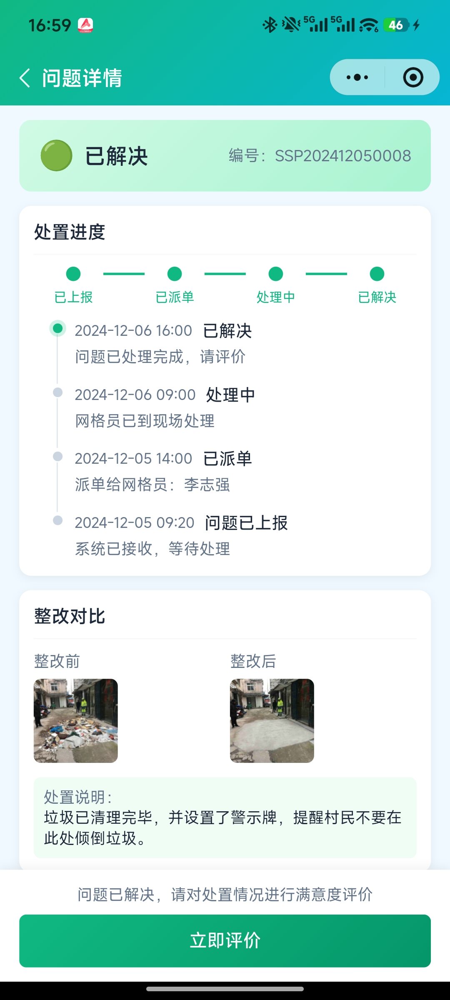
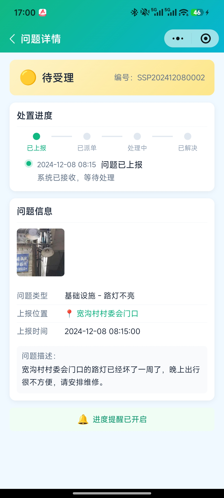

- 标注说明：
  ① 从随手拍首页或我的上报列表点击问题卡片进入
  ② 处置进度条显示四个阶段：已上报→已派单→处理中→已解决
  ③ 已解决状态显示整改前后对比照片，可评价处置结果

---

##### 确认项
- 功能是否需要： [ ] 需要  [ ] 不需要（原因：                ）
- 展示内容是否符合： [ ] 符合  [ ] 需调整（写明调整点：                ）
- 数据整体是否可落地： [ ] 可落地  [ ] 有风险（风险点：                ）

---

#### 5.2.6 功能名称：`我的上报列表`（所属模块：`随手拍`）

**这页用来干啥（1句话）：**
查看个人所有上报记录，支持按状态筛选和关键词搜索

---

##### 页面展示内容

- 原型截图：

- 标注说明：
  ① 从随手拍首页点击"我的上报"或"更多"进入
  ② 状态包括：全部、待受理、处理中、已解决、已驳回
  ③ 支持按问题类型、关键词、编号搜索

---

##### 确认项
- 功能是否需要： [ ] 需要  [ ] 不需要（原因：                ）
- 展示内容是否符合： [ ] 符合  [ ] 需调整（写明调整点：                ）
- 数据整体是否可落地： [ ] 可落地  [ ] 有风险（风险点：                ）

---

#### 5.2.7 功能名称：`满意度评价`（所属模块：`随手拍`）

**这页用来干啥（1句话）：**
对已解决的问题进行满意度评价，可申请二次反馈

---

##### 页面展示内容

- 原型截图：
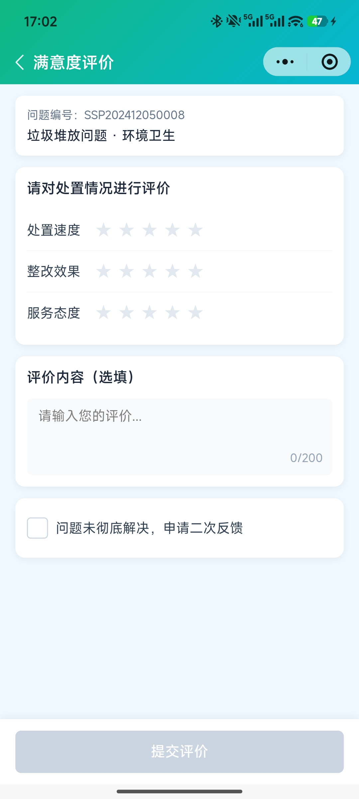

- 标注说明：
  ① 从问题详情页（已解决状态）点击"立即评价"进入
  ② 三项评分均为必填，每项1-5星
  ③ 如问题未彻底解决，可勾选"申请二次反馈"填写补充说明

---

##### 确认项
- 功能是否需要： [ ] 需要  [ ] 不需要（原因：                ）
- 展示内容是否符合： [ ] 符合  [ ] 需调整（写明调整点：                ）
- 数据整体是否可落地： [ ] 可落地  [ ] 有风险（风险点：                ）

---

#### 5.2.8 功能名称：`本村热门问题统计`（所属模块：`随手拍`）

**这页用来干啥（1句话）：**
展示本乡镇的问题统计数据，包括分类分布、高频问题、各村上报情况

---

##### 页面展示内容

- 原型截图：

- 标注说明：
  ① 从随手拍首页点击"热门问题"进入
  ② 统计数据为当前乡镇范围内的汇总数据
  ③ 展示本月上报总量、已解决数量、解决率等关键指标

---

##### 确认项
- 功能是否需要： [ ] 需要  [ ] 不需要（原因：                ）
- 展示内容是否符合： [ ] 符合  [ ] 需调整（写明调整点：                ）
- 数据整体是否可落地： [ ] 可落地  [ ] 有风险（风险点：                ）

---

### 5.3 农户端 - 服务模块

---

#### 5.3.1 功能名称：`服务首页`（所属模块：`便民服务`）

**这页用来干啥（1句话）：**
便民服务入口页面，展示上工打卡状态和办事指南、培训知识库、文化云享三个Tab

---

##### 页面展示内容

- 原型截图：

- 标注说明：
  ① 顶部固定显示上工打卡模块，下方为不同服务的切换内容
  ② 三个服务分类：办事指南、培训知识库、文化云享
  ③ 页面支持下拉刷新

---

##### 确认项
- 功能是否需要： [ ] 需要  [ ] 不需要（原因：                ）
- 展示内容是否符合： [ ] 符合  [ ] 需调整（写明调整点：                ）
- 数据整体是否可落地： [ ] 可落地  [ ] 有风险（风险点：                ）

---

#### 5.3.2 功能名称：`办事指南列表`（所属模块：`便民服务-办事指南`）

**这页用来干啥（1句话）：**
按分类展示所有可办理事项，支持搜索和分类筛选

---

##### 页面展示内容

- 原型截图：

- 标注说明：
  ① 在服务首页中点击办事指南列表处的“更多”进入完整办事指南列表
  ② 顶部搜索框支持按名称搜索
  ③ 办事项按分类分组显示，每组显示数量

---

##### 需要的数据

**办事项数据：**

| 序号 | 数据项名称 | 必填/选填 | 数据说明/口径 | 是否能提供 | 备注 |
|------|-----------|----------|--------------|-----------|------|
| 1 | 办事项名称 | [x]必填 [ ]选填 | 如"新农合参保登记" | [ ]能 [ ]部分能 [ ]不能 | 后台配置 |
| 2 | 所属分类 | [x]必填 [ ]选填 | 办事项所属分类 | [ ]能 [ ]部分能 [ ]不能 | 后台配置 |
| 3 | 是否热门 | [ ]必填 [x]选填 | 热门办事项标记 | [ ]能 [ ]部分能 [ ]不能 | 后台配置 |
| 4 | 办理地点 | [x]必填 [ ]选填 | 如"村委会便民服务中心" | [ ]能 [ ]部分能 [ ]不能 | 后台配置 |
| 5 | 办理时长 | [ ]必填 [x]选填 | 如"即时办结"/"3个工作日" | [ ]能 [ ]部分能 [ ]不能 | 后台配置 |
| 6 | 办理期限 | [ ]必填 [x]选填 | 截止日期 | [ ]能 [ ]部分能 [ ]不能 | 后台配置 |

---

##### 确认项
- 功能是否需要： [ ] 需要  [ ] 不需要（原因：                ）
- 展示内容是否符合： [ ] 符合  [ ] 需调整（写明调整点：                ）
- 数据整体是否可落地： [ ] 可落地  [ ] 有风险（风险点：                ）

---

#### 5.3.3 功能名称：`办事指南详情`（所属模块：`便民服务-办事指南`）

**这页用来干啥（1句话）：**
展示办事项的完整办理指南，包含办理条件、所需材料、办理流程

---

##### 页面展示内容

- 原型截图：
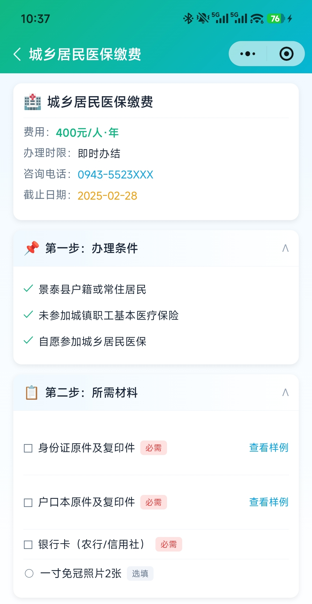
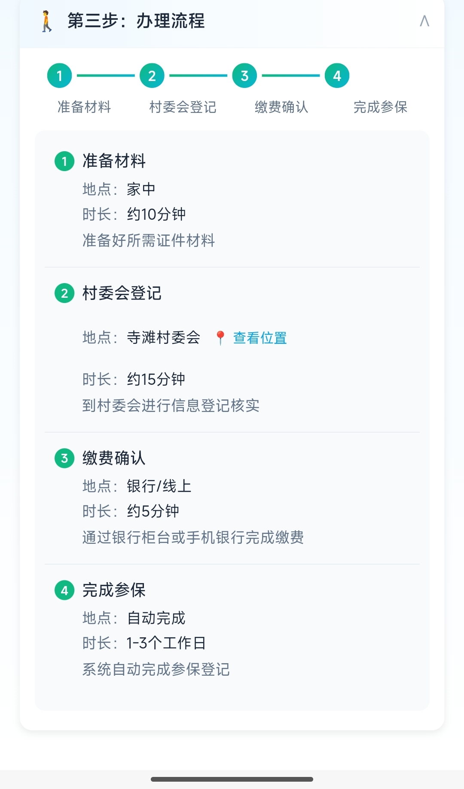

- 标注说明：
  ① 基本信息卡片显示费用、时长、联系方式、截止日期
  ② 办理条件、所需材料、办理流程支持展开/收起
  ③ 联系电话可点击拨打，流程中地点可点击查看位置

---

##### 需要的数据

**基本信息：**

| 序号 | 数据项名称 | 必填/选填 | 数据说明/口径 | 是否能提供 | 备注 |
|------|-----------|----------|--------------|-----------|------|
| 1 | 办事项名称 | [x]必填 [ ]选填 | 办事项标题 | [ ]能 [ ]部分能 [ ]不能 | 后台配置 |
| 2 | 办理费用 | [ ]必填 [x]选填 | 如"免费"或具体金额 | [ ]能 [ ]部分能 [ ]不能 | 后台配置 |
| 3 | 办理时长 | [ ]必填 [x]选填 | 如"即时办结"/"3个工作日" | [ ]能 [ ]部分能 [ ]不能 | 后台配置 |
| 4 | 联系电话 | [ ]必填 [x]选填 | 办事窗口联系电话 | [ ]能 [ ]部分能 [ ]不能 | 后台配置 |
| 5 | 办理截止日期 | [ ]必填 [x]选填 | 办事项截止时间 | [ ]能 [ ]部分能 [ ]不能 | 后台配置 |

**办理条件：**

| 序号 | 数据项名称 | 必填/选填 | 数据说明/口径 | 是否能提供 | 备注 |
|------|-----------|----------|--------------|-----------|------|
| 1 | 条件列表 | [x]必填 [ ]选填 | 办理该事项需满足的条件清单 | [ ]能 [ ]部分能 [ ]不能 | 后台配置，数组 |

**所需材料：**

| 序号 | 数据项名称 | 必填/选填 | 数据说明/口径 | 是否能提供 | 备注 |
|------|-----------|----------|--------------|-----------|------|
| 1 | 材料名称 | [x]必填 [ ]选填 | 如"身份证"/"户口本" | [ ]能 [ ]部分能 [ ]不能 | 后台配置 |
| 2 | 是否必需 | [x]必填 [ ]选填 | 必需材料/可选材料 | [ ]能 [ ]部分能 [ ]不能 | 后台配置 |
| 3 | 样例图片 | [ ]必填 [x]选填 | 材料样例图片URL | [ ]能 [ ]部分能 [ ]不能 | 后台配置 |

**办理流程：**

| 序号 | 数据项名称 | 必填/选填 | 数据说明/口径 | 是否能提供 | 备注 |
|------|-----------|----------|--------------|-----------|------|
| 1 | 步骤序号 | [x]必填 [ ]选填 | 流程步骤编号 | [ ]能 [ ]部分能 [ ]不能 | 后台配置 |
| 2 | 步骤标题 | [x]必填 [ ]选填 | 如"准备材料"/"窗口提交" | [ ]能 [ ]部分能 [ ]不能 | 后台配置 |
| 3 | 办理地点 | [ ]必填 [x]选填 | 该步骤办理地点 | [ ]能 [ ]部分能 [ ]不能 | 后台配置 |
| 4 | 地点坐标 | [ ]必填 [x]选填 | 经纬度，用于地图导航 | [ ]能 [ ]部分能 [ ]不能 | 后台配置 |
| 5 | 预计时长 | [ ]必填 [x]选填 | 该步骤预计耗时 | [ ]能 [ ]部分能 [ ]不能 | 后台配置 |
| 6 | 步骤说明 | [ ]必填 [x]选填 | 详细操作说明 | [ ]能 [ ]部分能 [ ]不能 | 后台配置 |

---

##### 确认项
- 功能是否需要： [ ] 需要  [ ] 不需要（原因：                ）
- 展示内容是否符合： [ ] 符合  [ ] 需调整（写明调整点：                ）
- 数据整体是否可落地： [ ] 可落地  [ ] 有风险（风险点：                ）

---

#### 5.3.4 功能名称：`培训与知识库列表`（所属模块：`便民服务-培训知识库`）

**这页用来干啥（1句话）：**
提供知识库学习资料浏览和培训课程报名入口

---

##### 页面展示内容

- 原型截图：
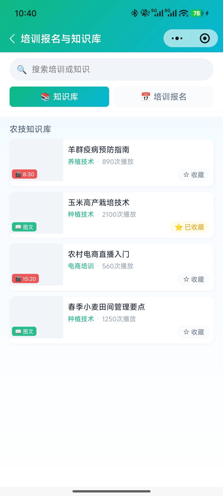
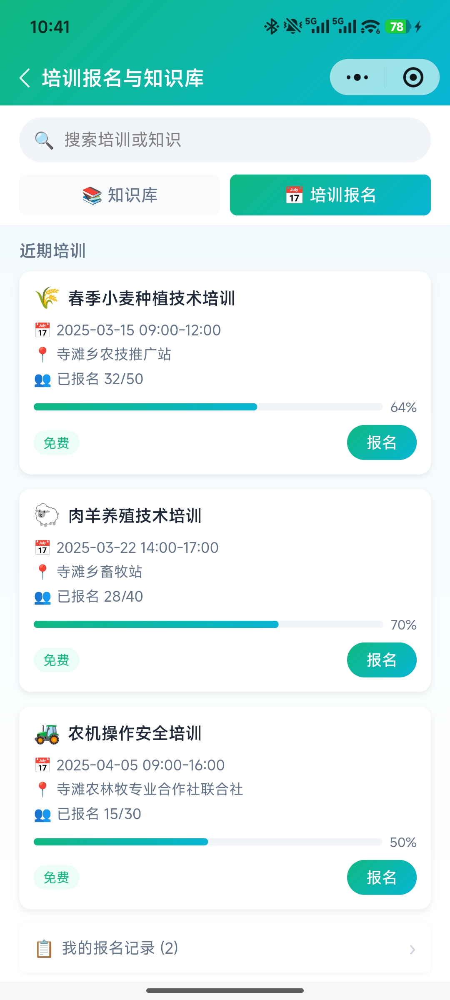

- 标注说明：
  ① 在服务首页中点击办事指南列表处的“更多”进入完整培训与知识库列表
  ② 顶部标签切换：知识库/培训报名
  ③ 知识库与培训信息支持按关键词搜索
  ④ 培训报名显示报名进度条

---

##### 需要的数据

**知识库内容：**

| 序号 | 数据项名称 | 必填/选填 | 数据说明/口径 | 是否能提供 | 备注 |
|------|-----------|----------|--------------|-----------|------|
| 1 | 知识标题 | [x]必填 [ ]选填 | 如"农作物病虫害防治指南" | [ ]能 [ ]部分能 [ ]不能 | 后台配置 |
| 2 | 内容类型 | [x]必填 [ ]选填 | video(视频)/article(图文) | [ ]能 [ ]部分能 [ ]不能 | 后台配置 |
| 3 | 封面图 | [x]必填 [ ]选填 | 内容封面图片URL | [ ]能 [ ]部分能 [ ]不能 | 后台配置 |
| 4 | 所属分类 | [x]必填 [ ]选填 | 分类名称 | [ ]能 [ ]部分能 [ ]不能 | 后台配置 |

**培训课程：**

| 序号 | 数据项名称 | 必填/选填 | 数据说明/口径 | 是否能提供 | 备注 |
|------|-----------|----------|--------------|-----------|------|
| 1 | 培训名称 | [x]必填 [ ]选填 | 如"电商直播技能培训" | [ ]能 [ ]部分能 [ ]不能 | 后台配置 |
| 2 | 培训分类图标 | [ ]必填 [x]选填 | 分类对应图标 | [ ]能 [ ]部分能 [ ]不能 | 后台配置 |
| 3 | 培训日期 | [x]必填 [ ]选填 | 如"2024-12-15" | [ ]能 [ ]部分能 [ ]不能 | 后台配置 |
| 4 | 培训时间 | [x]必填 [ ]选填 | 如"09:00-11:00" | [ ]能 [ ]部分能 [ ]不能 | 后台配置 |
| 5 | 培训地点 | [x]必填 [ ]选填 | 培训举办地点 | [ ]能 [ ]部分能 [ ]不能 | 后台配置 |
| 6 | 最大名额 | [x]必填 [ ]选填 | 培训最大容量 | [ ]能 [ ]部分能 [ ]不能 | 后台配置 |
| 7 | 是否免费 | [ ]必填 [x]选填 | 是否免费培训 | [ ]能 [ ]部分能 [ ]不能 | 后台配置 |

---

##### 确认项
- 功能是否需要： [ ] 需要  [ ] 不需要（原因：                ）
- 展示内容是否符合： [ ] 符合  [ ] 需调整（写明调整点：                ）
- 数据整体是否可落地： [ ] 可落地  [ ] 有风险（风险点：                ）

---

#### 5.3.5 功能名称：`培训详情`（所属模块：`便民服务-培训知识库`）

**这页用来干啥（1句话）：**
展示培训课程完整信息，供用户了解详情并进行报名

---

##### 页面展示内容

- 原型截图：

- 标注说明：
  ① 信息卡片显示时间、地点、讲师、报名进度
  ② 报名进度条显示已报名/总名额比例
  ③ 底部固定报名按钮

---

##### 需要的数据

**基本信息：**

| 序号 | 数据项名称 | 必填/选填 | 数据说明/口径 | 是否能提供 | 备注 |
|------|-----------|----------|--------------|-----------|------|
| 1 | 培训名称 | [x]必填 [ ]选填 | 培训课程标题 | [ ]能 [ ]部分能 [ ]不能 | 后台配置 |
| 2 | 培训分类图标 | [ ]必填 [x]选填 | 分类对应图标 | [ ]能 [ ]部分能 [ ]不能 | 后台配置 |
| 3 | 是否免费 | [ ]必填 [x]选填 | 是否免费培训 | [ ]能 [ ]部分能 [ ]不能 | 后台配置 |
| 4 | 培训日期 | [x]必填 [ ]选填 | 培训举办日期 | [ ]能 [ ]部分能 [ ]不能 | 后台配置 |
| 5 | 培训时间 | [x]必填 [ ]选填 | 培训时间段 | [ ]能 [ ]部分能 [ ]不能 | 后台配置 |
| 6 | 培训地点 | [x]必填 [ ]选填 | 举办地点 | [ ]能 [ ]部分能 [ ]不能 | 后台配置 |
| 7 | 地点坐标 | [ ]必填 [x]选填 | 经纬度，用于地图导航 | [ ]能 [ ]部分能 [ ]不能 | 后台配置 |
| 8 | 讲师姓名 | [x]必填 [ ]选填 | 授课讲师姓名 | [ ]能 [ ]部分能 [ ]不能 | 后台配置 |
| 9 | 讲师职称 | [ ]必填 [x]选填 | 讲师头衔/职称 | [ ]能 [ ]部分能 [ ]不能 | 后台配置 |
| 10 | 最大名额 | [x]必填 [ ]选填 | 培训最大容量 | [ ]能 [ ]部分能 [ ]不能 | 后台配置 |
| 11 | 培训简介 | [x]必填 [ ]选填 | 培训内容介绍 | [ ]能 [ ]部分能 [ ]不能 | 后台配置 |
| 12 | 培训大纲 | [ ]必填 [x]选填 | 培训内容大纲列表 | [ ]能 [ ]部分能 [ ]不能 | 后台配置，数组 |
| 13 | 适合人群 | [ ]必填 [x]选填 | 目标受众标签 | [ ]能 [ ]部分能 [ ]不能 | 后台配置，数组 |

---

##### 确认项
- 功能是否需要： [ ] 需要  [ ] 不需要（原因：                ）
- 展示内容是否符合： [ ] 符合  [ ] 需调整（写明调整点：                ）
- 数据整体是否可落地： [ ] 可落地  [ ] 有风险（风险点：                ）

---

#### 5.3.6 功能名称：`知识库详情`（所属模块：`便民服务-培训知识库`）

**这页用来干啥（1句话）：**
展示知识库内容详情，支持视频播放或图文阅读

---

##### 页面展示内容

- 原型截图：

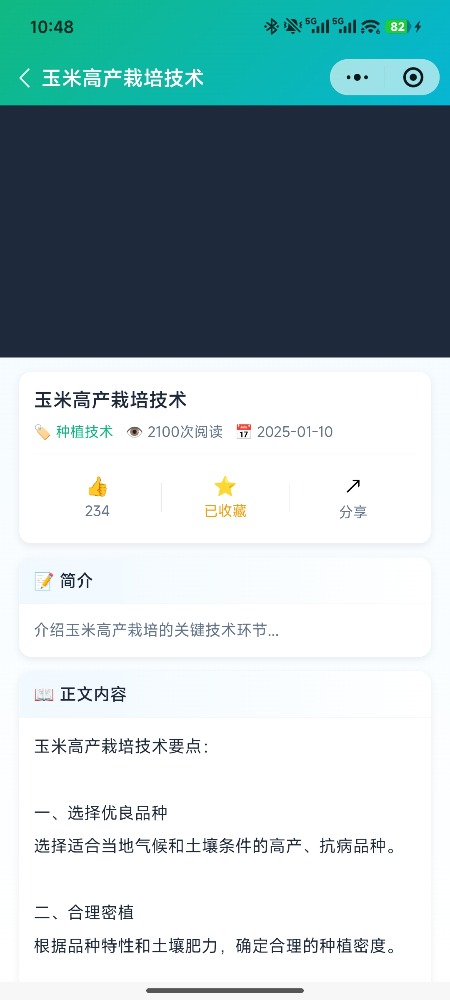

- 标注说明：
  ① 视频类型显示播放器，图文类型显示封面图
  ② 支持收藏、点赞、分享操作
  ③ 显示浏览量、分类、发布时间等元信息

---

##### 需要的数据

| 序号 | 数据项名称 | 必填/选填 | 数据说明/口径 | 是否能提供 | 备注 |
|------|-----------|----------|--------------|-----------|------|
| 1 | 知识标题 | [x]必填 [ ]选填 | 内容标题 | [ ]能 [ ]部分能 [ ]不能 | 后台配置 |
| 2 | 内容类型 | [x]必填 [ ]选填 | video(视频)/article(图文) | [ ]能 [ ]部分能 [ ]不能 | 后台配置 |
| 3 | 封面图/视频URL | [x]必填 [ ]选填 | 媒体资源地址 | [ ]能 [ ]部分能 [ ]不能 | 后台配置 |
| 4 | 视频时长 | [ ]必填 [x]选填 | 视频类型专用 | [ ]能 [ ]部分能 [ ]不能 | 仅视频类型 |
| 5 | 所属分类 | [x]必填 [ ]选填 | 分类名称 | [ ]能 [ ]部分能 [ ]不能 | 后台配置 |
| 6 | 发布日期 | [ ]必填 [x]选填 | 内容发布时间 | [ ]能 [ ]部分能 [ ]不能 | 系统记录 |
| 7 | 内容描述 | [x]必填 [ ]选填 | 内容简介 | [ ]能 [ ]部分能 [ ]不能 | 后台配置 |
| 8 | 正文内容 | [ ]必填 [x]选填 | 图文类型的正文 | [ ]能 [ ]部分能 [ ]不能 | 仅图文类型 |

---

##### 确认项
- 功能是否需要： [ ] 需要  [ ] 不需要（原因：                ）
- 展示内容是否符合： [ ] 符合  [ ] 需调整（写明调整点：                ）
- 数据整体是否可落地： [ ] 可落地  [ ] 有风险（风险点：                ）

---

#### 5.3.7 功能名称：`上工打卡`（所属模块：`便民服务-上工打卡`）

**这页用来干啥（1句话）：**
农户工作打卡页面，支持定位验证和拍照打卡

---

##### 页面展示内容

- 原型截图：
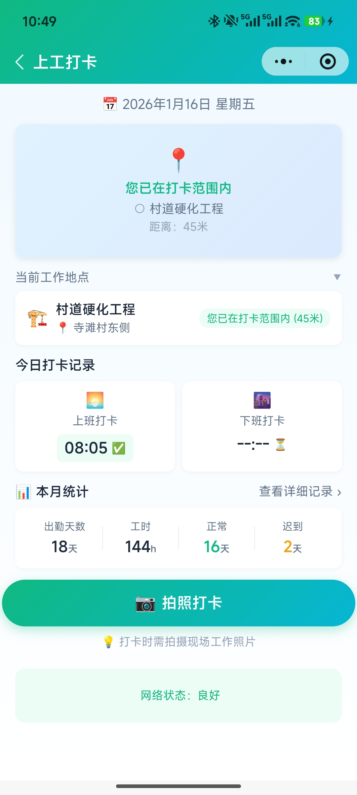

- 标注说明：

  ① 在服务首页点击上工打卡处的“更多”进入完整上工打卡页面
  ② 需要GPS定位，判断是否在工作点范围内
  ② 打卡需拍照上传，支持离线打卡
  ④ 超出打卡范围时禁用打卡按钮

---

##### 需要的数据

**工作点数据：**

| 序号 | 数据项名称 | 必填/选填 | 数据说明/口径 | 是否能提供 | 备注 |
|------|-----------|----------|--------------|-----------|------|
| 1 | 工作点名称 | [x]必填 [ ]选填 | 如"水库清淤项目" | [ ]能 [ ]部分能 [ ]不能 | 后台配置 |
| 2 | 工作点地址 | [x]必填 [ ]选填 | 详细地址 | [ ]能 [ ]部分能 [ ]不能 | 后台配置 |
| 3 | 中心点坐标 | [x]必填 [ ]选填 | 经纬度，用于定位判断 | [ ]能 [ ]部分能 [ ]不能 | 后台配置 |
| 4 | 打卡范围半径 | [x]必填 [ ]选填 | 允许打卡的距离范围（米） | [ ]能 [ ]部分能 [ ]不能 | 后台配置 |
| 5 | 是否在进行中 | [x]必填 [ ]选填 | 项目是否正在进行 | [ ]能 [ ]部分能 [ ]不能 | 后台配置 |

---

##### 确认项
- 功能是否需要： [ ] 需要  [ ] 不需要（原因：                ）
- 展示内容是否符合： [ ] 符合  [ ] 需调整（写明调整点：                ）
- 数据整体是否可落地： [ ] 可落地  [ ] 有风险（风险点：                ）

---

#### 5.3.8 功能名称：`考勤记录`（所属模块：`便民服务-上工打卡`）

**这页用来干啥（1句话）：**
查看历史考勤记录和月度统计报表

---

##### 页面展示内容

- 原型截图：
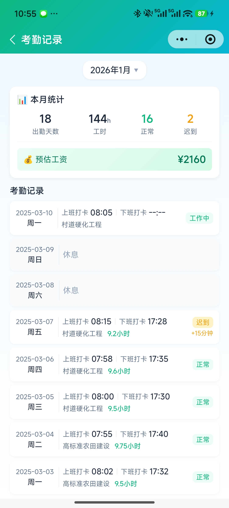

- 标注说明：
  ① 在上工打卡页点击“本月统计”处的“查看详细记录”
  ② 支持切换查看历史月份
  ③ 月度统计显示预估工资
  ④ 不同出勤状态用不同颜色/标签区分
---

##### 确认项
- 功能是否需要： [ ] 需要  [ ] 不需要（原因：                ）
- 展示内容是否符合： [ ] 符合  [ ] 需调整（写明调整点：                ）
- 数据整体是否可落地： [ ] 可落地  [ ] 有风险（风险点：                ）

---

#### 5.3.9 功能名称：`文化云享列表`（所属模块：`便民服务-文化云享`）

**这页用来干啥（1句话）：**
展示乡村文化内容，包含720全景、视频、图文、活动

---

##### 页面展示内容

- 原型截图：
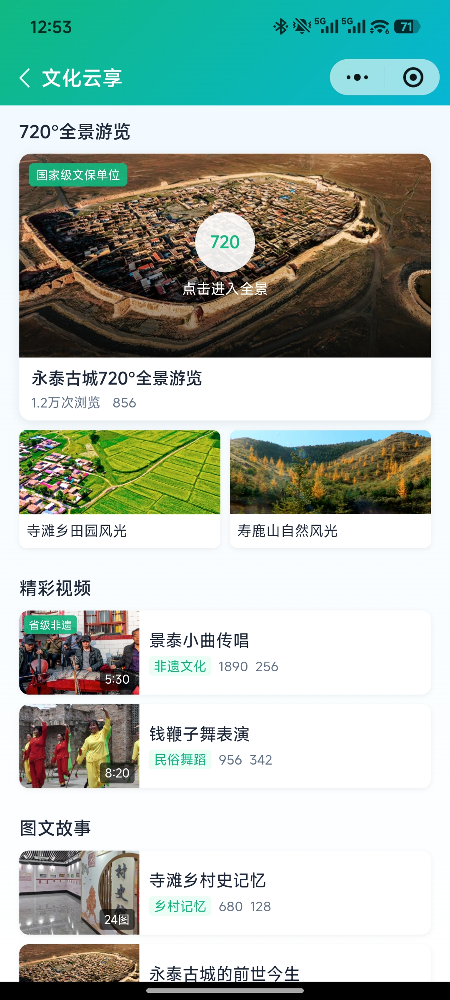

- 标注说明：
  ① 在服务首页中点击文化云享列表处的“更多”进入完整文化云享列表
  ② 720全景有主推大卡片和小列表两种展示
  ③ 视频卡片显示时长标签
  ④ 活动卡片显示状态标签（即将开始/进行中/已结束）

---

##### 需要的数据

**视频内容：**

| 序号 | 数据项名称 | 必填/选填 | 数据说明/口径 | 是否能提供 | 备注 |
|------|-----------|----------|--------------|-----------|------|
| 1 | 视频标题 | [x]必填 [ ]选填 | 如"传统农耕文化" | [ ]能 [ ]部分能 [ ]不能 | 后台配置 |
| 2 | 封面图 | [x]必填 [ ]选填 | 视频封面图片 | [ ]能 [ ]部分能 [ ]不能 | 后台配置 |
| 3 | 标签徽章 | [ ]必填 [x]选填 | 如"精选" | [ ]能 [ ]部分能 [ ]不能 | 后台配置 |
| 4 | 视频文件 | [x]必填 [ ]选填 | 视频文件 | [ ]能 [ ]部分能 [ ]不能 | 后台配置 |
| 5 | 分类 | [x]必填 [ ]选填 | 如"民俗文化" | [ ]能 [ ]部分能 [ ]不能 | 后台配置 |

**图文故事：**

| 序号 | 数据项名称 | 必填/选填 | 数据说明/口径 | 是否能提供 | 备注 |
|------|-----------|----------|--------------|-----------|------|
| 1 | 图文标题 | [x]必填 [ ]选填 | 内容标题 | [ ]能 [ ]部分能 [ ]不能 | 后台配置 |
| 2 | 封面图 | [x]必填 [ ]选填 | 图文封面图片 | [ ]能 [ ]部分能 [ ]不能 | 后台配置 |
| 3 | 内容类型 | [x]必填 [ ]选填 | 图文/图集 | [ ]能 [ ]部分能 [ ]不能 | 后台配置 |
| 4 | 图文内容 | [x]必填 []选填 | 图文内容 | [ ]能 [ ]部分能 [ ]不能 | 后台配置 |
| 5 | 分类 | [x]必填 [ ]选填 | 分类名称 | [ ]能 [ ]部分能 [ ]不能 | 后台配置 |

**近期活动：**

| 序号 | 数据项名称 | 必填/选填 | 数据说明/口径 | 是否能提供 | 备注 |
|------|-----------|----------|--------------|-----------|------|
| 1 | 活动标题 | [x]必填 [ ]选填 | 如"秋收农民节庆典" | [ ]能 [ ]部分能 [ ]不能 | 后台配置 |
| 2 | 封面图 | [x]必填 [ ]选填 | 活动封面图片 | [ ]能 [ ]部分能 [ ]不能 | 后台配置 |
| 3 | 活动状态 | [x]必填 [ ]选填 | upcoming/ongoing/ended | [ ]能 [ ]部分能 [ ]不能 | 系统判断 |
| 4 | 活动日期 | [x]必填 [ ]选填 | 活动举办日期 | [ ]能 [ ]部分能 [ ]不能 | 后台配置 |
| 5 | 活动时间 | [ ]必填 [x]选填 | 活动时间段 | [ ]能 [ ]部分能 [ ]不能 | 后台配置 |
| 6 | 活动地点 | [x]必填 [ ]选填 | 活动举办地点 | [ ]能 [ ]部分能 [ ]不能 | 后台配置 |

---

##### 确认项
- 功能是否需要： [ ] 需要  [ ] 不需要（原因：                ）
- 展示内容是否符合： [ ] 符合  [ ] 需调整（写明调整点：                ）
- 数据整体是否可落地： [ ] 可落地  [ ] 有风险（风险点：                ）

---

#### 5.3.10 功能名称：`文化内容详情`（所属模块：`便民服务-文化云享`）

**这页用来干啥（1句话）：**
展示视频/图文/活动的完整详情内容

---

##### 页面展示内容

- 原型截图：

- 标注说明：
  ① 视频类型显示播放器和评论区
  ② 活动类型显示日期、时间、地点等专属信息
  ③ 支持收藏、点赞、分享操作

---

##### 需要的数据

**基本信息：**

| 序号 | 数据项名称 | 必填/选填 | 数据说明/口径 | 是否能提供 | 备注 |
|------|-----------|----------|--------------|-----------|------|
| 1 | 内容类型 | [x]必填 [ ]选填 | video/album/article/activity | [ ]能 [ ]部分能 [ ]不能 | 后台配置 |
| 2 | 内容标题 | [x]必填 [ ]选填 | 标题 | [ ]能 [ ]部分能 [ ]不能 | 后台配置 |
| 3 | 封面图/视频 | [x]必填 [ ]选填 | 媒体资源地址 | [ ]能 [ ]部分能 [ ]不能 | 后台配置 |
| 4 | 标签徽章 | [ ]必填 [x]选填 | 如"精选"/"热门" | [ ]能 [ ]部分能 [ ]不能 | 后台配置 |
| 5 | 分类 | [x]必填 [ ]选填 | 分类名称 | [ ]能 [ ]部分能 [ ]不能 | 后台配置 |
| 6 | 内容描述 | [x]必填 [ ]选填 | 详细描述/正文内容 | [ ]能 [ ]部分能 [ ]不能 | 后台配置 |

**活动专属信息：**

| 序号 | 数据项名称 | 必填/选填 | 数据说明/口径 | 是否能提供 | 备注 |
|------|-----------|----------|--------------|-----------|------|
| 1 | 活动状态 | [x]必填 [ ]选填 | 即将开始/正在进行/已结束 | [ ]能 [ ]部分能 [ ]不能 | 系统判断 |
| 2 | 活动日期 | [x]必填 [ ]选填 | 活动举办日期 | [ ]能 [ ]部分能 [ ]不能 | 后台配置 |
| 3 | 活动时间 | [x]必填 [ ]选填 | 活动时间段 | [ ]能 [ ]部分能 [ ]不能 | 后台配置 |
| 4 | 活动地点 | [x]必填 [ ]选填 | 活动举办地点 | [ ]能 [ ]部分能 [ ]不能 | 后台配置 |

---

##### 确认项
- 功能是否需要： [ ] 需要  [ ] 不需要（原因：                ）
- 展示内容是否符合： [ ] 符合  [ ] 需调整（写明调整点：                ）
- 数据整体是否可落地： [ ] 可落地  [ ] 有风险（风险点：                ）

---

#### 5.3.11 功能名称：`720全景查看`（所属模块：`便民服务-文化云享`）

**这页用来干啥（1句话）：**
沉浸式查看乡村文化场所的720°全景影像

---

##### 页面展示内容

- 原型截图：

- 标注说明：
  ① 全景区域支持手势拖动、缩放(待添加实际数据后实现)
  ② 控制按钮：放大、回正、截图(待添加实际数据后实现)
  ③ 热点可切换到关联的其他全景点位

---

##### 确认项
- 功能是否需要： [ ] 需要  [ ] 不需要（原因：                ）
- 展示内容是否符合： [ ] 符合  [ ] 需调整（写明调整点：                ）
- 数据整体是否可落地： [ ] 可落地  [ ] 有风险（风险点：                ）

---

### 5.4 农户端 - 三务模块

---

#### 5.4.1 功能名称：`三务公开主页`（所属模块：`三务公开`）

**这页用来干啥（1句话）：**
村民查看三务公开信息的主入口，汇聚预警、政策、村务、曝光台内容

---

##### 页面展示内容

- 原型截图：
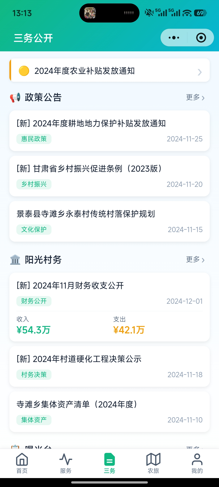

- 标注说明：
  ① 顶部预警信息为轮播滚动，3秒自动切换
  ② 各板块展示最新3条数据，点击"更多"进入列表页
  ③ 页面支持下拉刷新

---

##### 需要的数据

**预警信息：**

| 序号 | 数据项名称 | 必填/选填 | 数据说明/口径 | 是否能提供 | 备注 |
|------|-----------|----------|--------------|-----------|------|
| 1 | 预警类型 | [x]必填 [ ]选填 | 紧急/重要/一般 | [ ]能 [ ]部分能 [ ]不能 | 后台配置 |
| 2 | 预警标题 | [x]必填 [ ]选填 | 预警信息标题 | [ ]能 [ ]部分能 [ ]不能 | 后台配置 |
| 3 | 预警内容 | [x]必填 [ ]选填 | 预警详细内容 | [ ]能 [ ]部分能 [ ]不能 | 后台配置 |

**政策公告预览：**

| 序号 | 数据项名称 | 必填/选填 | 数据说明/口径 | 是否能提供 | 备注 |
|------|-----------|----------|--------------|-----------|------|
| 1 | 政策标题 | [x]必填 [ ]选填 | 政策公告标题 | [ ]能 [ ]部分能 [ ]不能 | 后台配置 |
| 2 | 政策分类 | [x]必填 [ ]选填 | 如惠民政策、乡村振兴等 | [ ]能 [ ]部分能 [ ]不能 | 后台配置 |

**阳光村务预览：**

| 序号 | 数据项名称 | 必填/选填 | 数据说明/口径 | 是否能提供 | 备注 |
|------|-----------|----------|--------------|-----------|------|
| 1 | 村务标题 | [x]必填 [ ]选填 | 村务公开标题 | [ ]能 [ ]部分能 [ ]不能 | 后台配置 |
| 2 | 村务类型 | [x]必填 [ ]选填 | 财务/决策/资产/会议 | [ ]能 [ ]部分能 [ ]不能 | 后台配置 |
| 3 | 收入金额 | [ ]必填 [x]选填 | 财务公开专用，收入总额（元） | [ ]能 [ ]部分能 [ ]不能 | 仅财务类型 |
| 4 | 支出金额 | [ ]必填 [x]选填 | 财务公开专用，支出总额（元） | [ ]能 [ ]部分能 [ ]不能 | 仅财务类型 |

**曝光台预览：**

| 序号 | 数据项名称 | 必填/选填 | 数据说明/口径 | 是否能提供 | 备注 |
|------|-----------|----------|--------------|-----------|------|
| 1 | 曝光标题 | [x]必填 [ ]选填 | 曝光记录标题 | [ ]能 [ ]部分能 [ ]不能 | 后台配置 |
| 2 | 曝光类型 | [x]必填 [ ]选填 | 黑榜/红榜 | [ ]能 [ ]部分能 [ ]不能 | 后台配置 |
| 3 | 所属村庄 | [x]必填 [ ]选填 | 曝光事项所属村庄 | [ ]能 [ ]部分能 [ ]不能 | 后台配置 |
| 4 | 整改状态 | [ ]必填 [x]选填 | 待整改/整改中/已整改 | [ ]能 [ ]部分能 [ ]不能 | 仅黑榜类型 |
| 5 | 整改进度 | [ ]必填 [x]选填 | 整改完成百分比(0-100) | [ ]能 [ ]部分能 [ ]不能 | 仅黑榜类型 |

---

##### 确认项
- 功能是否需要： [ ] 需要  [ ] 不需要（原因：                ）
- 展示内容是否符合： [ ] 符合  [ ] 需调整（写明调整点：                ）
- 数据整体是否可落地： [ ] 可落地  [ ] 有风险（风险点：                ）

---

#### 5.4.2 功能名称：`政策公告列表`（所属模块：`三务公开-政策公告`）

**这页用来干啥（1句话）：**
展示所有政策公告列表，支持按分类筛选和关键词搜索

---

##### 页面展示内容

- 原型截图：

- 标注说明：
  ① 在三务首页中点击“政策公告”列表处的“更多”进入完整政策公告列表
  ② 搜索支持关键词模糊匹配
  ③ 分类标签支持横向滑动，共7个分类（全部、惠民政策、乡村振兴、土地管理、文化保护、社会保障、本村公告）
  ④ 支持下拉刷新和上拉加载更多

---

##### 需要的数据

| 序号 | 数据项名称 | 必填/选填 | 数据说明/口径 | 是否能提供 | 备注 |
|------|-----------|----------|--------------|-----------|------|
| 1 | 政策标题 | [x]必填 [ ]选填 | 政策公告标题 | [ ]能 [ ]部分能 [ ]不能 | 后台配置 |
| 2 | 政策分类 | [x]必填 [ ]选填 | 惠民政策/乡村振兴/土地管理/文化保护/社会保障/本村公告 | [ ]能 [ ]部分能 [ ]不能 | 后台配置 |
| 3 | 政策摘要 | [ ]必填 [x]选填 | 政策内容简介，限2行显示 | [ ]能 [ ]部分能 [ ]不能 | 后台配置 |

---

##### 确认项
- 功能是否需要： [ ] 需要  [ ] 不需要（原因：                ）
- 展示内容是否符合： [ ] 符合  [ ] 需调整（写明调整点：                ）
- 数据整体是否可落地： [ ] 可落地  [ ] 有风险（风险点：                ）

---

#### 5.4.3 功能名称：`政策公告详情`（所属模块：`三务公开-政策公告`）

**这页用来干啥（1句话）：**
展示政策公告完整内容，支持收藏和分享

---

##### 页面展示内容

- 原型截图：

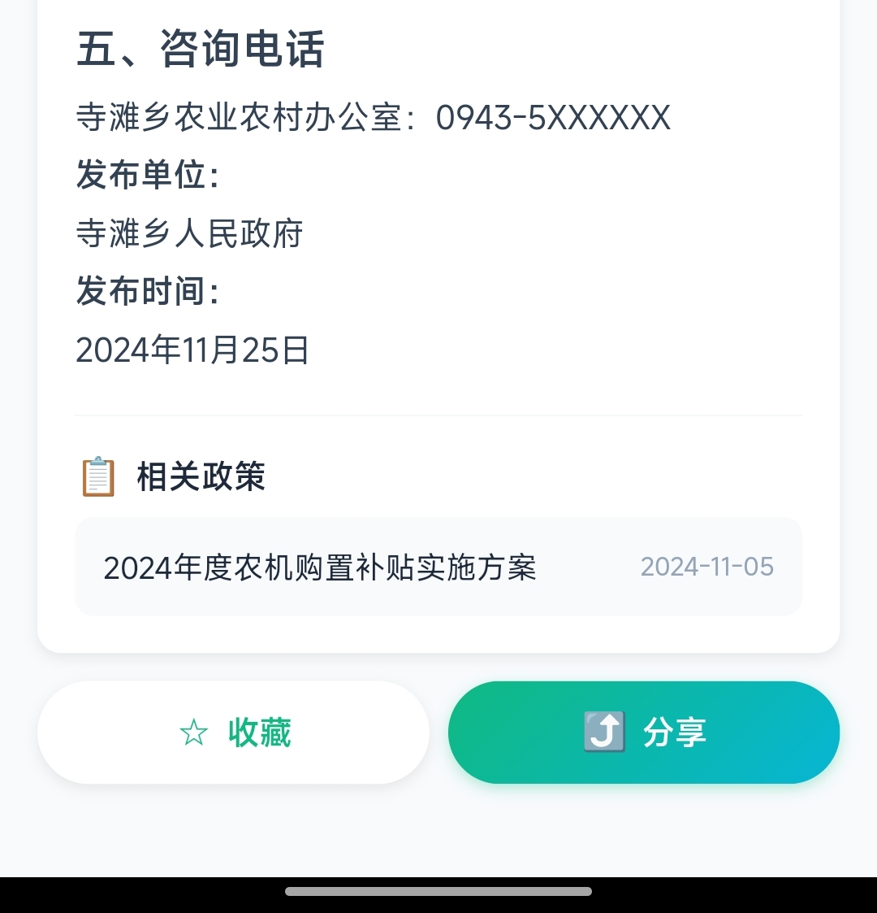

- 标注说明：
  ① 正文图文内容展示
  ② 附件支持点击下载
  ③ 相关政策点击可跳转对应详情页

---

##### 需要的数据

**基本信息：**

| 序号 | 数据项名称 | 必填/选填 | 数据说明/口径 | 是否能提供 | 备注 |
|------|-----------|----------|--------------|-----------|------|
| 1 | 政策标题 | [x]必填 [ ]选填 | 政策公告标题 | [ ]能 [ ]部分能 [ ]不能 | 后台配置 |
| 2 | 政策分类 | [x]必填 [ ]选填 | 政策所属分类 | [ ]能 [ ]部分能 [ ]不能 | 后台配置 |
| 3 | 标签列表 | [ ]必填 [x]选填 | 政策关键词标签，如["补贴申领","农业补贴"] | [ ]能 [ ]部分能 [ ]不能 | 后台配置，数组 |
| 4 | 政策摘要 | [ ]必填 [x]选填 | 内容简介 | [ ]能 [ ]部分能 [ ]不能 | 后台配置 |
| 5 | 政策正文 | [x]必填 [ ]选填 | 图文内容 | [ ]能 [ ]部分能 [ ]不能 | 后台配置 |
| 6 | 生效日期 | [ ]必填 [x]选填 | 政策生效日期 | [ ]能 [ ]部分能 [ ]不能 | 后台配置 |
| 7 | 失效日期 | [ ]必填 [x]选填 | 政策失效日期 | [ ]能 [ ]部分能 [ ]不能 | 后台配置 |

**附件信息：**

| 序号 | 数据项名称 | 必填/选填 | 数据说明/口径 | 是否能提供 | 备注 |
|------|-----------|----------|--------------|-----------|------|
| 1 | 附件名称 | [x]必填 [ ]选填 | 附件文件名 | [ ]能 [ ]部分能 [ ]不能 | 后台配置 |
| 2 | 附件文件 | [x]必填 [ ]选填 | 附件下载地址 | [ ]能 [ ]部分能 [ ]不能 | 后台配置 |

---

##### 确认项
- 功能是否需要： [ ] 需要  [ ] 不需要（原因：                ）
- 展示内容是否符合： [ ] 符合  [ ] 需调整（写明调整点：                ）
- 数据整体是否可落地： [ ] 可落地  [ ] 有风险（风险点：                ）

---

#### 5.4.4 功能名称：`阳光村务列表`（所属模块：`三务公开-阳光村务`）

**这页用来干啥（1句话）：**
展示村务公开信息列表，支持按类型筛选（财务/决策/资产/会议）

---

##### 页面展示内容

- 原型截图：

- 标注说明：
  ① 在三务首页中点击“政策公告”列表处的“更多”进入完整政策公告列表
  ② 类型筛选共4种：财务公开、村务决策、集体资产、会议记录
  ③ 财务公开类型卡片显示收入/支出金额预览
  ④ 支持搜索、下拉刷新和上拉加载

---

##### 需要的数据

| 序号 | 数据项名称 | 必填/选填 | 数据说明/口径 | 是否能提供 | 备注 |
|------|-----------|----------|--------------|-----------|------|
| 1 | 村务标题 | [x]必填 [ ]选填 | 村务公开标题 | [ ]能 [ ]部分能 [ ]不能 | 后台配置 |
| 2 | 村务类型 | [x]必填 [ ]选填 | 财务/决策/资产/会议 | [ ]能 [ ]部分能 [ ]不能 | 后台配置 |
| 3 | 收入金额 | [ ]必填 [x]选填 | 财务公开专用，收入总额（元） | [ ]能 [ ]部分能 [ ]不能 | 仅财务类型 |
| 4 | 支出金额 | [ ]必填 [x]选填 | 财务公开专用，支出总额（元） | [ ]能 [ ]部分能 [ ]不能 | 仅财务类型 |

---

##### 确认项
- 功能是否需要： [ ] 需要  [ ] 不需要（原因：                ）
- 展示内容是否符合： [ ] 符合  [ ] 需调整（写明调整点：                ）
- 数据整体是否可落地： [ ] 可落地  [ ] 有风险（风险点：                ）

---

#### 5.4.5 功能名称：`阳光村务详情`（所属模块：`三务公开-阳光村务`）

**这页用来干啥（1句话）：**
展示村务公开详细信息，根据类型显示不同内容（财务明细/决策表决/资产清单/会议记录）

---

##### 页面展示内容

- 原型截图：

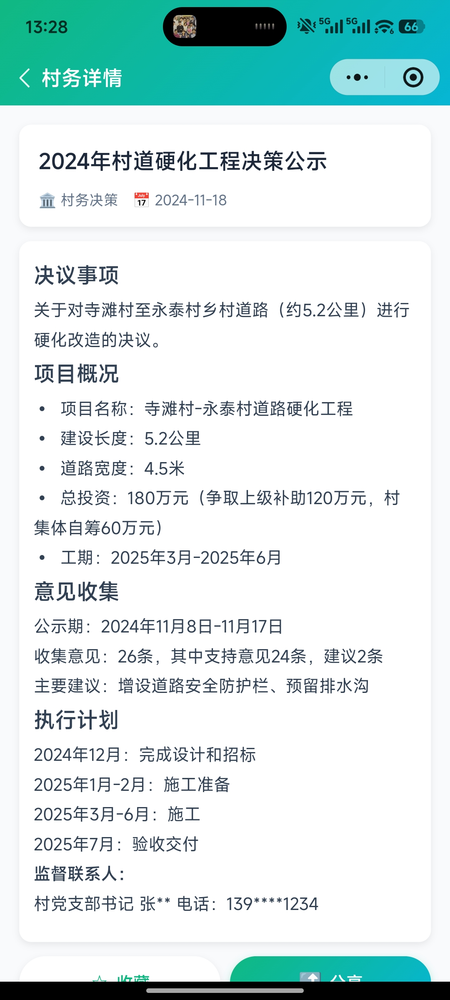
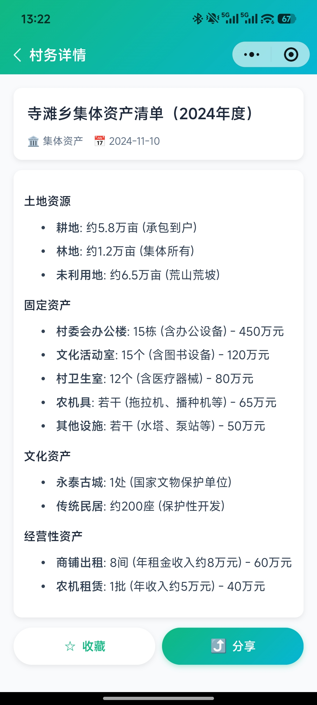

- 标注说明：
  ① 财务公开显示收支汇总和明细表格
  ③ 集体资产显示分类资产清单和变更记录
  ③ 会议记录显示议程、决议和参会信息

---

##### 需要的数据

**基本信息：**

| 序号 | 数据项名称 | 必填/选填 | 数据说明/口径 | 是否能提供 | 备注 |
|------|-----------|----------|--------------|-----------|------|
| 1 | 村务标题 | [x]必填 [ ]选填 | 村务公开标题 | [ ]能 [ ]部分能 [ ]不能 | 后台配置 |
| 2 | 村务类型 | [x]必填 [ ]选填 | 财务/决策/资产/会议 | [ ]能 [ ]部分能 [ ]不能 | 后台配置 |
| 3 | 发布日期 | [x]必填 [ ]选填 | 村务公开日期 | [ ]能 [ ]部分能 [ ]不能 | 后台配置 |

**财务公开专用：**

| 序号 | 数据项名称 | 必填/选填 | 数据说明/口径 | 是否能提供 | 备注 |
|------|-----------|----------|--------------|-----------|------|
| 1 | 收入总额 | [x]必填 [ ]选填 | 本期收入总金额（元） | [ ]能 [ ]部分能 [ ]不能 | 后台配置 |
| 2 | 支出总额 | [x]必填 [ ]选填 | 本期支出总金额（元） | [ ]能 [ ]部分能 [ ]不能 | 后台配置 |
| 4 | 收入明细项目 | [x]必填 [ ]选填 | 收入项目名称 | [ ]能 [ ]部分能 [ ]不能 | 后台配置，数组 |
| 5 | 收入明细金额 | [x]必填 [ ]选填 | 各收入项金额（元） | [ ]能 [ ]部分能 [ ]不能 | 后台配置，数组 |
| 6 | 支出明细项目 | [x]必填 [ ]选填 | 支出项目名称 | [ ]能 [ ]部分能 [ ]不能 | 后台配置，数组 |
| 7 | 支出明细金额 | [x]必填 [ ]选填 | 各支出项金额（元） | [ ]能 [ ]部分能 [ ]不能 | 后台配置，数组 |

**村务决策专用：**

| 序号 | 数据项名称 | 必填/选填 | 数据说明/口径 | 是否能提供 | 备注 |
|------|-----------|----------|--------------|-----------|------|
| 1 | 决策类型 | [x]必填 [ ]选填 | 如"基础设施建设"、"社会救助"等 | [ ]能 [ ]部分能 [ ]不能 | 后台配置 |
| 2 | 提议方 | [x]必填 [ ]选填 | 提出方，如"村委会" | [ ]能 [ ]部分能 [ ]不能 | 后台配置 |
| 3 | 表决日期 | [x]必填 [ ]选填 | 村民代表大会表决日期 | [ ]能 [ ]部分能 [ ]不能 | 后台配置 |
| 4 | 代表总数 | [x]必填 [ ]选填 | 村民代表总人数 | [ ]能 [ ]部分能 [ ]不能 | 后台配置 |
| 5 | 同意票数 | [x]必填 [ ]选填 | 投同意票人数 | [ ]能 [ ]部分能 [ ]不能 | 后台配置 |
| 6 | 反对票数 | [x]必填 [ ]选填 | 投反对票人数 | [ ]能 [ ]部分能 [ ]不能 | 后台配置 |
| 7 | 弃权票数 | [x]必填 [ ]选填 | 弃权人数 | [ ]能 [ ]部分能 [ ]不能 | 后台配置 |
| 9 | 决策详情 | [x]必填 [ ]选填 | 决策内容详情（图文内容） | [ ]能 [ ]部分能 [ ]不能 | 后台配置 |
| 10 | 执行时间线 | [ ]必填 [x]选填 | 执行计划节点列表 | [ ]能 [ ]部分能 [ ]不能 | 后台配置，数组 |

**集体资产专用：**

| 序号 | 数据项名称 | 必填/选填 | 数据说明/口径 | 是否能提供 | 备注 |
|------|-----------|----------|--------------|-----------|------|
| 1 | 资产总价值 | [x]必填 [ ]选填 | 集体资产总价值（元） | [ ]能 [ ]部分能 [ ]不能 | 后台配置 |
| 2 | 资产分类名称 | [x]必填 [ ]选填 | 如"土地资源"、"固定资产"等 | [ ]能 [ ]部分能 [ ]不能 | 后台配置 |
| 3 | 资产项目名称 | [x]必填 [ ]选填 | 具体资产名称 | [ ]能 [ ]部分能 [ ]不能 | 后台配置 |
| 4 | 资产数量 | [x]必填 [ ]选填 | 资产数量/面积 | [ ]能 [ ]部分能 [ ]不能 | 后台配置 |
| 5 | 资产价值 | [ ]必填 [x]选填 | 单项资产价值（元） | [ ]能 [ ]部分能 [ ]不能 | 后台配置 |
| 6 | 资产备注 | [ ]必填 [x]选填 | 资产说明，如"承包到户" | [ ]能 [ ]部分能 [ ]不能 | 后台配置 |
| 7 | 资产变更记录 | [ ]必填 [x]选填 | 新增/报废记录列表 | [ ]能 [ ]部分能 [ ]不能 | 后台配置，数组 |

**会议记录专用：**

| 序号 | 数据项名称 | 必填/选填 | 数据说明/口径 | 是否能提供 | 备注 |
|------|-----------|----------|--------------|-----------|------|
| 1 | 会议时间 | [x]必填 [ ]选填 | 会议召开时间 | [ ]能 [ ]部分能 [ ]不能 | 后台配置 |
| 2 | 会议地点 | [x]必填 [ ]选填 | 会议举办地点 | [ ]能 [ ]部分能 [ ]不能 | 后台配置 |
| 3 | 主持人 | [x]必填 [ ]选填 | 会议主持人姓名 | [ ]能 [ ]部分能 [ ]不能 | 后台配置 |
| 4 | 应到人数 | [x]必填 [ ]选填 | 应参会人数 | [ ]能 [ ]部分能 [ ]不能 | 后台配置 |
| 5 | 实到人数 | [x]必填 [ ]选填 | 实际参会人数 | [ ]能 [ ]部分能 [ ]不能 | 后台配置 |
| 7 | 会议议程 | [x]必填 [ ]选填 | 议程列表（标题/发言人/时长/结果） | [ ]能 [ ]部分能 [ ]不能 | 后台配置，数组 |
| 8 | 会议决议 | [x]必填 [ ]选填 | 会议形成的决议列表 | [ ]能 [ ]部分能 [ ]不能 | 后台配置，数组 |
| 9 | 会议照片 | [ ]必填 [x]选填 | 会议现场照片 | [ ]能 [ ]部分能 [ ]不能 | 后台配置 |

---

##### 确认项
- 功能是否需要： [ ] 需要  [ ] 不需要（原因：                ）
- 展示内容是否符合： [ ] 符合  [ ] 需调整（写明调整点：                ）
- 数据整体是否可落地： [ ] 可落地  [ ] 有风险（风险点：                ）

---

#### 5.4.6 功能名称：`曝光台列表`（所属模块：`三务公开-曝光台`）

**这页用来干啥（1句话）：**
展示曝光台信息列表，支持红榜/黑榜切换查看

---

##### 页面展示内容

- 原型截图：

- 标注说明：
  ① 在三务首页中点击“曝光台”列表处的“更多”进入完整曝光列表
  ① 红榜/黑榜通过顶部标签切换
  ② 红榜卡片显示表彰类别
  ④ 黑榜卡片显示整改状态和进度条

---

##### 需要的数据

| 序号 | 数据项名称 | 必填/选填 | 数据说明/口径 | 是否能提供 | 备注 |
|------|-----------|----------|--------------|-----------|------|
| 1 | 曝光标题 | [x]必填 [ ]选填 | 曝光记录标题 | [ ]能 [ ]部分能 [ ]不能 | 后台配置 |
| 2 | 曝光类型 | [x]必填 [ ]选填 | 黑榜/红榜 | [ ]能 [ ]部分能 [ ]不能 | 后台配置 |
| 3 | 所属村庄 | [x]必填 [ ]选填 | 曝光事项所属村庄 | [ ]能 [ ]部分能 [ ]不能 | 后台配置 |
| 4 | 整改状态 | [ ]必填 [x]选填 | 待整改/整改中/已整改 | [ ]能 [ ]部分能 [ ]不能 | 仅黑榜类型 |
| 5 | 整改进度 | [ ]必填 [x]选填 | 整改完成百分比(0-100) | [ ]能 [ ]部分能 [ ]不能 | 仅黑榜类型 |
| 6 | 表彰类别 | [ ]必填 [x]选填 | 红榜的表彰分类 | [ ]能 [ ]部分能 [ ]不能 | 仅红榜类型 |

---

##### 确认项
- 功能是否需要： [ ] 需要  [ ] 不需要（原因：                ）
- 展示内容是否符合： [ ] 符合  [ ] 需调整（写明调整点：                ）
- 数据整体是否可落地： [ ] 可落地  [ ] 有风险（风险点：                ）

---

#### 5.4.7 功能名称：`曝光台详情`（所属模块：`三务公开-曝光台`）

**这页用来干啥（1句话）：**
展示曝光/表彰详细信息，黑榜显示问题和整改进度，红榜显示先进事迹

---

##### 页面展示内容

- 原型截图：

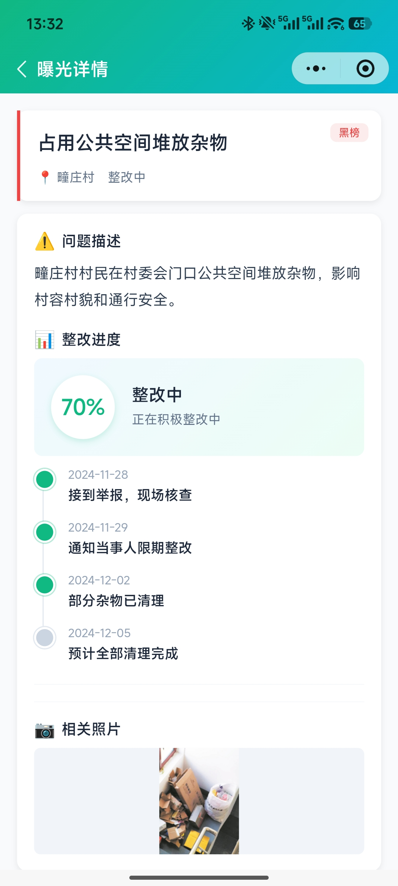

- 标注说明：
  ① 红榜显示先进事迹和荣誉亮点列表
  ② 黑榜显示问题描述、整改进度环（百分比）和整改时间线
  ③ 照片墙支持点击预览大图

---

##### 需要的数据

**基本信息：**

| 序号 | 数据项名称 | 必填/选填 | 数据说明/口径 | 是否能提供 | 备注 |
|------|-----------|----------|--------------|-----------|------|
| 1 | 曝光标题 | [x]必填 [ ]选填 | 曝光记录标题 | [ ]能 [ ]部分能 [ ]不能 | 后台配置 |
| 2 | 曝光类型 | [x]必填 [ ]选填 | 黑榜/红榜 | [ ]能 [ ]部分能 [ ]不能 | 后台配置 |
| 3 | 所属村庄 | [x]必填 [ ]选填 | 曝光事项所属村庄 | [ ]能 [ ]部分能 [ ]不能 | 后台配置 |
| 4 | 发布日期 | [x]必填 [ ]选填 | 曝光/表彰发布日期 | [ ]能 [ ]部分能 [ ]不能 | 后台配置 |

**黑榜专用：**

| 序号 | 数据项名称 | 必填/选填 | 数据说明/口径 | 是否能提供 | 备注 |
|------|-----------|----------|--------------|-----------|------|
| 1 | 问题描述 | [x]必填 [ ]选填 | 问题详细描述（图文内容） | [ ]能 [ ]部分能 [ ]不能 | 后台配置 |
| 2 | 曝光位置 | [x]必填 [ ]选填 | 问题发生具体位置 | [ ]能 [ ]部分能 [ ]不能 | 后台配置 |
| 3 | 举报来源 | [ ]必填 [x]选填 | "村民举报"/"巡查发现"等 | [ ]能 [ ]部分能 [ ]不能 | 后台配置 |
| 4 | 责任人 | [x]必填 [ ]选填 | 负责整改的网格员/责任人 | [ ]能 [ ]部分能 [ ]不能 | 后台配置 |
| 5 | 整改状态 | [x]必填 [ ]选填 | 待整改/整改中/已整改 | [ ]能 [ ]部分能 [ ]不能 | 后台配置 |
| 6 | 整改进度 | [x]必填 [ ]选填 | 整改完成百分比(0-100) | [ ]能 [ ]部分能 [ ]不能 | 后台配置 |
| 7 | 整改期限 | [x]必填 [ ]选填 | 要求整改完成日期 | [ ]能 [ ]部分能 [ ]不能 | 后台配置 |
| 8 | 整改完成日期 | [ ]必填 [x]选填 | 实际整改完成日期 | [ ]能 [ ]部分能 [ ]不能 | 仅已整改状态 |
| 9 | 问题照片 | [ ]必填 [x]选填 | 问题现场照片 | [ ]能 [ ]部分能 [ ]不能 | 后台配置 |
| 10 | 整改后照片 | [ ]必填 [x]选填 | 整改完成后照片 | [ ]能 [ ]部分能 [ ]不能 | 仅已整改状态 |

**红榜专用：**

| 序号 | 数据项名称 | 必填/选填 | 数据说明/口径 | 是否能提供 | 备注 |
|------|-----------|----------|--------------|-----------|------|
| 1 | 先进事迹 | [x]必填 [ ]选填 | 先进事迹描述（图文内容） | [ ]能 [ ]部分能 [ ]不能 | 后台配置 |
| 2 | 表彰类别 | [ ]必填 [x]选填 | 表彰分类，如"优秀调解员" | [ ]能 [ ]部分能 [ ]不能 | 后台配置 |
| 3 | 荣誉亮点 | [ ]必填 [x]选填 | 主要成就列表，如["成功调解12起","调解成功率100%"] | [ ]能 [ ]部分能 [ ]不能 | 后台配置，数组 |
| 4 | 获得荣誉 | [ ]必填 [x]选填 | 获得的荣誉称号 | [ ]能 [ ]部分能 [ ]不能 | 后台配置 |
| 5 | 表彰单位 | [ ]必填 [x]选填 | 颁发表彰的单位 | [ ]能 [ ]部分能 [ ]不能 | 后台配置 |
| 6 | 事迹照片 | [ ]必填 [x]选填 | 相关照片 | [ ]能 [ ]部分能 [ ]不能 | 后台配置 |

---

##### 确认项
- 功能是否需要： [ ] 需要  [ ] 不需要（原因：                ）
- 展示内容是否符合： [ ] 符合  [ ] 需调整（写明调整点：                ）
- 数据整体是否可落地： [ ] 可落地  [ ] 有风险（风险点：                ）

---

### 5.5 农户端 - 农旅模块

---

#### 5.5.1 功能名称：`农旅首页`（所属模块：`农旅`）

**这页用来干啥（1句话）：**
展示农旅游览入口，包含景点、特产、民宿等推荐内容

---

##### 页面展示内容

- 原型截图：

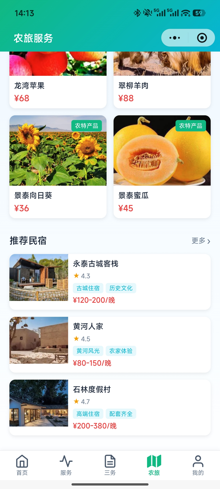

- 标注说明：
  ① 顶部轮播展示农旅活动、景点宣传等
  ② 4宫格入口提供景点、全景、路线、活动等快捷访问
  ③ 同时，展示精选景点、热门农产、推荐民宿列表
  ④ 页面支持游客模式（未登录用户也可使用）

---

##### 需要的数据

| 序号 | 数据项名称 | 必填/选填 | 数据说明/口径 | 是否能提供 | 备注 |
|------|-----------|----------|--------------|-----------|------|
| 1 | 精选景点列表 | [x]必填 [ ]选填 | 首页展示的精选景点数据 | [ ]能 [ ]部分能 [ ]不能 | 取前5-6个 |
| 2 | 热门农产列表 | [x]必填 [ ]选填 | 首页展示的热门农产品数据 | [ ]能 [ ]部分能 [ ]不能 | 取前4个 |
| 3 | 推荐民宿列表 | [x]必填 [ ]选填 | 首页展示的推荐民宿数据 | [ ]能 [ ]部分能 [ ]不能 | 取前3个 |

---

##### 确认项
- 功能是否需要： [ ] 需要  [ ] 不需要（原因：                ）
- 展示内容是否符合： [ ] 符合  [ ] 需调整（写明调整点：                ）
- 数据整体是否可落地： [ ] 可落地  [ ] 有风险（风险点：                ）

---

#### 5.5.2 功能名称：`景点列表`（所属模块：`农旅`）

**这页用来干啥（1句话）：**
展示所有旅游景点，支持按等级筛选和地图/列表视图切换

---

##### 页面展示内容

- 原型截图：

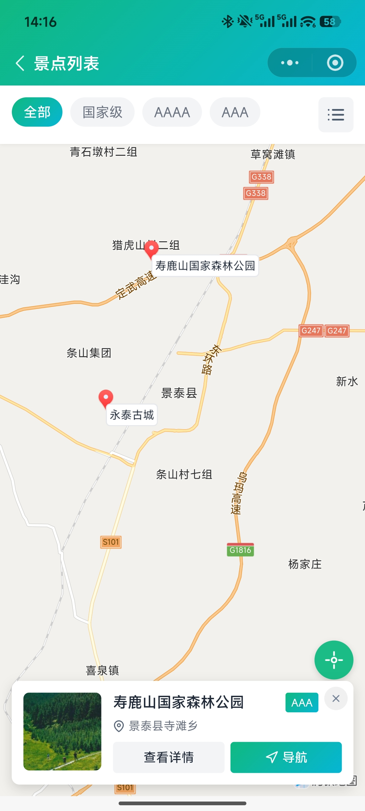

- 标注说明：
  ① 从农旅首页点击“景点浏览”按钮或者“精选景点”列表处的“更多”进入完整景点列表
  ② 顶部筛选支持按景点等级（全部/国家级/AAAA/AAA）筛选
  ③ 右上角可切换列表视图和地图视图
  ④ 地图视图点击标记可查看景点简要信息

---

##### 需要的数据

**列表数据：**

| 序号 | 数据项名称 | 必填/选填 | 数据说明/口径 | 是否能提供 | 备注 |
|------|-----------|----------|--------------|-----------|------|
| 2 | 景点名称 | [x]必填 [ ]选填 | 如"黄河石林"、"永泰古城" | [ ]能 [ ]部分能 [ ]不能 | |
| 3 | 景点等级 | [x]必填 [ ]选填 | 国家级/AAAA/AAA等 | [ ]能 [ ]部分能 [ ]不能 | 用于筛选 |
| 4 | 景点类型 | [x]必填 [ ]选填 | 如"地质公园"、"古城遗址" | [ ]能 [ ]部分能 [ ]不能 | |
| 5 | 景点照片 | [x]必填 [ ]选填 | 列表展示的图片 | [ ]能 [ ]部分能 [ ]不能 | 建议尺寸300×200 |
| 6 | 景点地址 | [x]必填 [ ]选填 | 景点详细地址 | [ ]能 [ ]部分能 [ ]不能 | |
| 7 | 建议游览时长 | [ ]必填 [x]选填 | 如"3-4小时" | [ ]能 [ ]部分能 [ ]不能 | |
| 8 | 门票信息 | [ ]必填 [x]选填 | 如"免费"、"¥80" | [ ]能 [ ]部分能 [ ]不能 | |
| 9 | 景点评分 | [ ]必填 [x]选填 | 1-5分的评分 | [ ]能 [ ]部分能 [ ]不能 | |

**地图图层数据：**

| 序号 | 数据项名称 | 必填/选填 | 数据说明/口径 | 是否能提供 | 备注 |
|------|-----------|----------|--------------|-----------|------|
| 1 | 景点经度 | [x]必填 [ ]选填 | 景点位置经度 | [ ]能 [ ]部分能 [ ]不能 | 用于地图标点 |
| 2 | 景点纬度 | [x]必填 [ ]选填 | 景点位置纬度 | [ ]能 [ ]部分能 [ ]不能 | 用于地图标点 |

---

##### 确认项
- 功能是否需要： [ ] 需要  [ ] 不需要（原因：                ）
- 展示内容是否符合： [ ] 符合  [ ] 需调整（写明调整点：                ）
- 数据整体是否可落地： [ ] 可落地  [ ] 有风险（风险点：                ）

---

#### 5.5.3 功能名称：`景点详情`（所属模块：`农旅`）

**这页用来干啥（1句话）：**
展示景点完整信息，支持导航、分享、收藏和720全景查看

---

##### 页面展示内容

- 原型截图：

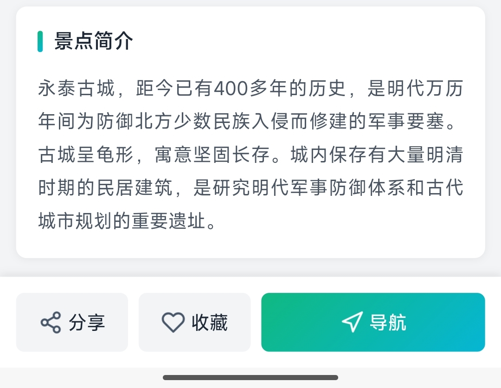

- 标注说明：
  ① 从农旅首页点击顶部轮播景点或“精选景点”列表项或景点列表中的列表项进入景点详情页
  ② 顶部图片支持轮播展示多张景点图片
  ③ 有720全景资源时显示全景入口按钮
  ④ 底部操作栏支持分享、收藏、导航三个功能

---

##### 需要的数据

| 序号 | 数据项名称 | 必填/选填 | 数据说明/口径 | 是否能提供 | 备注 |
|------|-----------|----------|--------------|-----------|------|
| 1 | 景点名称 | [x]必填 [ ]选填 | 景点名称 | [ ]能 [ ]部分能 [ ]不能 | |
| 2 | 景点等级 | [x]必填 [ ]选填 | 国家级/AAAA/AAA等 | [ ]能 [ ]部分能 [ ]不能 | |
| 3 | 景点类型 | [x]必填 [ ]选填 | 如"地质公园" | [ ]能 [ ]部分能 [ ]不能 | |
| 4 | 景点评分 | [x]必填 [ ]选填 | 1-5分评分 | [ ]能 [ ]部分能 [ ]不能 | |
| 5 | 景点图片列表 | [x]必填 [ ]选填 | 多张图片 | [ ]能 [ ]部分能 [ ]不能 | 用于轮播 |
| 6 | 景点地址 | [x]必填 [ ]选填 | 详细地址 | [ ]能 [ ]部分能 [ ]不能 | |
| 7 | 开放时间 | [x]必填 [ ]选填 | 如"08:00-18:00" | [ ]能 [ ]部分能 [ ]不能 | |
| 8 | 门票价格 | [x]必填 [ ]选填 | 如"免费"、"¥80/人" | [ ]能 [ ]部分能 [ ]不能 | |
| 9 | 建议游览时长 | [x]必填 [ ]选填 | 如"3-4小时" | [ ]能 [ ]部分能 [ ]不能 | |
| 10 | 景点简介 | [x]必填 [ ]选填 | 景点详细介绍文字 | [ ]能 [ ]部分能 [ ]不能 | |
| 11 | 景点经度 | [x]必填 [ ]选填 | 用于导航 | [ ]能 [ ]部分能 [ ]不能 | |
| 12 | 景点纬度 | [x]必填 [ ]选填 | 用于导航 | [ ]能 [ ]部分能 [ ]不能 | |

---

##### 确认项
- 功能是否需要： [ ] 需要  [ ] 不需要（原因：                ）
- 展示内容是否符合： [ ] 符合  [ ] 需调整（写明调整点：                ）
- 数据整体是否可落地： [ ] 可落地  [ ] 有风险（风险点：                ）

---

#### 5.5.4 功能名称：`全景漫游列表`（所属模块：`农旅`）

**这页用来干啥（1句话）：**
展示所有支持720°全景的点位，支持列表和地图两种浏览方式

---

##### 页面展示内容

- 原型截图：

- 标注说明：
  ① 从农旅首页点击“全景漫游”按钮进入完整全景漫游列表
  ② 顶部标签页切换列表视图和地图视图
  ③ 每个点位卡片显示720°标识
  ④ 数据来源包括独立VR点位和支持全景的景点

---

##### 确认项
- 功能是否需要： [ ] 需要  [ ] 不需要（原因：                ）
- 展示内容是否符合： [ ] 符合  [ ] 需调整（写明调整点：                ）
- 数据整体是否可落地： [ ] 可落地  [ ] 有风险（风险点：                ）

---

#### 5.5.5 功能名称：`精品路线列表`（所属模块：`农旅`）

**这页用来干啥（1句话）：**
展示精品旅游路线，支持按类型筛选，可查看路线详情或地图

---

##### 页面展示内容

- 原型截图：

- 标注说明：
  ① 从农旅首页点击“精品路线”按钮进入完整精品路线列表
  ② 顶部筛选支持按路线类型（休闲度假/摄影采风/研学游/亲子游）筛选
  ③ 每个路线卡片显示景点流程（如：景点1→景点2→景点3）
  ④ 可点击"地图显示"按钮查看路线地图

---

##### 需要的数据

| 序号 | 数据项名称 | 必填/选填 | 数据说明/口径 | 是否能提供 | 备注 |
|------|-----------|----------|--------------|-----------|------|
| 1 | 路线标题 | [x]必填 [ ]选填 | 如"石林古城休闲二日游" | [ ]能 [ ]部分能 [ ]不能 | |
| 2 | 路线类型 | [x]必填 [ ]选填 | 休闲度假/摄影采风/研学游/亲子游 | [ ]能 [ ]部分能 [ ]不能 | 用于筛选 |
| 3 | 路线封面图 | [x]必填 [ ]选填 | 卡片展示的封面图URL | [ ]能 [ ]部分能 [ ]不能 | |
| 4 | 行程天数 | [x]必填 [ ]选填 | 如"2天" | [ ]能 [ ]部分能 [ ]不能 | |
| 5 | 路线评分 | [ ]必填 [x]选填 | 1-5分评分 | [ ]能 [ ]部分能 [ ]不能 | |
| 6 | 起步价格 | [x]必填 [ ]选填 | 如"¥380" | [ ]能 [ ]部分能 [ ]不能 | |
| 7 | 路线简介 | [ ]必填 [x]选填 | 简短描述 | [ ]能 [ ]部分能 [ ]不能 | |
| 8 | 景点列表 | [x]必填 [ ]选填 | 路线包含的景点名称数组 | [ ]能 [ ]部分能 [ ]不能 | 用于展示景点流程 |
| 9 | 路线标签 | [ ]必填 [x]选填 | 如["精品推荐","自驾首选"] | [ ]能 [ ]部分能 [ ]不能 | |

---

##### 确认项
- 功能是否需要： [ ] 需要  [ ] 不需要（原因：                ）
- 展示内容是否符合： [ ] 符合  [ ] 需调整（写明调整点：                ）
- 数据整体是否可落地： [ ] 可落地  [ ] 有风险（风险点：                ）

---

#### 5.5.7 功能名称：`路线详情`（所属模块：`农旅`）

**这页用来干啥（1句话）：**
展示旅游路线完整信息，包含行程安排、费用说明、温馨提示等

---

##### 页面展示内容

- 原型截图：

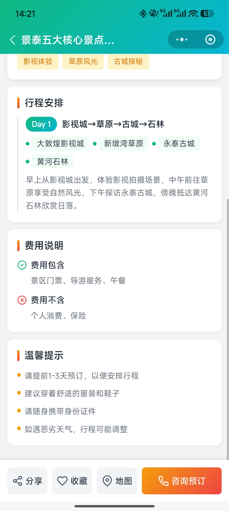

- 标注说明：
  ① 行程安排按天数分组展示，每天包含多个景点
  ② 费用说明分为"费用包含"和"费用不含"两部分
  ③ 底部"咨询预订"按钮可拨打客服电话

---

##### 需要的数据

| 序号 | 数据项名称 | 必填/选填 | 数据说明/口径 | 是否能提供 | 备注 |
|------|-----------|----------|--------------|-----------|------|
| 1 | 路线标题 | [x]必填 [ ]选填 | 路线名称 | [ ]能 [ ]部分能 [ ]不能 | |
| 2 | 路线类型名称 | [x]必填 [ ]选填 | 如"休闲度假" | [ ]能 [ ]部分能 [ ]不能 | |
| 3 | 路线封面图 | [x]必填 [ ]选填 | 大图URL | [ ]能 [ ]部分能 [ ]不能 | |
| 4 | 行程天数 | [x]必填 [ ]选填 | 如"2天" | [ ]能 [ ]部分能 [ ]不能 | |
| 5 | 路线评分 | [ ]必填 [x]选填 | 1-5分评分 | [ ]能 [ ]部分能 [ ]不能 | |
| 6 | 起步价格 | [x]必填 [ ]选填 | 如"¥380" | [ ]能 [ ]部分能 [ ]不能 | |
| 7 | 路线简介 | [x]必填 [ ]选填 | 详细描述 | [ ]能 [ ]部分能 [ ]不能 | |
| 8 | 路线标签 | [ ]必填 [x]选填 | 标签数组 | [ ]能 [ ]部分能 [ ]不能 | |
| 9 | 行程安排 | [x]必填 [ ]选填 | 每日行程数组，含日次、标题、景点列表、描述 | [ ]能 [ ]部分能 [ ]不能 | 结构化数据 |
| 10 | 费用包含说明 | [x]必填 [ ]选填 | 包含的费用项目描述 | [ ]能 [ ]部分能 [ ]不能 | |
| 11 | 费用不含说明 | [x]必填 [ ]选填 | 不包含的费用项目描述 | [ ]能 [ ]部分能 [ ]不能 | |
| 12 | 客服电话 | [x]必填 [ ]选填 | 咨询预订电话 | [ ]能 [ ]部分能 [ ]不能 | 用于拨打电话 |

---

##### 确认项
- 功能是否需要： [ ] 需要  [ ] 不需要（原因：                ）
- 展示内容是否符合： [ ] 符合  [ ] 需调整（写明调整点：                ）
- 数据整体是否可落地： [ ] 可落地  [ ] 有风险（风险点：                ）

---

#### 5.5.8 功能名称：`路线地图`（所属模块：`农旅`）

**这页用来干啥（1句话）：**
在地图上展示旅游路线的完整行程，支持导航到第一个景点

---

##### 页面展示内容

- 原型截图：

- 标注说明：
  ① 从精品路线列表页点击“地图显示”按钮或者在路线详情页点击“地图”按钮，进入路线地图
  ② 地图上用折线连接各景点，显示行程顺序
  ③ 每个景点用标记点标注，带编号和名称气泡
  ④ 底部卡片可点击"开始导航"导航到第一个景点

---

**地图图层数据：**

| 序号 | 数据项名称 | 必填/选填 | 数据说明/口径 | 是否能提供 | 备注 |
|------|-----------|----------|--------------|-----------|------|
| 1 | 景点名称 | [x]必填 [ ]选填 | 行程中各景点名称 | [ ]能 [ ]部分能 [ ]不能 | 用于标记点标注 |
| 2 | 景点经度 | [x]必填 [ ]选填 | 景点位置经度 | [ ]能 [ ]部分能 [ ]不能 | 用于地图标点 |
| 3 | 景点纬度 | [x]必填 [ ]选填 | 景点位置纬度 | [ ]能 [ ]部分能 [ ]不能 | 用于地图标点 |

---

##### 确认项
- 功能是否需要： [ ] 需要  [ ] 不需要（原因：                ）
- 展示内容是否符合： [ ] 符合  [ ] 需调整（写明调整点：                ）
- 数据整体是否可落地： [ ] 可落地  [ ] 有风险（风险点：                ）

---

#### 5.5.9 功能名称：`活动列表`（所属模块：`农旅`）

**这页用来干啥（1句话）：**
展示农旅相关活动信息，支持按状态筛选（全部/进行中/即将开始/已结束）

---

##### 页面展示内容

- 原型截图：

- 标注说明：
  ① 从农旅首页点击“农事活动”按钮进入完整农事活动列表
  ② 顶部状态标签筛选支持全部/进行中/即将开始/已结束
  ③ 卡片右侧显示活动状态标签（不同状态不同颜色）

---

##### 需要的数据

| 序号 | 数据项名称 | 必填/选填 | 数据说明/口径 | 是否能提供 | 备注 |
|------|-----------|----------|--------------|-----------|------|
| 1 | 活动标题 | [x]必填 [ ]选填 | 如"黄河石林摄影节" | [ ]能 [ ]部分能 [ ]不能 | |
| 2 | 活动类型名称 | [x]必填 [ ]选填 | 如"文化活动"、"采摘节" | [ ]能 [ ]部分能 [ ]不能 | |
| 3 | 活动时间范围 | [x]必填 [ ]选填 | 如"2025.01.15 - 2025.01.20" | [ ]能 [ ]部分能 [ ]不能 | |
| 4 | 活动地点 | [x]必填 [ ]选填 | 如"黄河石林景区" | [ ]能 [ ]部分能 [ ]不能 | |
| 5 | 活动状态 | [x]必填 [ ]选填 | 如"进行中"、"即将开始"、"已结束" | [ ]能 [ ]部分能 [ ]不能 | |

---

##### 确认项
- 功能是否需要： [ ] 需要  [ ] 不需要（原因：                ）
- 展示内容是否符合： [ ] 符合  [ ] 需调整（写明调整点：                ）
- 数据整体是否可落地： [ ] 可落地  [ ] 有风险（风险点：                ）

---

#### 5.5.10 功能名称：`活动详情`（所属模块：`农旅`）

**这页用来干啥（1句话）：**
展示活动完整信息，包含活动介绍、亮点、报名方式，支持咨询报名

---

##### 页面展示内容

- 原型截图：

- 标注说明：
  ① 顶部显示活动状态徽章（进行中/即将开始/已结束）
  ② 活动亮点以列表形式展示关键卖点
  ③ 已结束的活动不显示底部操作栏

---

##### 需要的数据

| 序号 | 数据项名称 | 必填/选填 | 数据说明/口径 | 是否能提供 | 备注 |
|------|-----------|----------|--------------|-----------|------|
| 1 | 活动标题 | [x]必填 [ ]选填 | 活动名称 | [ ]能 [ ]部分能 [ ]不能 | |
| 2 | 活动图片列表 | [ ]必填 [x]选填 | 多张图片（如有则轮播） | [ ]能 [ ]部分能 [ ]不能 | |
| 3 | 活动状态 | [x]必填 [ ]选填 | 如"进行中" | [ ]能 [ ]部分能 [ ]不能 | |
| 4 | 活动时间范围 | [x]必填 [ ]选填 | 如"2025.01.15 - 2025.01.20" | [ ]能 [ ]部分能 [ ]不能 | |
| 5 | 活动地点 | [x]必填 [ ]选填 | 活动举办地点 | [ ]能 [ ]部分能 [ ]不能 | |
| 6 | 活动类型名称 | [x]必填 [ ]选填 | 如"文化活动" | [ ]能 [ ]部分能 [ ]不能 | |
| 7 | 活动详情描述 | [x]必填 [ ]选填 | 活动详细介绍文字 | [ ]能 [ ]部分能 [ ]不能 | |
| 8 | 活动亮点列表 | [ ]必填 [x]选填 | 活动亮点/卖点字符串数组 | [ ]能 [ ]部分能 [ ]不能 | |
| 9 | 报名方式说明 | [ ]必填 [x]选填 | 如何报名参加的说明 | [ ]能 [ ]部分能 [ ]不能 | 进行中/即将开始显示 |
| 10 | 联系电话 | [ ]必填 [x]选填 | 咨询报名电话 | [ ]能 [ ]部分能 [ ]不能 | 用于拨打电话 |

---

##### 确认项
- 功能是否需要： [ ] 需要  [ ] 不需要（原因：                ）
- 展示内容是否符合： [ ] 符合  [ ] 需调整（写明调整点：                ）
- 数据整体是否可落地： [ ] 可落地  [ ] 有风险（风险点：                ）

---

#### 5.5.11 功能名称：`特色农产列表`（所属模块：`农旅`）

**这页用来干啥（1句话）：**
展示当地特色农产品，支持按类别筛选，可查看详情购买

---

##### 页面展示内容

- 原型截图：

- 标注说明：
  ① 从农旅首页点击“热门农产”列表处的“更多”，进入完整农产品列表
  ① 顶部筛选支持按类别（全部/农特产品/手工艺品/特色纪念品）筛选
  ③ 热门产品可显示徽章标识

---

##### 需要的数据

| 序号 | 数据项名称 | 必填/选填 | 数据说明/口径 | 是否能提供 | 备注 |
|------|-----------|----------|--------------|-----------|------|
| 1 | 产品名称 | [x]必填 [ ]选填 | 如"白银枸杞" | [ ]能 [ ]部分能 [ ]不能 | |
| 2 | 产品分类 | [x]必填 [ ]选填 | 农特产品/手工艺品/特色纪念品 | [ ]能 [ ]部分能 [ ]不能 | 用于筛选 |
| 3 | 产品图片 | [x]必填 [ ]选填 | 列表展示的图片URL | [ ]能 [ ]部分能 [ ]不能 | |
| 4 | 产品规格 | [ ]必填 [x]选填 | 如"500g/袋" | [ ]能 [ ]部分能 [ ]不能 | |
| 8 | 产品价格 | [x]必填 [ ]选填 | 如"¥68" | [ ]能 [ ]部分能 [ ]不能 | |
| 6 | 产品徽章 | [ ]必填 [x]选填 | 如"热销"、"新品" | [ ]能 [ ]部分能 [ ]不能 | 可选显示 |

---

##### 确认项
- 功能是否需要： [ ] 需要  [ ] 不需要（原因：                ）
- 展示内容是否符合： [ ] 符合  [ ] 需调整（写明调整点：                ）
- 数据整体是否可落地： [ ] 可落地  [ ] 有风险（风险点：                ）

---

#### 5.5.12 功能名称：`产品详情`（所属模块：`农旅`）

**这页用来干啥（1句话）：**
展示农产品完整信息，提供线下和线上购买渠道

---

##### 页面展示内容

- 原型截图：

- 标注说明：
  ① 顶部图片支持轮播展示多张产品图片
  ② 线下购买展示门店信息，可拨打电话
  ③ 网上购买展示各电商平台入口（淘宝、京东、拼多多等）

---

##### 需要的数据

| 序号 | 数据项名称 | 必填/选填 | 数据说明/口径 | 是否能提供 | 备注 |
|------|-----------|----------|--------------|-----------|------|
| 1 | 产品名称 | [x]必填 [ ]选填 | 产品名称 | [ ]能 [ ]部分能 [ ]不能 | |
| 2 | 产品图片列表 | [x]必填 [ ]选填 | 多张图片URL数组 | [ ]能 [ ]部分能 [ ]不能 | 用于轮播 |
| 3 | 产品徽章 | [ ]必填 [x]选填 | 如"热销" | [ ]能 [ ]部分能 [ ]不能 | |
| 4 | 产品产地 | [x]必填 [ ]选填 | 如"甘肃景泰" | [ ]能 [ ]部分能 [ ]不能 | |
| 5 | 产品价格 | [x]必填 [ ]选填 | 如"¥68" | [ ]能 [ ]部分能 [ ]不能 | |
| 6 | 产品规格 | [ ]必填 [x]选填 | 如"500g/袋" | [ ]能 [ ]部分能 [ ]不能 | |
| 7 | 产品介绍 | [x]必填 [ ]选填 | 详细介绍文字 | [ ]能 [ ]部分能 [ ]不能 | |
| 8 | 线下门店列表 | [ ]必填 [x]选填 | 包含门店名称、地址、营业时间、电话 | [ ]能 [ ]部分能 [ ]不能 | 结构化数据 |
| 9 | 网上购买平台 | [ ]必填 [x]选填 | 如["淘宝","京东","拼多多"] | [ ]能 [ ]部分能 [ ]不能 | |

---

##### 确认项
- 功能是否需要： [ ] 需要  [ ] 不需要（原因：                ）
- 展示内容是否符合： [ ] 符合  [ ] 需调整（写明调整点：                ）
- 数据整体是否可落地： [ ] 可落地  [ ] 有风险（风险点：                ）

---

#### 5.5.13 功能名称：`民宿列表`（所属模块：`农旅`）

**这页用来干啥（1句话）：**
展示当地民宿住宿信息，支持搜索、筛选和地图查看

---

##### 页面展示内容

- 原型截图：
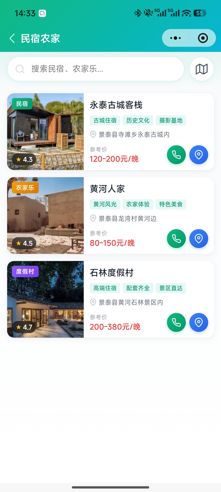

- 标注说明：
  ① 从农旅首页点击“推荐民宿”列表处的“更多”，进入完整民宿列表
  ② 顶部支持关键词搜索，可搜索民宿名称、地址、标签
  ③ 分类筛选支持全部/民宿/农家乐/客栈
  ④ 卡片右侧有快捷拨打电话和导航按钮

---

##### 需要的数据

**列表数据：**

| 序号 | 数据项名称 | 必填/选填 | 数据说明/口径 | 是否能提供 | 备注 |
|------|-----------|----------|--------------|-----------|------|
| 1 | 民宿名称 | [x]必填 [ ]选填 | 如"石林农家小院" | [ ]能 [ ]部分能 [ ]不能 | |
| 2 | 民宿类型 | [x]必填 [ ]选填 | 如"民宿"、"农家乐"、"客栈" | [ ]能 [ ]部分能 [ ]不能 | |
| 3 | 民宿照片 | [x]必填 [ ]选填 | 列表展示的图片URL | [ ]能 [ ]部分能 [ ]不能 | |
| 4 | 民宿评分 | [x]必填 [ ]选填 | 1-5分评分 | [ ]能 [ ]部分能 [ ]不能 | |
| 5 | 民宿标签 | [ ]必填 [x]选填 | 如["免费WiFi","停车场","农家菜"] | [ ]能 [ ]部分能 [ ]不能 | |
| 6 | 民宿地址 | [x]必填 [ ]选填 | 详细地址 | [ ]能 [ ]部分能 [ ]不能 | |
| 7 | 价格范围 | [x]必填 [ ]选填 | 如"¥150-300/晚" | [ ]能 [ ]部分能 [ ]不能 | |
| 8 | 联系电话 | [x]必填 [ ]选填 | 预订电话 | [ ]能 [ ]部分能 [ ]不能 | 用于快捷拨打 |

**地图图层数据：**

| 序号 | 数据项名称 | 必填/选填 | 数据说明/口径 | 是否能提供 | 备注 |
|------|-----------|----------|--------------|-----------|------|
| 1 | 民宿经度 | [x]必填 [ ]选填 | 民宿位置经度 | [ ]能 [ ]部分能 [ ]不能 | 用于地图标点和导航 |
| 2 | 民宿纬度 | [x]必填 [ ]选填 | 民宿位置纬度 | [ ]能 [ ]部分能 [ ]不能 | 用于地图标点和导航 |

---

##### 确认项
- 功能是否需要： [ ] 需要  [ ] 不需要（原因：                ）
- 展示内容是否符合： [ ] 符合  [ ] 需调整（写明调整点：                ）
- 数据整体是否可落地： [ ] 可落地  [ ] 有风险（风险点：                ）

---

#### 5.5.14 功能名称：`民宿详情`（所属模块：`农旅`）

**这页用来干啥（1句话）：**
展示民宿完整信息，包含设施服务、介绍、联系方式，支持收藏和导航

---

##### 页面展示内容

- 原型截图：

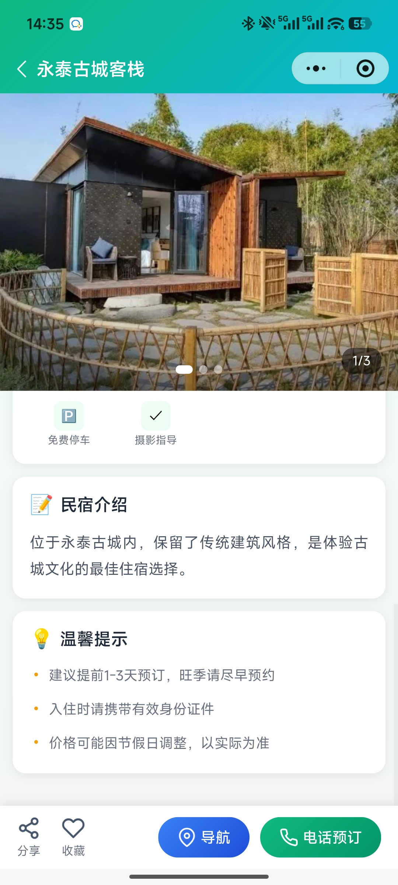

- 标注说明：
  ① 顶部图片轮播
  ② 设施服务以图标网格形式展示
  ③ 底部操作栏支持分享、收藏、导航、电话预订

---

##### 需要的数据

| 序号 | 数据项名称 | 必填/选填 | 数据说明/口径 | 是否能提供 | 备注 |
|------|-----------|----------|--------------|-----------|------|
| 1 | 民宿名称 | [x]必填 [ ]选填 | 民宿名称 | [ ]能 [ ]部分能 [ ]不能 | |
| 2 | 民宿类型 | [x]必填 [ ]选填 | homestay/farmstay/guesthouse | [ ]能 [ ]部分能 [ ]不能 | |
| 3 | 民宿类型名称 | [x]必填 [ ]选填 | 如"民宿" | [ ]能 [ ]部分能 [ ]不能 | |
| 4 | 民宿图片列表 | [x]必填 [ ]选填 | 多张图片URL数组 | [ ]能 [ ]部分能 [ ]不能 | 用于轮播 |
| 5 | 民宿评分 | [x]必填 [ ]选填 | 1-5分评分 | [ ]能 [ ]部分能 [ ]不能 | |
| 6 | 民宿标签 | [ ]必填 [x]选填 | 特色标签数组 | [ ]能 [ ]部分能 [ ]不能 | |
| 7 | 价格范围 | [x]必填 [ ]选填 | 如"¥150-300/晚" | [ ]能 [ ]部分能 [ ]不能 | |
| 8 | 民宿地址 | [x]必填 [ ]选填 | 详细地址 | [ ]能 [ ]部分能 [ ]不能 | |
| 9 | 联系电话 | [x]必填 [ ]选填 | 预订电话 | [ ]能 [ ]部分能 [ ]不能 | |
| 10 | 微信号 | [ ]必填 [x]选填 | 微信联系方式 | [ ]能 [ ]部分能 [ ]不能 | 点击可复制 |
| 11 | 设施服务列表 | [x]必填 [ ]选填 | 包含设施名称和图标名称的数组 | [ ]能 [ ]部分能 [ ]不能 | 如WiFi、停车场、空调等 |
| 12 | 民宿介绍 | [x]必填 [ ]选填 | 详细介绍文字 | [ ]能 [ ]部分能 [ ]不能 | |
| 13 | 民宿经度 | [x]必填 [ ]选填 | 用于导航 | [ ]能 [ ]部分能 [ ]不能 | |
| 14 | 民宿纬度 | [x]必填 [ ]选填 | 用于导航 | [ ]能 [ ]部分能 [ ]不能 | |

---

##### 确认项
- 功能是否需要： [ ] 需要  [ ] 不需要（原因：                ）
- 展示内容是否符合： [ ] 符合  [ ] 需调整（写明调整点：                ）
- 数据整体是否可落地： [ ] 可落地  [ ] 有风险（风险点：                ）

---

### 5.6 农户端 - 我的模块

---

#### 5.6.1 功能名称：`我的-主页`（所属模块：`农户端-我的`）

**这页用来干啥（1句话）：**
展示当前用户信息和享受的惠民政策，提供各功能模块的入口

---

##### 页面展示内容

- 原型截图：
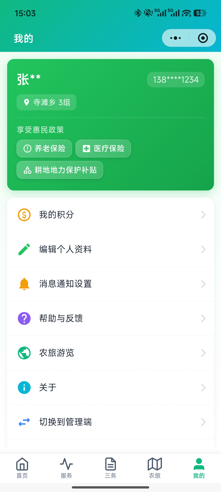

- 标注说明：
  ① 顶部绿色卡片区展示用户基本信息和当前享受的惠民政策
  ② 功能菜单列表包含：我的积分、编辑资料、通知设置、帮助反馈、农旅游览、关于、退出登录
  ③ 若用户同时拥有管理员权限，会显示"切换到管理端"菜单项

---

##### 需要的数据

| 序号 | 数据项名称 | 必填/选填 | 数据说明/口径 | 是否能提供 | 备注 |
|------|-----------|----------|--------------|-----------|------|
| 1 | 农户姓名 | [x]必填 [ ]选填 | 用户的真实姓名 | [ ]能 [ ]部分能 [ ]不能 |  |
| 2 | 手机号（脱敏） | [x]必填 [ ]选填 | 格式如138****1234 | [ ]能 [ ]部分能 [ ]不能 |  |
| 3 | 所属村组 | [x]必填 [ ]选填 | 如"XX村3组" | [ ]能 [ ]部分能 [ ]不能 |  |
| 4 | 惠民政策列表 | [ ]必填 [x]选填 | 当前享受的政策名称，如养老保险、医疗保险、耕地补贴等 | [ ]能 [ ]部分能 [ ]不能 | 可显示多个标签 |

---

##### 确认项
- 功能是否需要： [ ] 需要  [ ] 不需要（原因：                ）
- 展示内容是否符合： [ ] 符合  [ ] 需调整（写明调整点：                ）
- 数据整体是否可落地： [ ] 可落地  [ ] 有风险（风险点：                ）

---

#### 5.6.2 功能名称：`我的积分首页`（所属模块：`农户端-我的积分`）

**这页用来干啥（1句话）：**
展示用户积分余额、本月收支情况和村内排行榜TOP10

---

##### 页面展示内容

- 原型截图：

- 标注说明：
  ① 顶部绿色卡片展示积分余额、本月获得/使用统计，即将过期积分以橙色提示
  ② 四个快捷按钮：明细（跳转积分明细）、兑换（跳转积分超市）、记录（跳转兑换记录）、规则（跳转规则说明）
  ③ 排行榜TOP10展示排名、头像、姓名、积分、排名变化，党员用红色五角星标识，支持点击查看完整排行榜

---

##### 确认项
- 功能是否需要： [ ] 需要  [ ] 不需要（原因：                ）
- 展示内容是否符合： [ ] 符合  [ ] 需调整（写明调整点：                ）
- 数据整体是否可落地： [ ] 可落地  [ ] 有风险（风险点：                ）

---

#### 5.6.3 功能名称：`我的积分明细`（所属模块：`农户端-我的积分`）

**这页用来干啥（1句话）：**
展示积分余额、统计数据和完整的积分收支明细记录

---

##### 页面展示内容

- 原型截图：

- 标注说明：
  ① 顶部显示当前积分余额和有效期
  ② 三个统计数据：累计获得、累计使用、已过期积分
  ③ 支持按类型筛选（全部/获得/使用/过期），列表按时间倒序显示

---

##### 确认项
- 功能是否需要： [ ] 需要  [ ] 不需要（原因：                ）
- 展示内容是否符合： [ ] 符合  [ ] 需调整（写明调整点：                ）
- 数据整体是否可落地： [ ] 可落地  [ ] 有风险（风险点：                ）

---

#### 5.6.4 功能名称：`积分超市`（所属模块：`农户端-我的积分`）

**这页用来干啥（1句话）：**
浏览可兑换商品，支持分类筛选和搜索，选择商品进行兑换

---

##### 页面展示内容

- 原型截图：

- 标注说明：
  ① 从我的积分首页点击“兑换”按钮进入积分超市
  ② 顶部搜索框可按商品名称搜索，下方显示当前积分余额
  ③ 分类标签支持切换：全部、农资农具、生活用品等
  ④ 商品卡片显示图片、名称、所需积分、库存状态（充足/紧张/售罄）、热门标签

---

##### 确认项
- 功能是否需要： [ ] 需要  [ ] 不需要（原因：                ）
- 展示内容是否符合： [ ] 符合  [ ] 需调整（写明调整点：                ）
- 数据整体是否可落地： [ ] 可落地  [ ] 有风险（风险点：                ）

---

#### 5.6.5 功能名称：`商品详情`（所属模块：`农户端-我的积分`）

**这页用来干啥（1句话）：**
查看商品详细信息、领取地点和兑换须知，发起兑换申请

---

##### 页面展示内容

- 原型截图：

- 标注说明：
  ① 顶部展示商品图片（点击可预览大图）、名称、所需积分、库存数量、已兑换次数
  ② 中部展示领取信息：领取地点、领取时间段、联系电话（可直接拨打）
  ③ 底部展示兑换须知和操作按钮，积分不足时显示差额提示

---

##### 需要的数据

| 序号 | 数据项名称 | 必填/选填 | 数据说明/口径 | 是否能提供 | 备注 |
|------|-----------|----------|--------------|-----------|------|
| 1 | 商品图片 | [x]必填 [ ]选填 | 商品展示图片 | [ ]能 [ ]部分能 [ ]不能 |  |
| 2 | 商品名称 | [x]必填 [ ]选填 | 商品名称 | [ ]能 [ ]部分能 [ ]不能 |  |
| 3 | 所需积分 | [x]必填 [ ]选填 | 兑换该商品需要的积分数 | [ ]能 [ ]部分能 [ ]不能 |  |
| 4 | 库存数量 | [x]必填 [ ]选填 | 当前剩余库存 | [ ]能 [ ]部分能 [ ]不能 |  |
| 5 | 领取地点 | [x]必填 [ ]选填 | 商品领取的具体地址 | [ ]能 [ ]部分能 [ ]不能 |  |
| 6 | 领取时间 | [x]必填 [ ]选填 | 可领取的时间段，如"工作日 9:00-17:00" | [ ]能 [ ]部分能 [ ]不能 |  |
| 7 | 联系电话 | [x]必填 [ ]选填 | 领取点联系电话 | [ ]能 [ ]部分能 [ ]不能 | 点击可拨打 |
| 8 | 商品说明 | [ ]必填 [x]选填 | 商品详细描述 | [ ]能 [ ]部分能 [ ]不能 |  |
| 9 | 兑换须知 | [x]必填 [ ]选填 | 兑换规则说明，如领取期限、退换规则等 | [ ]能 [ ]部分能 [ ]不能 | 可配置 |

---

##### 确认项
- 功能是否需要： [ ] 需要  [ ] 不需要（原因：                ）
- 展示内容是否符合： [ ] 符合  [ ] 需调整（写明调整点：                ）
- 数据整体是否可落地： [ ] 可落地  [ ] 有风险（风险点：                ）

---

#### 5.6.6 功能名称：`兑换确认`（所属模块：`农户端-我的积分`）

**这页用来干啥（1句话）：**
确认兑换信息、选择预约领取时间，提交兑换申请

---

##### 页面展示内容

- 原型截图：
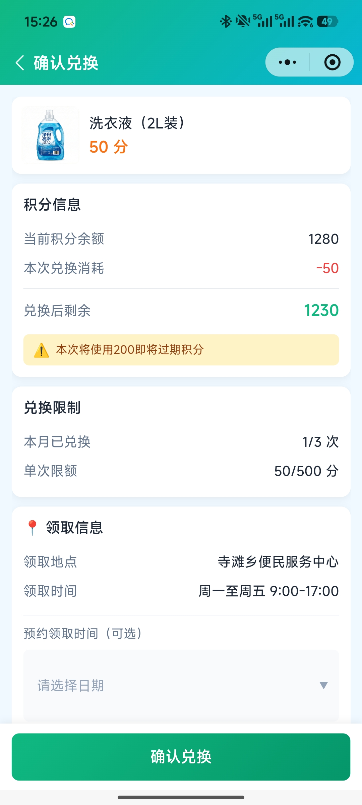

- 标注说明：
  ① 商品信息卡片展示商品图片、名称、所需积分
  ② 积分信息展示当前余额、本次消耗、兑换后余额；即将过期积分会优先使用
  ③ 兑换限制展示本月已兑换次数/上限、单次兑换积分限额
  ④ 预约时间支持选择7天内的日期和上午/下午时段

---

##### 确认项
- 功能是否需要： [ ] 需要  [ ] 不需要（原因：                ）
- 展示内容是否符合： [ ] 符合  [ ] 需调整（写明调整点：                ）
- 数据整体是否可落地： [ ] 可落地  [ ] 有风险（风险点：                ）

---

#### 5.6.7 功能名称：`兑换记录`（所属模块：`农户端-我的积分`）

**这页用来干啥（1句话）：**
查看所有兑换订单记录，支持按状态筛选和操作

---

##### 页面展示内容

- 原型截图：
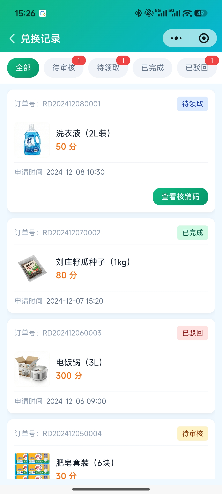

- 标注说明：
  ① 从我的积分首页点击“记录”按钮进入兑换记录
  ② 顶部状态筛选标签支持切换查看不同状态的订单
  ③ 订单卡片显示订单号、申请时间、商品图片、名称、积分、状态标签
  ④ 待审核订单可取消，待领取订单可查看核销码

---

##### 确认项
- 功能是否需要： [ ] 需要  [ ] 不需要（原因：                ）
- 展示内容是否符合： [ ] 符合  [ ] 需调整（写明调整点：                ）
- 数据整体是否可落地： [ ] 可落地  [ ] 有风险（风险点：                ）

---

#### 5.6.8 功能名称：`订单详情`（所属模块：`农户端-我的积分`）

**这页用来干啥（1句话）：**
查看兑换订单完整信息，待领取订单展示核销码

---

##### 页面展示内容

- 原型截图：
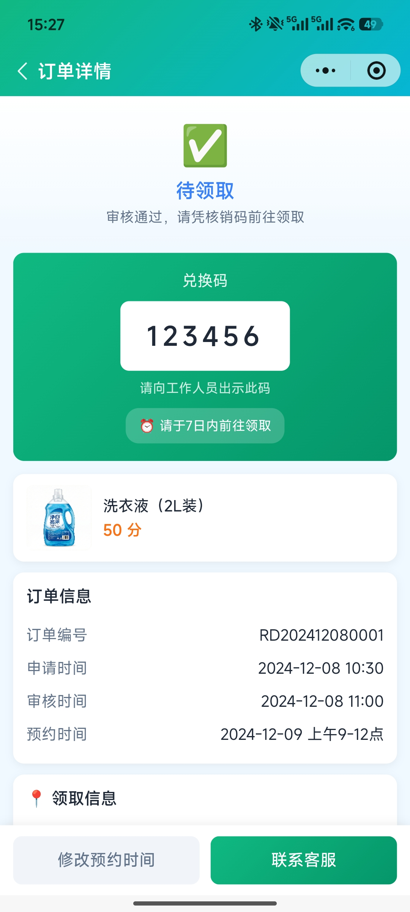

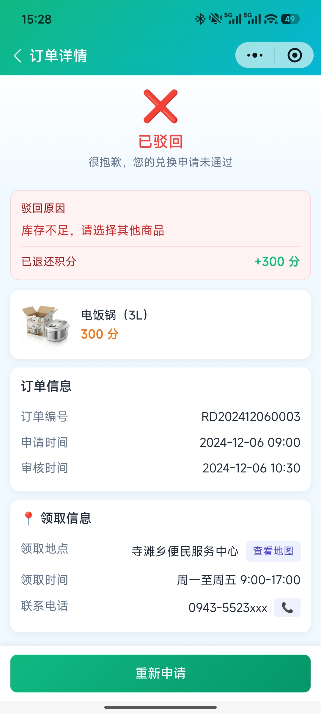

- 标注说明：
  ① 顶部状态卡片显示当前订单状态和状态说明
  ② 待领取订单显示核销码，提示出示给工作人员
  ③ 显示领取地点（支持导航）和联系电话（支持拨打）
  ④ 已拒绝订单显示拒绝原因和退还积分数

---
##### 确认项
- 功能是否需要： [ ] 需要  [ ] 不需要（原因：                ）
- 展示内容是否符合： [ ] 符合  [ ] 需调整（写明调整点：                ）
- 数据整体是否可落地： [ ] 可落地  [ ] 有风险（风险点：                ）

---

#### 5.6.9 功能名称：`积分排行榜`（所属模块：`农户端-我的积分`）

**这页用来干啥（1句话）：**
查看村内完整积分排行榜TOP50，支持切换时间维度

---

##### 页面展示内容

- 原型截图：
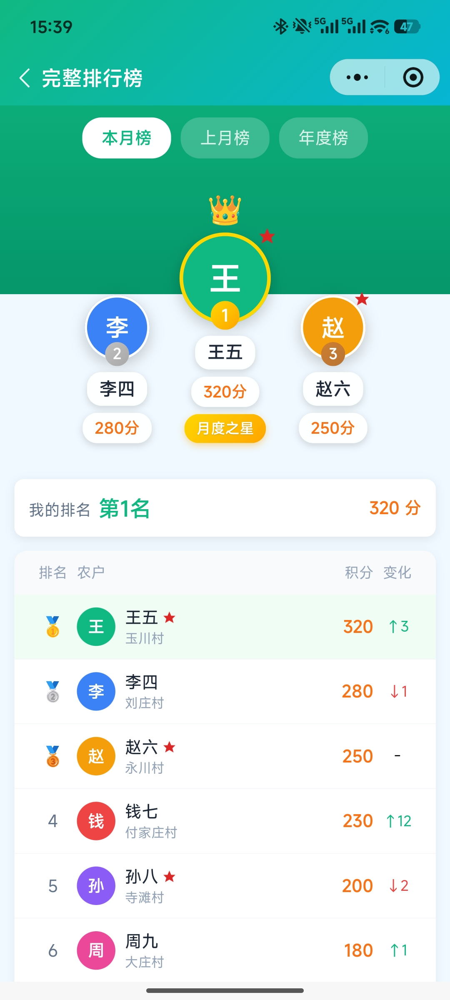

- 标注说明：
  ① 点击“我的积分”首页中的排行榜底部的“查看完整排行榜”进入
  ② 顶部时间维度切换：本月、上月、年度排行
  ③ TOP3以领奖台形式突出展示，金银铜牌配色
  ④ 完整排行列表显示排名、头像、姓名、积分、排名变化，党员用红色五角星标识

---

##### 确认项
- 功能是否需要： [ ] 需要  [ ] 不需要（原因：                ）
- 展示内容是否符合： [ ] 符合  [ ] 需调整（写明调整点：                ）
- 数据整体是否可落地： [ ] 可落地  [ ] 有风险（风险点：                ）

---

#### 5.6.10 功能名称：`积分规则`（所属模块：`农户端-我的积分`）

**这页用来干啥（1句话）：**
展示完整的积分获取规则、使用规则、有效期和限制说明

---

##### 页面展示内容

- 原型截图：
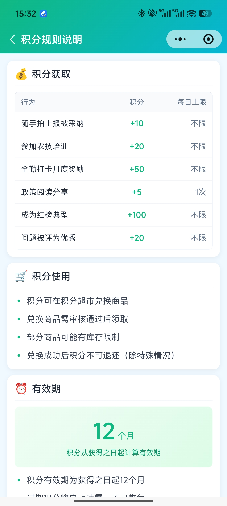
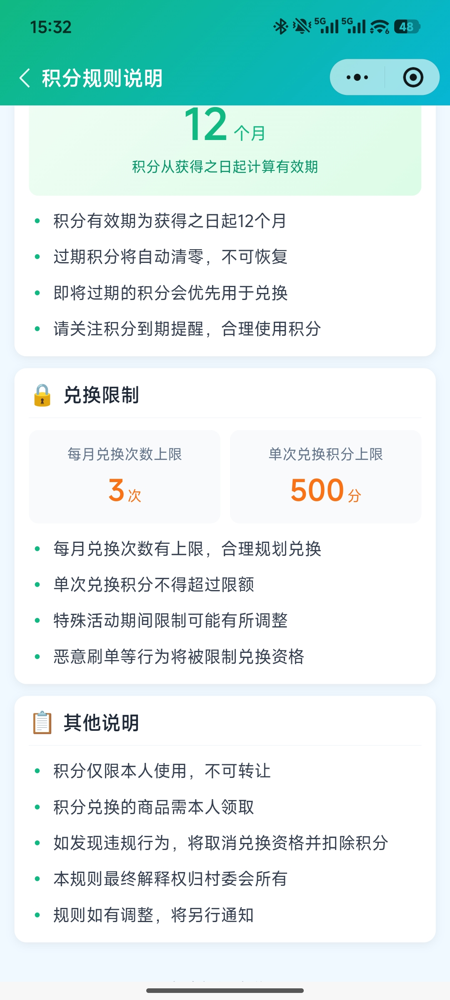

- 标注说明：
  ① 积分获取规则列出各行为对应的积分奖励，如随手拍上报+50分、参与培训+30分等
  ② 使用规则说明积分兑换流程和注意事项
  ③ 有效期说明积分12个月有效，过期自动清零
  ④ 兑换限制说明月度次数上限和单次积分限额

---

##### 确认项
- 功能是否需要： [ ] 需要  [ ] 不需要（原因：                ）
- 展示内容是否符合： [ ] 符合  [ ] 需调整（写明调整点：                ）
- 数据整体是否可落地： [ ] 可落地  [ ] 有风险（风险点：                ）

---

#### 5.6.11 功能名称：`编辑个人资料`（所属模块：`农户端-我的`）

**这页用来干啥（1句话）：**
让用户修改自己的姓名，并提供手机号修改入口

---

##### 页面展示内容

- 原型截图：

- 标注说明：
  ① 姓名字段可编辑，用户可自行修改
  ② 手机号显示当前号码，点击箭头可跳转到修改手机号页面
  ③ 所属村组为只读显示，农户不可自行修改，需联系管理员

---

##### 需要的数据

| 序号 | 数据项名称 | 必填/选填 | 数据说明/口径 | 是否能提供 | 备注 |
|------|-----------|----------|--------------|-----------|------|
| 1 | 农户姓名 | [x]必填 [ ]选填 | 可编辑的姓名字段 | [ ]能 [ ]部分能 [ ]不能 |  |
| 2 | 手机号 | [x]必填 [ ]选填 | 当前绑定的手机号 | [ ]能 [ ]部分能 [ ]不能 |  |
| 3 | 所属村组 | [x]必填 [ ]选填 | 用户所属的村和组，如"XX村3组" | [ ]能 [ ]部分能 [ ]不能 | 只读展示 |

---

##### 确认项
- 功能是否需要： [ ] 需要  [ ] 不需要（原因：                ）
- 展示内容是否符合： [ ] 符合  [ ] 需调整（写明调整点：                ）
- 数据整体是否可落地： [ ] 可落地  [ ] 有风险（风险点：                ）

---

#### 5.6.12 功能名称：`消息通知设置`（所属模块：`农户端-我的`）

**这页用来干啥（1句话）：**
让用户自主控制4类消息的推送开关

---

##### 页面展示内容

- 原型截图：

- 标注说明：
  ① 每个通知项包含标题和描述说明
  ② 开关默认状态根据系统预设值加载
  ③ 用户修改后即时保存
---

##### 确认项
- 功能是否需要： [ ] 需要  [ ] 不需要（原因：                ）
- 展示内容是否符合： [ ] 符合  [ ] 需调整（写明调整点：                ）
- 数据整体是否可落地： [ ] 可落地  [ ] 有风险（风险点：                ）

---

#### 5.6.13 功能名称：`帮助与反馈`（所属模块：`农户端-我的`）

**这页用来干啥（1句话）：**
展示常见问题解答，提供意见反馈和联系村委的入口

---

##### 页面展示内容

- 原型截图：

- 标注说明：
  ① 常见问题列表支持点击展开/收起，方便快速查找答案
  ② 意见反馈点击后弹出填写窗口，可输入反馈内容和联系方式
  ③ 联系村委直接拨打村委电话

---

##### 需要的数据

**村委联系信息：**

| 序号 | 数据项名称 | 必填/选填 | 数据说明/口径 | 是否能提供 | 备注 |
|------|-----------|----------|--------------|-----------|------|
| 1 | 联系单位名称 | [x]必填 [ ]选填 | 如"XX村党群服务中心" | [ ]能 [ ]部分能 [ ]不能 |  |
| 2 | 联系电话 | [x]必填 [ ]选填 | 村委会联系电话 | [ ]能 [ ]部分能 [ ]不能 | 点击可直接拨打 |

---

##### 确认项
- 功能是否需要： [ ] 需要  [ ] 不需要（原因：                ）
- 展示内容是否符合： [ ] 符合  [ ] 需调整（写明调整点：                ）
- 数据整体是否可落地： [ ] 可落地  [ ] 有风险（风险点：                ）

---

#### 5.6.14 功能名称：`关于`（所属模块：`农户端-我的`）

**这页用来干啥（1句话）：**
展示应用信息，提供协议政策查看和账号注销入口

---

##### 页面展示内容

- 原型截图：

- 标注说明：
  ① 顶部展示应用Logo、名称和当前版本号（待定）
  ② 用户协议和隐私政策点击后跳转对应页面（待开发）
  ③ 检查更新点击后模拟检查，当前为最新版本时提示
  ④ 账号注销入口为红色文字，点击进入注销流程页面

---

##### 确认项
- 功能是否需要： [ ] 需要  [ ] 不需要（原因：                ）
- 展示内容是否符合： [ ] 符合  [ ] 需调整（写明调整点：                ）
- 数据整体是否可落地： [ ] 可落地  [ ] 有风险（风险点：                ）

---

## 6. 附录

### 6.1 数据项汇总

| 数据项 | 来源系统/方式 | 优先级 | 状态 |
|--------|--------------|--------|------|
| 用户姓名 | 用户系统 | 必须 | [ ]已对接 [ ]待开发 |
| 当前积分 | 积分系统 | 必须 | [ ]已对接 [ ]待开发 |
| 即将过期积分 | 积分系统 | 可选 | [ ]已对接 [ ]待开发 |
| 轮播横幅数据 | 后台配置 | 必须 | [ ]已对接 [ ]待开发 |
| 快捷服务角标数据 | 各业务系统 | 可选 | [ ]已对接 [ ]待开发 |
| 村务动态数据 | 三务公开系统 | 必须 | [ ]已对接 [ ]待开发 |
| 随手拍进度数据 | 随手拍系统 | 可选 | [ ]已对接 [ ]待开发 |
| 预警信息数据 | 预警系统 | 必须 | [ ]已对接 [ ]待开发 |
| 政策公告数据 | 三务公开系统 | 必须 | [ ]已对接 [ ]待开发 |
| 阳光村务数据 | 三务公开系统 | 必须 | [ ]已对接 [ ]待开发 |
| 财务收支明细 | 村务财务系统 | 必须 | [ ]已对接 [ ]待开发 |
| 村务决策表决数据 | 村务会议系统 | 必须 | [ ]已对接 [ ]待开发 |
| 集体资产清单 | 资产管理系统 | 必须 | [ ]已对接 [ ]待开发 |
| 会议记录数据 | 村务会议系统 | 可选 | [ ]已对接 [ ]待开发 |
| 曝光台数据 | 曝光台系统 | 必须 | [ ]已对接 [ ]待开发 |
| 整改进度数据 | 曝光台系统 | 必须 | [ ]已对接 [ ]待开发 |
| 惠民政策列表 | 政策关联表 | 可选 | [ ]已对接 [ ]待开发 |
| 通知设置数据 | 本地存储 | 必须 | [ ]已对接 [ ]待开发 |
| 常见问题列表 | 系统配置表 | 必须 | [ ]已对接 [ ]待开发 |
| 村委联系信息 | 村务信息表 | 必须 | [ ]已对接 [ ]待开发 |
| 应用版本信息 | 系统配置 | 必须 | [ ]已对接 [ ]待开发 |

### 6.2 接口清单

| 接口名称 | 说明 | 优先级 |
|----------|------|--------|
| 获取用户信息 | 获取当前登录用户基本信息 | 必须 |
| 获取积分信息 | 获取用户当前积分和即将过期积分 | 必须 |
| 获取轮播横幅列表 | 获取首页轮播通知数据 | 必须 |
| 获取快捷服务角标数据 | 获取各服务的统计数字 | 可选 |
| 获取村务动态列表 | 获取三务公开最新动态 | 必须 |
| 获取我的随手拍进度 | 获取用户最近一条处理中的上报 | 可选 |
| 获取预警信息列表 | 获取当前有效的预警信息 | 必须 |
| 获取政策公告列表 | 获取政策公告列表（支持分类筛选、分页） | 必须 |
| 获取政策公告详情 | 根据ID获取政策公告完整内容 | 必须 |
| 获取阳光村务列表 | 获取村务公开列表（支持类型筛选、分页） | 必须 |
| 获取阳光村务详情 | 根据ID获取村务公开详情（含财务明细/表决结果等） | 必须 |
| 获取曝光台列表 | 获取曝光台记录列表（支持红榜/黑榜筛选、分页） | 必须 |
| 获取曝光台详情 | 根据ID获取曝光记录详情（含整改时间线） | 必须 |
| 收藏/取消收藏 | 用户收藏或取消收藏政策/村务/曝光记录 | 可选 |
| 更新用户信息 | 更新用户姓名等个人资料 | 必须 |
| 修改手机号 | 通过验证码修改绑定手机号 | 可选 |
| 获取常见问题列表 | 获取帮助中心FAQ数据 | 必须 |
| 提交意见反馈 | 用户提交意见反馈内容 | 可选 |
| 发送短信验证码 | 用于修改手机号或注销账号验证 | 必须 |
| 注销账号 | 用户账号注销申请（7天冷静期） | 可选 |

### 6.3 技术字段与用户名称映射表

| 技术字段名 | 用户名称 |
|-----------|---------|
| userName | 用户姓名 |
| userPoints | 当前积分 |
| expiringPoints | 即将过期积分 |
| banners | 轮播横幅列表 |
| quickServices | 快捷服务列表 |
| news | 村务动态列表 |
| myProgress | 我的进度 |
| villageName | 村庄名称 |
| warningMessages | 预警信息列表 |
| policyAnnouncements | 政策公告列表 |
| villageAffairs | 阳光村务列表 |
| exposureRecords | 曝光台记录列表 |
| incomeDetails | 收入明细列表 |
| expenseDetails | 支出明细列表 |
| voteResult | 表决结果 |
| timeline | 时间线/进度列表 |
| progress | 整改进度 |
| rectificationStatus | 整改状态 |
| userInfo.name | 农户姓名 |
| userInfo.phone | 手机号（脱敏） |
| userInfo.fullAddress | 所属村组 |
| userInfo.welfarePolicies | 惠民政策列表 |
| userInfo.roles | 用户角色列表 |
| notificationSettings | 通知设置 |
| faqList | 常见问题列表 |
| villageContact | 村委联系信息 |
| appInfo | 应用信息 |

---

## 7. 签字确认

| 角色 | 签字 | 日期 |
|------|------|------|
| 产品负责人 | | |
| 业务负责人 | | |
| 技术负责人 | | |

---

**文档说明**：
- 本文档用于系统原型走读与需求确认
- 请在确认项中勾选结论，有调整需求请在备注中说明
- 数据项"是否能提供"请业务方确认后勾选
- 如有疑问请在走读会议中提出讨论
